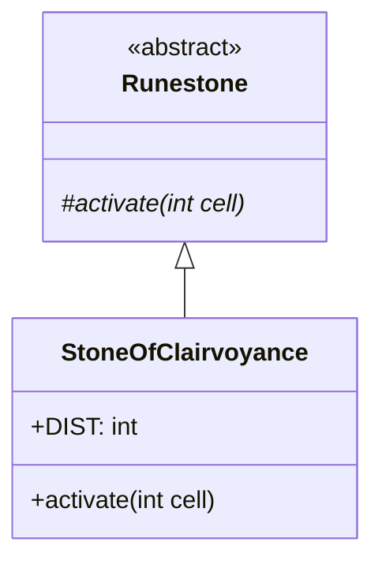

# StoneOfClairvoyance 文档

## 1. 基本信息

| 属性 | 值 |
|------|-----|
| **文件路径** | core/src/main/java/com/shatteredpixel/shatteredpixeldungeon/items/stones/StoneOfClairvoyance.java |
| **包名** | com.shatteredpixel.shatteredpixeldungeon.items.stones |
| **文件类型** | class |
| **继承关系** | extends Runestone |
| **代码行数** | 91 |
| **所属模块** | core |

## 2. 文件职责说明

### 核心职责
StoneOfClairvoyance（明示符石）是一种投掷型符石，被投掷后瞬间揭示以目标位置为中心的巨大范围内的所有地格，效果甚至能穿透墙壁。

### 系统定位
位于 Runestone → StoneOfClairvoyance 继承链中，是一种探索型符石，提供大范围的地图揭示能力。

### 不负责什么
- 不负责直接显示敌人位置
- 不负责揭示物品位置

## 3. 结构总览

### 主要成员概览
- `DIST` - 探测距离常量
- `image` - 精灵图设置

### 主要逻辑块概览
- `activate(int cell)` - 揭示范围区域

### 生命周期/调用时机
1. 玩家投掷符石到目标位置
2. 符石激活
3. 揭示目标周围的地图

## 4. 继承与协作关系

### 父类提供的能力
从 Runestone 继承：
- `stackable = true` - 可堆叠
- `defaultAction = AC_THROW` - 默认动作为投掷
- `onThrow()` - 投掷逻辑
- `activate()` - 激活方法（需覆写）

### 覆写的方法
| 方法 | 覆写逻辑 |
|------|----------|
| `activate(int cell)` | 揭示范围内的地图和秘密 |

### 依赖的关键类
| 类名 | 用途 |
|------|------|
| `Dungeon` | 关卡数据 |
| `CheckedCell` | 检查单元格视觉效果 |
| `ScrollOfMagicMapping` | 魔法映射效果 |
| `ShadowCaster` | 阴影投射算法 |
| `GameScene` | 游戏场景 |
| `ItemSpriteSheet` | 精灵图定义 |
| `Sample` | 音效播放 |
| `Point` | 坐标点 |

## 5. 字段/常量详解

### 静态常量
| 常量名 | 类型 | 值 | 说明 |
|--------|------|-----|------|
| `DIST` | int | 20 | 探测范围半径（格子数） |

### 实例字段
| 字段名 | 类型 | 默认值 | 说明 |
|--------|------|--------|------|
| `image` | int | ItemSpriteSheet.STONE_CLAIRVOYANCE | 符石精灵图 |

## 6. 构造与初始化机制

### 构造器
使用默认构造器，通过实例初始化块设置属性：

```java
{
    image = ItemSpriteSheet.STONE_CLAIRVOYANCE;
}
```

## 7. 方法详解

### activate(int cell)

**可见性**：protected

**是否覆写**：是，覆写自 Runestone

**方法职责**：揭示以目标位置为中心、半径 DIST 范围内的所有地格。

**参数**：
- `cell` (int)：激活位置的格子坐标

**返回值**：void

**副作用**：
- 揭示范围内的地图
- 发现隐藏的秘密（门、陷阱等）
- 播放视觉效果
- 播放音效

**核心实现逻辑**：
```java
@Override
protected void activate(final int cell) {
    Point c = Dungeon.level.cellToPoint(cell);
    
    int[] rounding = ShadowCaster.rounding[DIST];
    
    int left, right;
    int curr;
    boolean noticed = false;
    
    // 遍历以目标为中心的圆形区域
    for (int y = Math.max(0, c.y - DIST); y <= Math.min(Dungeon.level.height()-1, c.y + DIST); y++) {
        // 计算该行的左右边界
        // ... 使用 ShadowCaster 算法
        
        for (curr = left + y * Dungeon.level.width(); curr <= right + y * Dungeon.level.width(); curr++){
            // 显示视觉效果
            GameScene.effectOverFog( new CheckedCell( curr, cell ) );
            
            // 标记为已映射
            Dungeon.level.mapped[curr] = true;
            
            // 发现秘密
            if (Dungeon.level.secret[curr]) {
                Dungeon.level.discover(curr);
                
                if (Dungeon.level.heroFOV[curr]) {
                    GameScene.discoverTile(curr, Dungeon.level.map[curr]);
                    ScrollOfMagicMapping.discover(curr);
                    noticed = true;
                }
            }
        }
    }
    
    if (noticed) {
        Sample.INSTANCE.play( Assets.Sounds.SECRET );
    }
    
    Sample.INSTANCE.play( Assets.Sounds.TELEPORT );
    GameScene.updateFog();
}
```

**边界情况**：
- 范围超出地图边界时会正确截断
- 只有在玩家视野内的秘密才会触发发现效果

## 8. 对外暴露能力

### 显式 API
| 方法 | 用途 |
|------|------|
| `activate(int cell)` | 激活符石效果（由父类调用） |

## 9. 运行机制与调用链

```
投掷动作 → Runestone.onThrow() → activate()
    → 遍历圆形区域
    → CheckedCell 视觉效果
    → Dungeon.level.mapped[] = true
    → 发现秘密并显示
    → 播放音效
```

## 10. 资源、配置与国际化关联

### 引用的 messages 文案
| 键名 | 中文翻译 | 用途 |
|------|---------|------|
| items.stones.stoneofclairvoyance.name | 明示符石 | 物品名称 |
| items.stones.stoneofclairvoyance.desc | 这颗符石被扔出后会瞬间搜索以目的地为中心的巨大范围内的所有地格... | 物品描述 |

### 依赖的资源
- `ItemSpriteSheet.STONE_CLAIRVOYANCE` - 符石精灵图
- `Assets.Sounds.SECRET` - 发现秘密音效
- `Assets.Sounds.TELEPORT` - 传送音效

### 中文翻译来源
来自 `items_zh.properties` 文件。

## 11. 使用示例

### 基本用法
```java
// 创建并投掷明示符石
StoneOfClairvoyance stone = new StoneOfClairvoyance();
stone.quantity = 1;

// 投掷到目标位置，揭示周围20格范围
stone.doThrow(hero, targetCell);
```

### 战术应用
```java
// 用于探索大型房间
// 用于发现隐藏门和陷阱
// 可穿透墙壁，用于预览隔壁房间
```

## 12. 开发注意事项

### 状态依赖
- 使用 ShadowCaster 算法计算圆形范围
- 效果穿透墙壁

### 常见陷阱
- DIST 值较大时可能影响性能
- 需要正确处理地图边界

## 13. 事实核查清单

- [x] 是否已覆盖全部字段
- [x] 是否已覆盖全部方法
- [x] 是否已检查继承链与覆写关系
- [x] 是否已核对官方中文翻译
- [x] 是否存在任何推测性表述（无）
- [x] 示例代码是否真实可用

---

## 附：类关系图

