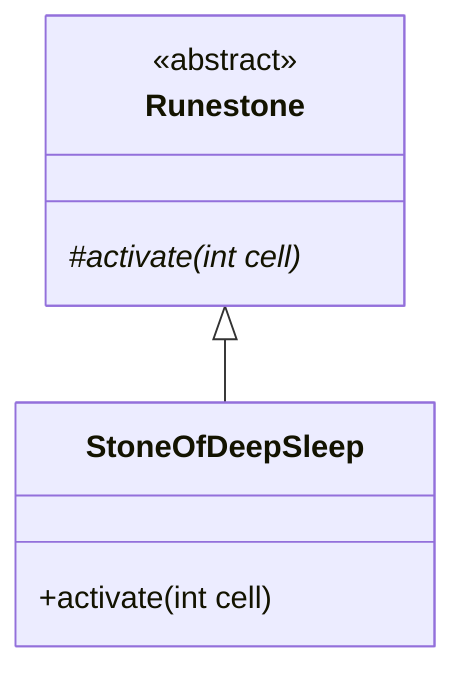

# StoneOfDeepSleep 文档

## 1. 基本信息

| 属性 | 值 |
|------|-----|
| **文件路径** | core/src/main/java/com/shatteredpixel/shatteredpixeldungeon/items/stones/StoneOfDeepSleep.java |
| **包名** | com.shatteredpixel.shatteredpixeldungeon.items.stones |
| **文件类型** | class |
| **继承关系** | extends Runestone |
| **代码行数** | 59 |
| **所属模块** | core |

## 2. 文件职责说明

### 核心职责
StoneOfDeepSleep（沉睡符石）是一种投掷型符石，被投掷到敌人位置后，会使敌人陷入魔法睡眠状态。陷入魔法睡眠的敌人会一直沉睡直到被外界打扰。

### 系统定位
位于 Runestone → StoneOfDeepSleep 继承链中，是一种控制型符石，可让敌人暂时失去行动能力。

### 不负责什么
- 不负责对玩家或盟友产生效果
- 不负责直接造成伤害

## 3. 结构总览

### 主要成员概览
- `image` - 精灵图设置

### 主要逻辑块概览
- `activate(int cell)` - 施加魔法睡眠

### 生命周期/调用时机
1. 玩家投掷符石到敌人位置
2. 符石激活
3. 对命中的敌人施加 MagicalSleep Buff

## 4. 继承与协作关系

### 父类提供的能力
从 Runestone 继承：
- `stackable = true` - 可堆叠
- `defaultAction = AC_THROW` - 默认动作为投掷
- `onThrow()` - 投掷逻辑
- `activate()` - 激活方法（需覆写）

### 覆写的方法
| 方法 | 覆写逻辑 |
|------|----------|
| `activate(int cell)` | 对目标位置的敌人施加魔法睡眠 |

### 依赖的关键类
| 类名 | 用途 |
|------|------|
| `Actor` | 查找位置上的角色 |
| `Char` | 角色基类 |
| `Buff` | Buff 管理器 |
| `MagicalSleep` | 魔法睡眠 Buff |
| `Mob` | 怪物类 |
| `Speck` | 粒子效果 |
| `ItemSpriteSheet` | 精灵图定义 |
| `Sample` | 音效播放 |

## 5. 字段/常量详解

### 静态常量
无静态常量定义。

### 实例字段
| 字段名 | 类型 | 默认值 | 说明 |
|--------|------|--------|------|
| `image` | int | ItemSpriteSheet.STONE_SLEEP | 符石精灵图 |

## 6. 构造与初始化机制

### 构造器
使用默认构造器，通过实例初始化块设置属性：

```java
{
    image = ItemSpriteSheet.STONE_SLEEP;
}
```

## 7. 方法详解

### activate(int cell)

**可见性**：protected

**是否覆写**：是，覆写自 Runestone

**方法职责**：对目标位置的敌人施加魔法睡眠效果。

**参数**：
- `cell` (int)：激活位置的格子坐标

**返回值**：void

**副作用**：
- 对目标敌人施加 MagicalSleep Buff
- 播放视觉效果
- 播放音效

**核心实现逻辑**：
```java
@Override
protected void activate(int cell) {
    if (Actor.findChar(cell) != null) {
        Char c = Actor.findChar(cell);

        if (c instanceof Mob){
            Buff.affect(c, MagicalSleep.class);
            c.sprite.centerEmitter().start( Speck.factory( Speck.NOTE ), 0.3f, 5 );
        }
    }
    
    Sample.INSTANCE.play( Assets.Sounds.LULLABY );
}
```

**边界情况**：
- 目标位置无角色时，仅播放音效
- 只对 Mob（怪物）生效，不影响玩家或盟友

## 8. 对外暴露能力

### 显式 API
| 方法 | 用途 |
|------|------|
| `activate(int cell)` | 激活符石效果（由父类调用） |

## 9. 运行机制与调用链

```
投掷动作 → Runestone.onThrow() → activate()
    → Actor.findChar() 查找目标
    → 检查是否为 Mob
    → Buff.affect(MagicalSleep.class) 施加睡眠
    → 播放视觉效果和音效
```

## 10. 资源、配置与国际化关联

### 引用的 messages 文案
| 键名 | 中文翻译 | 用途 |
|------|---------|------|
| items.stones.stoneofdeepsleep.name | 沉睡符石 | 物品名称 |
| items.stones.stoneofdeepsleep.desc | 当把这颗符石掷向一个敌人时，被命中的敌人会陷入魔法睡眠... | 物品描述 |

### 依赖的资源
- `ItemSpriteSheet.STONE_SLEEP` - 符石精灵图
- `Assets.Sounds.LULLABY` - 摇篮曲音效
- `Speck.NOTE` - 音符粒子效果

### 中文翻译来源
来自 `items_zh.properties` 文件。

## 11. 使用示例

### 基本用法
```java
// 创建并投掷沉睡符石
StoneOfDeepSleep stone = new StoneOfDeepSleep();
stone.quantity = 1;

// 投掷到敌人位置
stone.doThrow(hero, enemyCell);

// 敌人会陷入魔法睡眠
```

### 战术应用
```java
// 用于让敌人暂时失去行动能力
// 可安全绕过敌人或进行偷袭
// 注意：敌人被攻击后会醒来
```

## 12. 开发注意事项

### 状态依赖
- 只对 Mob 类型角色生效
- 睡眠效果会被攻击打断

### 常见陷阱
- 对已睡眠的敌人使用无效
- 不影响 Boss（由 MagicalSleep 决定）

## 13. 事实核查清单

- [x] 是否已覆盖全部字段
- [x] 是否已覆盖全部方法
- [x] 是否已检查继承链与覆写关系
- [x] 是否已核对官方中文翻译
- [x] 是否存在任何推测性表述（无）
- [x] 示例代码是否真实可用

---

## 附：类关系图

