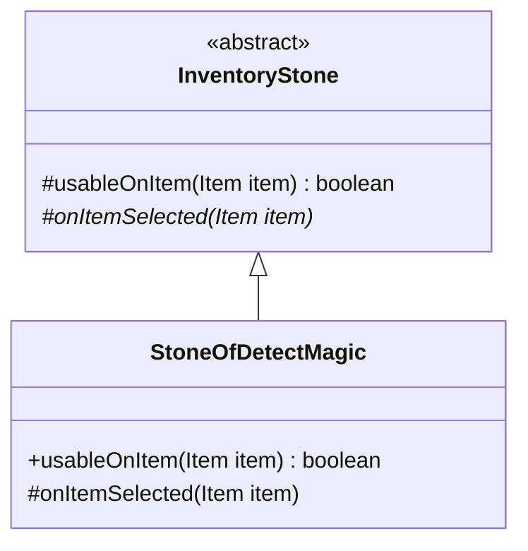

# StoneOfDetectMagic 文档

## 1. 基本信息

| 属性 | 值 |
|------|-----|
| **文件路径** | core/src/main/java/com/shatteredpixel/shatteredpixeldungeon/items/stones/StoneOfDetectMagic.java |
| **包名** | com.shatteredpixel.shatteredpixeldungeon.items.stones |
| **文件类型** | class |
| **继承关系** | extends InventoryStone |
| **代码行数** | 95 |
| **所属模块** | core |

## 2. 文件职责说明

### 核心职责
StoneOfDetectMagic（探魔符石）是一种背包型符石，用于检测未鉴定物品上的魔法属性，判断是否附有诅咒或正向魔法（如附魔、升级）。

### 系统定位
位于 InventoryStone → StoneOfDetectMagic 继承链中，是一种鉴定辅助道具，帮助玩家了解物品的魔法状态。

### 不负责什么
- 不负责完全鉴定物品
- 不负责移除诅咒

## 3. 结构总览

### 主要成员概览
- `preferredBag` - 优先显示背包
- `image` - 精灵图设置

### 主要逻辑块概览
- `usableOnItem()` - 判断物品是否可检测
- `onItemSelected()` - 执行检测并显示结果

### 生命周期/调用时机
1. 玩家在背包中使用符石
2. 选择要检测的物品
3. 检测并显示结果

## 4. 继承与协作关系

### 父类提供的能力
从 InventoryStone 继承：
- `AC_USE` - 使用动作
- `itemSelector` - 物品选择器
- `useAnimation()` - 使用动画

### 覆写的方法
| 方法 | 覆写逻辑 |
|------|----------|
| `usableOnItem(Item item)` | 检查物品是否未鉴定或诅咒状态未知 |
| `onItemSelected(Item item)` | 检测物品魔法属性并显示结果 |

### 依赖的关键类
| 类名 | 用途 |
|------|------|
| `Belongings` | 背包类型定义 |
| `EquipableItem` | 可装备物品基类 |
| `Item` | 物品基类 |
| `Weapon` | 武器类（检查诅咒附魔） |
| `Armor` | 护甲类（检查诅咒刻印） |
| `Wand` | 法杖类 |
| `Catalog` | 使用统计 |
| `Talent` | 天赋系统 |
| `GLog` | 游戏日志 |

## 5. 字段/常量详解

### 静态常量
无静态常量定义。

### 实例字段
| 字段名 | 类型 | 默认值 | 说明 |
|--------|------|--------|------|
| `preferredBag` | Class | Belongings.Backpack.class | 优先显示背包类型 |
| `image` | int | ItemSpriteSheet.STONE_DETECT | 符石精灵图 |

## 6. 构造与初始化机制

### 构造器
使用默认构造器，通过实例初始化块设置属性：

```java
{
    preferredBag = Belongings.Backpack.class;
    image = ItemSpriteSheet.STONE_DETECT;
}
```

## 7. 方法详解

### usableOnItem(Item item)

**可见性**：public

**是否覆写**：是，覆写自 InventoryStone

**方法职责**：判断物品是否可以被检测。

**参数**：
- `item` (Item)：要检查的物品

**返回值**：boolean，是否可检测

**核心实现逻辑**：
```java
@Override
public boolean usableOnItem(Item item){
    return (item instanceof EquipableItem || item instanceof Wand)
            && (!item.isIdentified() || !item.cursedKnown);
}
```

**边界情况**：
- 只能检测可装备物品或法杖
- 已鉴定且已知诅咒状态的物品无法检测

---

### onItemSelected(Item item)

**可见性**：protected

**是否覆写**：是，覆写自 InventoryStone

**方法职责**：检测物品的魔法属性并显示结果。

**参数**：
- `item` (Item)：选择的物品

**返回值**：void

**副作用**：
- 设置物品的 `cursedKnown = true`
- 显示检测结果日志
- 消耗符石

**核心实现逻辑**：
```java
@Override
protected void onItemSelected(Item item) {
    item.cursedKnown = true;
    useAnimation();

    boolean negativeMagic = false;
    boolean positiveMagic = false;

    // 检测诅咒
    negativeMagic = item.cursed;
    if (!negativeMagic){
        if (item instanceof Weapon && ((Weapon) item).hasCurseEnchant()){
            negativeMagic = true;
        } else if (item instanceof Armor && ((Armor) item).hasCurseGlyph()){
            negativeMagic = true;
        }
    }

    // 检测正向魔法
    positiveMagic = item.trueLevel() > 0;
    if (!positiveMagic){
        if (item instanceof Weapon && ((Weapon) item).hasGoodEnchant()){
            positiveMagic = true;
        } else if (item instanceof Armor && ((Armor) item).hasGoodGlyph()){
            positiveMagic = true;
        }
    }

    // 显示结果
    if (!positiveMagic && !negativeMagic){
        GLog.i(Messages.get(this, "detected_none"));
    } else if (positiveMagic && negativeMagic) {
        GLog.h(Messages.get(this, "detected_both"));
    } else if (positiveMagic){
        GLog.p(Messages.get(this, "detected_good"));
    } else if (negativeMagic){
        GLog.w(Messages.get(this, "detected_bad"));
    }

    if (!anonymous) {
        curItem.detach(curUser.belongings.backpack);
        Catalog.countUse(getClass());
        Talent.onRunestoneUsed(curUser, curUser.pos, getClass());
    }
}
```

**检测逻辑说明**：
- **负面魔法**：物品诅咒、武器诅咒附魔、护甲诅咒刻印
- **正向魔法**：物品升级等级 > 0、武器正向附魔、护甲正向刻印

## 8. 对外暴露能力

### 显式 API
| 方法 | 用途 |
|------|------|
| `usableOnItem(Item)` | 判断物品是否可检测 |
| `onItemSelected(Item)` | 执行检测并显示结果 |

## 9. 运行机制与调用链

```
使用符石 → InventoryStone.execute(AC_USE)
    → GameScene.selectItem() 显示物品选择
    → 玩家选择物品 → onItemSelected()
    → 检测物品魔法属性
    → 显示结果日志
    → 消耗符石
```

## 10. 资源、配置与国际化关联

### 引用的 messages 文案
| 键名 | 中文翻译 | 用途 |
|------|---------|------|
| items.stones.stoneofdetectmagic.name | 探魔符石 | 物品名称 |
| items.stones.stoneofdetectmagic.inv_title | 探测一件物品 | 选择界面标题 |
| items.stones.stoneofdetectmagic.detected_none | 你探测出这件物品并不附有任何魔咒。 | 无魔法结果 |
| items.stones.stoneofdetectmagic.detected_both | 你探测出这件物品附有附魔/升级与诅咒！ | 双重魔法结果 |
| items.stones.stoneofdetectmagic.detected_good | 你探测出这件物品附有附魔/升级！ | 正向魔法结果 |
| items.stones.stoneofdetectmagic.detected_bad | 你探测出这件物品附有诅咒！ | 负面魔法结果 |
| items.stones.stoneofdetectmagic.desc | 这颗符石能够侦测物品上的魔咒... | 物品描述 |

### 中文翻译来源
来自 `items_zh.properties` 文件。

## 11. 使用示例

### 基本用法
```java
// 使用探魔符石
StoneOfDetectMagic stone = new StoneOfDetectMagic();

// 玩家选择未鉴定物品
// 系统显示物品的魔法状态
// 例如："你探测出这件物品附有诅咒！"
```

## 12. 开发注意事项

### 状态依赖
- 检测后会设置 `item.cursedKnown = true`
- 日志类型根据结果不同：i（普通）、h（高亮）、p（正面）、w（警告）

### 常见陷阱
- 已完全鉴定的物品无法使用此符石
- 不会显示具体的附魔/刻印类型

## 13. 事实核查清单

- [x] 是否已覆盖全部字段
- [x] 是否已覆盖全部方法
- [x] 是否已检查继承链与覆写关系
- [x] 是否已核对官方中文翻译
- [x] 是否存在任何推测性表述（无）
- [x] 示例代码是否真实可用

---

## 附：类关系图

