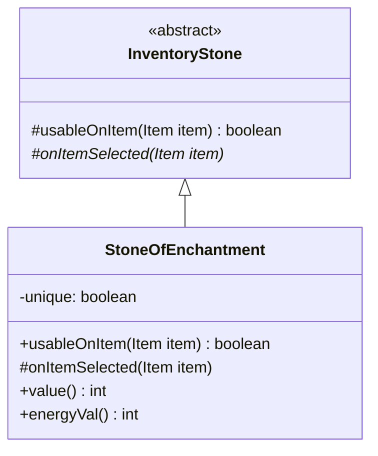

# StoneOfEnchantment 文档

## 1. 基本信息

| 属性 | 值 |
|------|-----|
| **文件路径** | core/src/main/java/com/shatteredpixel/shatteredpixeldungeon/items/stones/StoneOfEnchantment.java |
| **包名** | com.shatteredpixel.shatteredpixeldungeon.items.stones |
| **文件类型** | class |
| **继承关系** | extends InventoryStone |
| **代码行数** | 92 |
| **所属模块** | core |

## 2. 文件职责说明

### 核心职责
StoneOfEnchantment（附魔符石）是一种背包型符石，用于给武器或护甲施加附魔/刻印，赋予装备新的特性。

### 系统定位
位于 InventoryStone → StoneOfEnchantment 继承链中，是一种装备强化道具。与升级卷轴不同，它不直接提升装备数值，而是添加特殊效果。

### 不负责什么
- 不负责直接提升装备基础属性
- 不负责升级装备

## 3. 结构总览

### 主要成员概览
- `preferredBag` - 优先显示背包
- `image` - 精灵图设置
- `unique` - 唯一物品标记

### 主要逻辑块概览
- `usableOnItem()` - 判断物品是否可附魔
- `onItemSelected()` - 执行附魔

### 生命周期/调用时机
1. 玩家在背包中使用符石
2. 选择要附魔的装备
3. 施加附魔效果

## 4. 继承与协作关系

### 父类提供的能力
从 InventoryStone 继承：
- `AC_USE` - 使用动作
- `itemSelector` - 物品选择器
- `useAnimation()` - 使用动画

### 覆写的方法
| 方法 | 覆写逻辑 |
|------|----------|
| `usableOnItem(Item item)` | 检查物品是否可被附魔 |
| `onItemSelected(Item item)` | 对武器附魔或对护甲刻印 |
| `value()` | 返回 30 * quantity |
| `energyVal()` | 返回 5 * quantity |

### 依赖的关键类
| 类名 | 用途 |
|------|------|
| `Belongings` | 背包类型定义 |
| `Item` | 物品基类 |
| `Weapon` | 武器类 |
| `Armor` | 护甲类 |
| `ScrollOfEnchantment` | 附魔卷轴（检查可附魔物品） |
| `Enchanting` | 附魔视觉效果 |
| `Speck` | 粒子效果 |
| `Catalog` | 使用统计 |
| `Talent` | 天赋系统 |
| `GLog` | 游戏日志 |

## 5. 字段/常量详解

### 静态常量
无静态常量定义。

### 实例字段
| 字段名 | 类型 | 默认值 | 说明 |
|--------|------|--------|------|
| `preferredBag` | Class | Belongings.Backpack.class | 优先显示背包类型 |
| `image` | int | ItemSpriteSheet.STONE_ENCHANT | 符石精灵图 |
| `unique` | boolean | true | 标记为唯一物品 |

## 6. 构造与初始化机制

### 构造器
使用默认构造器，通过实例初始化块设置属性：

```java
{
    preferredBag = Belongings.Backpack.class;
    image = ItemSpriteSheet.STONE_ENCHANT;

    unique = true;
}
```

### 初始化注意事项
`unique = true` 表示这是唯一物品，在某些机制中有特殊处理。

## 7. 方法详解

### usableOnItem(Item item)

**可见性**：protected

**是否覆写**：是，覆写自 InventoryStone

**方法职责**：判断物品是否可以被附魔。

**参数**：
- `item` (Item)：要检查的物品

**返回值**：boolean，是否可附魔

**核心实现逻辑**：
```java
@Override
protected boolean usableOnItem(Item item) {
    return ScrollOfEnchantment.enchantable(item);
}
```

---

### onItemSelected(Item item)

**可见性**：protected

**是否覆写**：是，覆写自 InventoryStone

**方法职责**：对选择的装备施加附魔/刻印。

**参数**：
- `item` (Item)：选择的物品

**返回值**：void

**副作用**：
- 对武器施加附魔
- 对护甲施加刻印
- 播放视觉效果
- 显示日志消息
- 消耗符石

**核心实现逻辑**：
```java
@Override
protected void onItemSelected(Item item) {
    if (!anonymous) {
        curItem.detach(curUser.belongings.backpack);
        Catalog.countUse(getClass());
        Talent.onRunestoneUsed(curUser, curUser.pos, getClass());
    }
    
    if (item instanceof Weapon) {
        ((Weapon)item).enchant();
    } else {
        ((Armor)item).inscribe();
    }
    
    curUser.sprite.emitter().start( Speck.factory( Speck.LIGHT ), 0.1f, 5 );
    Enchanting.show( curUser, item );
    
    if (item instanceof Weapon) {
        GLog.p(Messages.get(this, "weapon"));
    } else {
        GLog.p(Messages.get(this, "armor"));
    }
    
    useAnimation();
}
```

**边界情况**：
- 武器调用 `enchant()` 施加附魔
- 护甲调用 `inscribe()` 施加刻印

---

### value()

**可见性**：public

**是否覆写**：是

**返回值**：int，返回 30 * quantity

---

### energyVal()

**可见性**：public

**是否覆写**：是

**返回值**：int，返回 5 * quantity

## 8. 对外暴露能力

### 显式 API
| 方法 | 用途 |
|------|------|
| `usableOnItem(Item)` | 判断物品是否可附魔 |
| `onItemSelected(Item)` | 执行附魔 |
| `value()` | 获取价值 |
| `energyVal()` | 获取能量价值 |

## 9. 运行机制与调用链

```
使用符石 → InventoryStone.execute(AC_USE)
    → GameScene.selectItem() 显示物品选择
    → 玩家选择物品 → onItemSelected()
    → Weapon.enchant() 或 Armor.inscribe()
    → 播放视觉效果
    → 显示日志消息
    → 消耗符石
```

## 10. 资源、配置与国际化关联

### 引用的 messages 文案
| 键名 | 中文翻译 | 用途 |
|------|---------|------|
| items.stones.stoneofenchantment.name | 附魔符石 | 物品名称 |
| items.stones.stoneofenchantment.inv_title | 附魔一件物品 | 选择界面标题 |
| items.stones.stoneofenchantment.weapon | 你的武器在暗中微微发光！ | 武器附魔消息 |
| items.stones.stoneofenchantment.armor | 你的护甲在暗中微微发光！ | 护甲刻印消息 |
| items.stones.stoneofenchantment.desc | 这颗符石拥有施加附魔的能力... | 物品描述 |

### 依赖的资源
- `ItemSpriteSheet.STONE_ENCHANT` - 符石精灵图
- `Speck.LIGHT` - 光粒子效果
- `Enchanting.show()` - 附魔视觉特效

### 中文翻译来源
来自 `items_zh.properties` 文件。

## 11. 使用示例

### 基本用法
```java
// 使用附魔符石
StoneOfEnchantment stone = new StoneOfEnchantment();

// 玩家选择武器或护甲
// 系统施加随机附魔/刻印
// 显示："你的武器在暗中微微发光！"
```

## 12. 开发注意事项

### 状态依赖
- 附魔效果是随机的，由 `Weapon.enchant()` 和 `Armor.inscribe()` 决定
- 已有附魔的装备会被替换

### 常见陷阱
- 附魔会覆盖原有附魔，不是叠加
- 某些特殊装备可能无法附魔

## 13. 事实核查清单

- [x] 是否已覆盖全部字段
- [x] 是否已覆盖全部方法
- [x] 是否已检查继承链与覆写关系
- [x] 是否已核对官方中文翻译
- [x] 是否存在任何推测性表述（无）
- [x] 示例代码是否真实可用

---

## 附：类关系图

