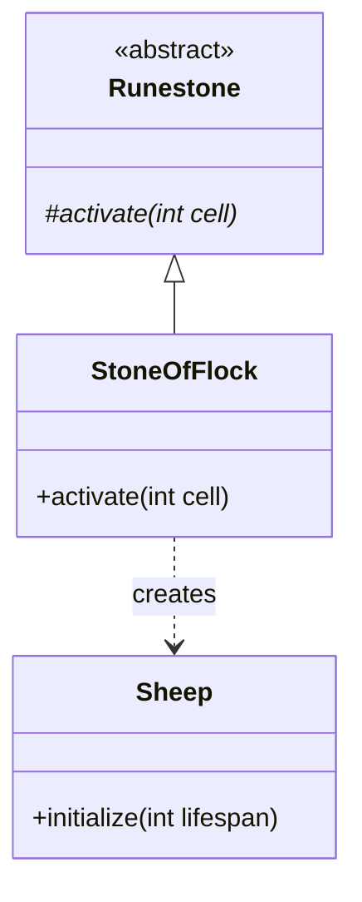

# StoneOfFlock 文档

## 1. 基本信息

| 属性 | 值 |
|------|-----|
| **文件路径** | core/src/main/java/com/shatteredpixel/shatteredpixeldungeon/items/stones/StoneOfFlock.java |
| **包名** | com.shatteredpixel.shatteredpixeldungeon.items.stones |
| **文件类型** | class |
| **继承关系** | extends Runestone |
| **代码行数** | 74 |
| **所属模块** | core |

## 2. 文件职责说明

### 核心职责
StoneOfFlock（羊群符石）是一种投掷型符石，被投掷后会在目标位置周围召唤一群魔法绵羊，阻挡移动。

### 系统定位
位于 Runestone → StoneOfFlock 继承链中，是一种控制/阻碍型符石，可用于封锁区域或阻挡敌人移动。

### 不负责什么
- 不负责直接造成伤害
- 不负责对敌人产生直接效果

## 3. 结构总览

### 主要成员概览
- `image` - 精灵图设置

### 主要逻辑块概览
- `activate(int cell)` - 召唤魔法绵羊

### 生命周期/调用时机
1. 玩家投掷符石到目标位置
2. 符石激活
3. 在目标周围生成魔法绵羊

## 4. 继承与协作关系

### 父类提供的能力
从 Runestone 继承：
- `stackable = true` - 可堆叠
- `defaultAction = AC_THROW` - 默认动作为投掷
- `onThrow()` - 投掷逻辑
- `activate()` - 激活方法（需覆写）

### 覆写的方法
| 方法 | 覆写逻辑 |
|------|----------|
| `activate(int cell)` | 在目标周围召唤魔法绵羊 |

### 依赖的关键类
| 类名 | 用途 |
|------|------|
| `Dungeon` | 关卡数据 |
| `Actor` | 查找位置上的角色 |
| `Sheep` | 魔法绵羊 NPC |
| `CellEmitter` | 单元格特效发射器 |
| `Speck` | 粒子效果 |
| `GameScene` | 游戏场景 |
| `BArray` | 布尔数组工具 |
| `PathFinder` | 路径查找器 |
| `ItemSpriteSheet` | 精灵图定义 |
| `Sample` | 音效播放 |

## 5. 字段/常量详解

### 静态常量
无静态常量定义。

### 实例字段
| 字段名 | 类型 | 默认值 | 说明 |
|--------|------|--------|------|
| `image` | int | ItemSpriteSheet.STONE_FLOCK | 符石精灵图 |

## 6. 构造与初始化机制

### 构造器
使用默认构造器，通过实例初始化块设置属性：

```java
{
    image = ItemSpriteSheet.STONE_FLOCK;
}
```

## 7. 方法详解

### activate(int cell)

**可见性**：protected

**是否覆写**：是，覆写自 Runestone

**方法职责**：在目标位置周围召唤魔法绵羊。

**参数**：
- `cell` (int)：激活位置的格子坐标

**返回值**：void

**副作用**：
- 在目标周围2格范围内生成魔法绵羊
- 播放视觉效果
- 播放音效

**核心实现逻辑**：
```java
@Override
protected void activate(int cell) {
    // 构建距离地图，查找2格范围内的非固体格子
    PathFinder.buildDistanceMap( cell, BArray.not( Dungeon.level.solid, null ), 2 );
    ArrayList<Integer> spawnPoints = new ArrayList<>();
    for (int i = 0; i < PathFinder.distance.length; i++) {
        if (PathFinder.distance[i] < Integer.MAX_VALUE) {
            spawnPoints.add(i);
        }
    }

    // 在每个有效位置生成绵羊
    for (int i : spawnPoints){
        if (Dungeon.level.insideMap(i)
                && Actor.findChar(i) == null
                && !(Dungeon.level.pit[i])) {
            Sheep sheep = new Sheep();
            sheep.initialize(8);  // 设置8回合寿命
            sheep.pos = i;
            GameScene.add(sheep);
            Dungeon.level.occupyCell(sheep);
            CellEmitter.get(i).burst(Speck.factory(Speck.WOOL), 4);
        }
    }

    // 播放效果
    CellEmitter.get(cell).burst(Speck.factory(Speck.WOOL), 4);
    Sample.INSTANCE.play(Assets.Sounds.PUFF);
    Sample.INSTANCE.play(Assets.Sounds.SHEEP);
}
```

**边界情况**：
- 只在地图内、无角色、非深坑的位置生成绵羊
- 绵羊有8回合的寿命

## 8. 对外暴露能力

### 显式 API
| 方法 | 用途 |
|------|------|
| `activate(int cell)` | 激活符石效果（由父类调用） |

## 9. 运行机制与调用链

```
投掷动作 → Runestone.onThrow() → activate()
    → PathFinder.buildDistanceMap() 计算范围
    → 遍历有效位置
    → 创建 Sheep 对象
    → GameScene.add() 添加到场景
    → 播放视觉和音效
```

## 10. 资源、配置与国际化关联

### 引用的 messages 文案
| 键名 | 中文翻译 | 用途 |
|------|---------|------|
| items.stones.stoneofflock.name | 羊群符石 | 物品名称 |
| items.stones.stoneofflock.desc | 这颗符石被扔出后会在目的地召唤一群魔法绵羊。 | 物品描述 |

### 依赖的资源
- `ItemSpriteSheet.STONE_FLOCK` - 符石精灵图
- `Assets.Sounds.PUFF` - 噗声
- `Assets.Sounds.SHEEP` - 羊叫声
- `Speck.WOOL` - 羊毛粒子效果

### 中文翻译来源
来自 `items_zh.properties` 文件。

## 11. 使用示例

### 基本用法
```java
// 创建并投掷羊群符石
StoneOfFlock stone = new StoneOfFlock();
stone.quantity = 1;

// 投掷到目标位置
stone.doThrow(hero, targetCell);

// 会在目标周围生成一群魔法绵羊
```

### 战术应用
```java
// 用于封锁走廊或通道
// 阻挡敌人移动
// 创造逃跑或治疗的机会
// 绵羊会在8回合后消失
```

## 12. 开发注意事项

### 状态依赖
- 绵羊的寿命由 `Sheep.initialize(8)` 设置
- 绵羊会占据位置，阻止角色移动

### 常见陷阱
- 绵羊不会阻挡远程攻击
- 强敌可能会杀死绵羊

## 13. 事实核查清单

- [x] 是否已覆盖全部字段
- [x] 是否已覆盖全部方法
- [x] 是否已检查继承链与覆写关系
- [x] 是否已核对官方中文翻译
- [x] 是否存在任何推测性表述（无）
- [x] 示例代码是否真实可用

---

## 附：类关系图

