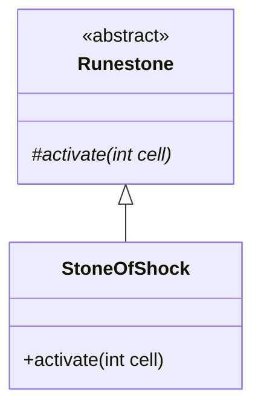

# StoneOfShock 文档

## 1. 基本信息

| 属性 | 值 |
|------|-----|
| **文件路径** | core/src/main/java/com/shatteredpixel/shatteredpixeldungeon/items/stones/StoneOfShock.java |
| **包名** | com.shatteredpixel.shatteredpixeldungeon.items.stones |
| **文件类型** | class |
| **继承关系** | extends Runestone |
| **代码行数** | 78 |
| **所属模块** | core |

## 2. 文件职责说明

### 核心职责
StoneOfShock（电击符石）是一种投掷型符石，被投掷后释放一阵电能量，麻痹范围内所有目标并根据命中的目标数量恢复使用者的法杖充能。

### 系统定位
位于 Runestone → StoneOfShock 继承链中，是一种攻击/辅助型符石，同时具有控制和充能效果。

### 不负责什么
- 不负责直接造成大量伤害
- 不负责对使用者产生效果

## 3. 结构总览

### 主要成员概览
- `image` - 精灵图设置

### 主要逻辑块概览
- `activate(int cell)` - 释放电击并充能

### 生命周期/调用时机
1. 玩家投掷符石到目标位置
2. 符石激活
3. 对范围内目标施加麻痹
4. 为使用者的法杖充能

## 4. 继承与协作关系

### 父类提供的能力
从 Runestone 继承：
- `stackable = true` - 可堆叠
- `defaultAction = AC_THROW` - 默认动作为投掷
- `onThrow()` - 投掷逻辑
- `activate()` - 激活方法（需覆写）

### 覆写的方法
| 方法 | 覆写逻辑 |
|------|----------|
| `activate(int cell)` | 释放电击效果并充能 |

### 依赖的关键类
| 类名 | 用途 |
|------|------|
| `Dungeon` | 关卡数据 |
| `Actor` | 查找位置上的角色 |
| `Char` | 角色基类 |
| `Buff` | Buff 管理器 |
| `Paralysis` | 麻痹 Buff |
| `Lightning` | 闪电视觉效果 |
| `CellEmitter` | 单元格特效发射器 |
| `SparkParticle` | 火花粒子 |
| `EnergyParticle` | 能量粒子 |
| `BArray` | 布尔数组工具 |
| `PathFinder` | 路径查找器 |
| `ItemSpriteSheet` | 精灵图定义 |
| `Sample` | 音效播放 |

## 5. 字段/常量详解

### 静态常量
无静态常量定义。

### 实例字段
| 字段名 | 类型 | 默认值 | 说明 |
|--------|------|--------|------|
| `image` | int | ItemSpriteSheet.STONE_SHOCK | 符石精灵图 |

## 6. 构造与初始化机制

### 构造器
使用默认构造器，通过实例初始化块设置属性：

```java
{
    image = ItemSpriteSheet.STONE_SHOCK;
}
```

## 7. 方法详解

### activate(int cell)

**可见性**：protected

**是否覆写**：是，覆写自 Runestone

**方法职责**：释放电击效果，麻痹范围内目标并为使用者充能。

**参数**：
- `cell` (int)：激活位置的格子坐标

**返回值**：void

**副作用**：
- 对范围内目标施加 Paralysis Buff（1回合）
- 为使用者的法杖充能
- 播放闪电视觉效果
- 播放音效

**核心实现逻辑**：
```java
@Override
protected void activate(int cell) {
    Sample.INSTANCE.play( Assets.Sounds.LIGHTNING );
    
    ArrayList<Lightning.Arc> arcs = new ArrayList<>();
    int hits = 0;
    
    // 查找2格范围内的所有角色
    PathFinder.buildDistanceMap( cell, BArray.not( Dungeon.level.solid, null ), 2 );
    for (int i = 0; i < PathFinder.distance.length; i++) {
        if (PathFinder.distance[i] < Integer.MAX_VALUE) {
            Char n = Actor.findChar(i);
            if (n != null) {
                arcs.add(new Lightning.Arc(cell, n.sprite.center()));
                Buff.prolong(n, Paralysis.class, 1f);
                hits++;
            }
        }
    }
    
    // 火花效果
    CellEmitter.center( cell ).burst( SparkParticle.FACTORY, 3 );
    
    // 如果命中目标，显示闪电并充能
    if (hits > 0) {
        curUser.sprite.parent.addToFront( new Lightning( arcs, null ) );
        curUser.sprite.centerEmitter().burst(EnergyParticle.FACTORY, 10);
        Sample.INSTANCE.play( Assets.Sounds.LIGHTNING );
        
        // 充能：1 + 命中数量
        curUser.belongings.charge(1f + hits);
    }
}
```

**边界情况**：
- 只对2格范围内的角色生效
- 无目标时只播放音效，不显示闪电
- 充能量 = 1 + 命中目标数

## 8. 对外暴露能力

### 显式 API
| 方法 | 用途 |
|------|------|
| `activate(int cell)` | 激活符石效果（由父类调用） |

## 9. 运行机制与调用链

```
投掷动作 → Runestone.onThrow() → activate()
    → PathFinder.buildDistanceMap() 计算范围
    → 遍历范围内的角色
    → 施加 Paralysis Buff
    → 记录命中数量
    → 显示闪电效果
    → 为法杖充能（1 + hits）
```

## 10. 资源、配置与国际化关联

### 引用的 messages 文案
| 键名 | 中文翻译 | 用途 |
|------|---------|------|
| items.stones.stoneofshock.name | 电击符石 | 物品名称 |
| items.stones.stoneofshock.desc | 这颗符石被扔出后会爆出一阵电能量，短暂麻痹范围内所有目标... | 物品描述 |

### 依赖的资源
- `ItemSpriteSheet.STONE_SHOCK` - 符石精灵图
- `Assets.Sounds.LIGHTNING` - 闪电音效
- `Lightning.Arc` - 闪电弧线视觉效果
- `SparkParticle` - 火花粒子
- `EnergyParticle` - 能量粒子

### 中文翻译来源
来自 `items_zh.properties` 文件。

## 11. 使用示例

### 基本用法
```java
// 创建并投掷电击符石
StoneOfShock stone = new StoneOfShock();
stone.quantity = 1;

// 投掷到敌人聚集的位置
stone.doThrow(hero, targetCell);

// 范围内敌人会被麻痹
// 使用者的法杖获得充能
```

### 战术应用
```java
// 用于控制多个敌人
// 同时为法杖充能
// 配合法杖使用效果更佳
// 命中越多目标充能越多
```

## 12. 开发注意事项

### 状态依赖
- 充能量依赖命中的目标数量
- 麻痹时间固定为1回合

### 常见陷阱
- 对自己范围内的敌人也会生效
- 不会伤害目标，只有麻痹效果

## 13. 事实核查清单

- [x] 是否已覆盖全部字段
- [x] 是否已覆盖全部方法
- [x] 是否已检查继承链与覆写关系
- [x] 是否已核对官方中文翻译
- [x] 是否存在任何推测性表述（无）
- [x] 示例代码是否真实可用

---

## 附：类关系图

