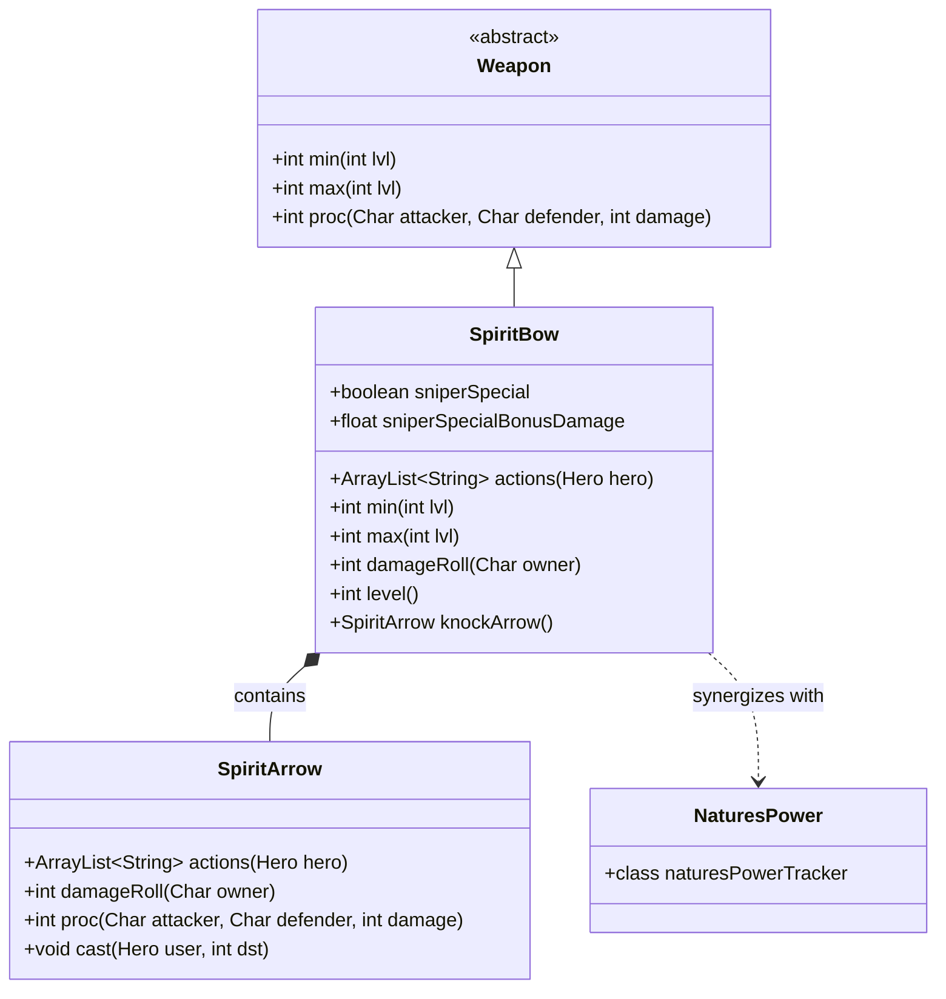

# SpiritBow 类文档

## 1. 基本信息
| 属性 | 值 |
|------|-----|
| 文件路径 | core/src/main/java/com/shatteredpixel/shatteredpixeldungeon/items/weapon/SpiritBow.java |
| 包名 | com.shatteredpixel.shatteredpixeldungeon.items.weapon |
| 类类型 | public class |
| 继承关系 | extends Weapon |
| 代码行数 | 505 行 |

## 2. 类职责说明
SpiritBow（灵魂之弓）是猎手职业的专属武器。它是一个独特的远程武器，无需弹药，通过射击自动生成的灵魂之箭进行攻击。伤害随英雄等级提升，并支持与自然之力能力的协同效果。该武器不可升级，但会随着英雄等级自动变强。

## 4. 继承与协作关系


## 静态常量表
| 常量名 | 类型 | 值 | 说明 |
|--------|------|-----|------|
| AC_SHOOT | String | "SHOOT" | 射击动作标识符 |

## 实例字段表
| 字段名 | 类型 | 修饰符 | 说明 |
|--------|------|--------|------|
| sniperSpecial | boolean | public | 是否激活狙击特殊技能 |
| sniperSpecialBonusDamage | float | public | 狙击特殊技能的额外伤害加成 |
| targetPos | int | private | 目标位置，用于狙击特殊技能 |
| shooter | CellSelector.Listener | private | 目标选择监听器 |
| harmfulPlants | Class[] | private static | 有害植物类数组，用于自然之怒天赋 |

## 7. 方法详解

### actions
**签名**: `public ArrayList<String> actions(Hero hero)`
**功能**: 获取弓的可用动作列表
**参数**: 
- `hero` - 执行动作的英雄
**返回值**: 动作字符串列表
**实现逻辑**: 
```java
// 第76-81行
ArrayList<String> actions = super.actions(hero);      // 获取父类动作
actions.remove(AC_EQUIP);                             // 移除装备动作（自动装备）
actions.add(AC_SHOOT);                                // 添加射击动作
return actions;
```

### execute
**签名**: `public void execute(Hero hero, String action)`
**功能**: 执行指定动作
**参数**: 
- `hero` - 执行动作的英雄
- `action` - 动作名称
**返回值**: 无
**实现逻辑**: 
```java
// 第84-95行
super.execute(hero, action);                          // 调用父类execute

if (action.equals(AC_SHOOT)) {                        // 如果是射击动作
    curUser = hero;                                   // 设置当前用户
    curItem = this;                                   // 设置当前物品
    GameScene.selectCell( shooter );                  // 打开目标选择器
}
```

### proc
**签名**: `public int proc(Char attacker, Char defender, int damage)`
**功能**: 处理命中效果，包括自然之怒天赋
**参数**: 
- `attacker` - 攻击者
- `defender` - 防御者
- `damage` - 基础伤害
**返回值**: 处理后的伤害值
**实现逻辑**: 
```java
// 第102-135行
if (attacker.buff(NaturesPower.naturesPowerTracker.class) != null && !sniperSpecial){
    // 如果有自然之力buff且不是狙击特殊技能
    Actor.add(new Actor() {
        { actPriority = VFX_PRIO; }
        
        protected boolean act() {
            // 自然之怒天赋：有几率触发有害植物效果
            if (Random.Int(12) < ((Hero)attacker).pointsInTalent(Talent.NATURES_WRATH)){
                Plant plant = (Plant) Reflection.newInstance(Random.element(harmfulPlants));
                plant.pos = defender.pos;
                plant.activate( defender.isAlive() ? defender : null );
            }

            // 狂野动量天赋：击杀延长自然之力持续时间
            if (!defender.isAlive()){
                NaturesPower.naturesPowerTracker tracker = attacker.buff(NaturesPower.naturesPowerTracker.class);
                if (tracker != null){
                    tracker.extend(((Hero) attacker).pointsInTalent(Talent.WILD_MOMENTUM));
                }
            }

            Actor.remove(this);
            return true;
        }
    });
}

return super.proc(attacker, defender, damage);
```

### info
**签名**: `public String info()`
**功能**: 获取弓的详细信息
**参数**: 无
**返回值**: 信息字符串
**实现逻辑**: 
```java
// 第138-181行
String info = super.info();                           // 获取父类信息

// 添加伤害统计
info += "\n\n" + Messages.get( SpiritBow.class, "stats",
        Math.round(augment.damageFactor(min())),
        Math.round(augment.damageFactor(max())),
        STRReq());

// 添加力量需求说明
if (STRReq() > Dungeon.hero.STR()) {
    info += " " + Messages.get(Weapon.class, "too_heavy");
} else if (Dungeon.hero.STR() > STRReq()){
    info += " " + Messages.get(Weapon.class, "excess_str", Dungeon.hero.STR() - STRReq());
}

// 添加强化类型说明
switch (augment) {
    case SPEED: info += "\n\n" + Messages.get(Weapon.class, "faster"); break;
    case DAMAGE: info += "\n\n" + Messages.get(Weapon.class, "stronger"); break;
    case NONE:
}

// 添加附魔信息
if (enchantment != null && (cursedKnown || !enchantment.curse())){
    info += "\n\n" + Messages.capitalize(Messages.get(Weapon.class, "enchanted", enchantment.name()));
    if (enchantHardened) info += " " + Messages.get(Weapon.class, "enchant_hardened");
    info += " " + enchantment.desc();
}

// 添加诅咒状态
// ...

// 添加射程说明
info += "\n\n" + Messages.get(MissileWeapon.class, "distance");

return info;
```

### STRReq
**签名**: `public int STRReq(int lvl)`
**功能**: 获取力量需求
**参数**: 
- `lvl` - 武器等级
**返回值**: 力量需求值
**实现逻辑**: 
```java
// 第184-186行
return STRReq(1, lvl);                                // 固定为1阶武器的力量需求
```

### min
**签名**: `public int min(int lvl)`
**功能**: 计算最小伤害
**参数**: 
- `lvl` - 武器等级
**返回值**: 最小伤害值
**实现逻辑**: 
```java
// 第189-194行
int dmg = 1 + Dungeon.hero.lvl/5                     // 英雄等级贡献
        + RingOfSharpshooting.levelDamageBonus(Dungeon.hero)  // 神射戒加成
        + (curseInfusionBonus ? 1 + Dungeon.hero.lvl/30 : 0); // 诅咒灌注加成
return Math.max(0, dmg);
```

### max
**签名**: `public int max(int lvl)`
**功能**: 计算最大伤害
**参数**: 
- `lvl` - 武器等级
**返回值**: 最大伤害值
**实现逻辑**: 
```java
// 第197-202行
int dmg = 6 + (int)(Dungeon.hero.lvl/2.5f)           // 英雄等级贡献
        + 2*RingOfSharpshooting.levelDamageBonus(Dungeon.hero)  // 神射戒加成
        + (curseInfusionBonus ? 2 + Dungeon.hero.lvl/15 : 0);   // 诅咒灌注加成
return Math.max(0, dmg);
```

### targetingPos
**签名**: `public int targetingPos(Hero user, int dst)`
**功能**: 获取瞄准位置
**参数**: 
- `user` - 使用者
- `dst` - 目标位置
**返回值**: 实际瞄准位置
**实现逻辑**: 
```java
// 第205-207行
return knockArrow().targetingPos(user, dst);          // 委托给箭矢
```

### damageRoll
**签名**: `public int damageRoll(Char owner)`
**功能**: 计算伤害掷骰
**参数**: 
- `owner` - 武器持有者
**返回值**: 伤害值
**实现逻辑**: 
```java
// 第212-243行
int damage = augment.damageFactor(super.damageRoll(owner));  // 应用强化修正

// 额外力量加成
if (owner instanceof Hero) {
    int exStr = ((Hero)owner).STR() - STRReq();
    if (exStr > 0) {
        damage += Hero.heroDamageIntRange( 0, exStr );
    }
}

// 狙击特殊技能加成
if (sniperSpecial){
    damage = Math.round(damage * (1f + sniperSpecialBonusDamage));

    switch (augment){
        case NONE:
            damage = Math.round(damage * 0.667f);    // 无强化：66.7%伤害
            break;
        case SPEED:
            damage = Math.round(damage * 0.5f);      // 速度强化：50%伤害，3连射
            break;
        case DAMAGE:
            // 伤害强化：伤害随距离增加，最高3倍
            int distance = Dungeon.level.distance(owner.pos, targetPos) - 1;
            float multiplier = Math.min(3f, 1.2f * (float)Math.pow(1.125f, distance));
            damage = Math.round(damage * multiplier);
            break;
    }
}

return damage;
```

### baseDelay
**签名**: `protected float baseDelay(Char owner)`
**功能**: 计算基础攻击延迟
**参数**: 
- `owner` - 武器持有者
**返回值**: 攻击延迟（回合）
**实现逻辑**: 
```java
// 第246-259行
if (sniperSpecial){
    switch (augment){
        case NONE: default:
            return 0f;                                // 无强化：瞬间攻击
        case SPEED:
            return 1f;                                // 速度强化：1回合
        case DAMAGE:
            return 2f;                                // 伤害强化：2回合
    }
} else{
    return super.baseDelay(owner);
}
```

### speedMultiplier
**签名**: `protected float speedMultiplier(Char owner)`
**功能**: 计算速度乘数
**参数**: 
- `owner` - 武器持有者
**返回值**: 速度乘数
**实现逻辑**: 
```java
// 第262-269行
float speed = super.speedMultiplier(owner);
if (owner.buff(NaturesPower.naturesPowerTracker.class) != null){
    // 自然之力buff提供+33%到+50%速度加成
    speed += ((8 + ((Hero)owner).pointsInTalent(Talent.GROWING_POWER)) / 24f);
}
return speed;
```

### level
**签名**: `public int level()`
**功能**: 获取武器等级（基于英雄等级）
**参数**: 无
**返回值**: 武器等级
**实现逻辑**: 
```java
// 第272-276行
int level = Dungeon.hero == null ? 0 : Dungeon.hero.lvl/5;  // 英雄等级/5
if (curseInfusionBonus) level += 1 + level/6;        // 诅咒灌注加成
return level;
```

### buffedLvl
**签名**: `public int buffedLvl()`
**功能**: 获取增益后的等级
**参数**: 无
**返回值**: 武器等级（不受buff/debuff影响）
**实现逻辑**: 
```java
// 第279-282行
return level();                                      // 等级不受buff影响
```

### isUpgradable
**签名**: `public boolean isUpgradable()`
**功能**: 灵魂之弓不可升级
**参数**: 无
**返回值**: 总是返回false
**实现逻辑**: 第285-287行，直接返回false

### knockArrow
**签名**: `public SpiritArrow knockArrow()`
**功能**: 创建灵魂之箭
**参数**: 无
**返回值**: 新的SpiritArrow实例
**实现逻辑**: 
```java
// 第289-291行
return new SpiritArrow();                            // 创建新箭矢
```

## SpiritArrow 内部类

### 1. 基本信息
SpiritArrow是SpiritBow的内部类，代表灵魂之弓发射的箭矢。它继承自MissileWeapon，但不需要实体弹药。

### 主要方法

| 方法名 | 功能 |
|--------|------|
| actions() | 返回空列表（箭矢不可独立使用） |
| damageRoll() | 委托给SpiritBow.damageRoll() |
| proc() | 委托给SpiritBow.proc() |
| hasEnchant() | 委托给SpiritBow.hasEnchant() |
| onThrow() | 处理箭矢落地，未命中时显示水花效果 |
| cast() | 处理射击逻辑，支持连射（速度强化）和预知射击天赋 |

## 11. 使用示例
```java
// 基本射击
// 点击弓选择"SHOOT"动作，然后选择目标

// 自然之力协同
// 激活自然之力后射击更快，有几率触发植物效果

// 狙击特殊技能
// 根据强化类型有不同的效果：
// - 无强化：快速低伤害射击
// - 速度强化：3连射
// - 伤害强化：高伤害远程狙击，伤害随距离增加
```

## 注意事项
1. **自动成长**: 弓的伤害随英雄等级提升，无需升级
2. **不可升级**: 无法通过升级卷轴提升
3. **专属武器**: 猎手职业专属
4. **无限弹药**: 不需要实体箭矢
5. **狙击技能**: 支持三种不同的狙击特殊技能模式

## 最佳实践
1. 搭配神射戒提升伤害
2. 使用自然之力能力提升射速
3. 狙击技能配合伤害强化可以造成极高伤害
4. 速度强化的狙击技能适合清理多个敌人