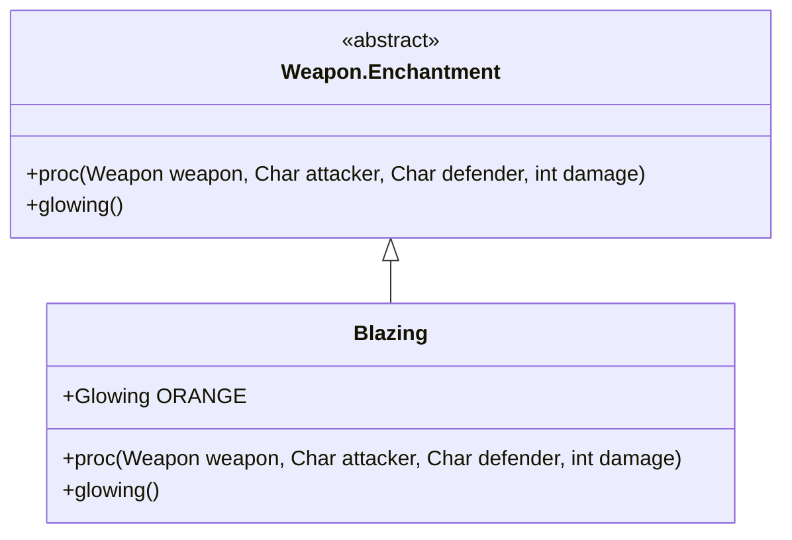

# Blazing 附魔文档

## 1. 基本信息
| 属性 | 值 |
|------|-----|
| 文件路径 | core/src/main/java/com/shatteredpixel/shatteredpixeldungeon/items/weapon/enchantments/Blazing.java |
| 包名 | com.shatteredpixel.shatteredpixeldungeon.items.weapon.enchantments |
| 类类型 | public class |
| 继承关系 | extends Weapon.Enchantment |
| 代码行数 | 75 行 |

## 2. 类职责说明
Blazing（炽焰）附魔使武器在攻击时有机会点燃敌人，造成持续的火焰伤害。如果敌人已经在燃烧，则造成额外的即时火焰伤害。

## 4. 继承与协作关系


## 静态常量表
| 常量名 | 类型 | 值 | 说明 |
|--------|------|-----|------|
| ORANGE | Glowing | 0xFF4400 | 橙色发光效果 |

## 7. 方法详解

### proc
**签名**: `public int proc(Weapon weapon, Char attacker, Char defender, int damage)`
**功能**: 处理攻击效果
**参数**: 
- `weapon` - 武器
- `attacker` - 攻击者
- `defender` - 防御者
- `damage` - 原始伤害
**返回值**: 处理后的伤害
**实现逻辑**:
```java
int level = Math.max(0, weapon.buffedLvl());
// 触发概率: 等级0=33%, 等级1=50%, 等级2=60%
float procChance = (level+1f)/(level+3f) * procChanceMultiplier(attacker);
if (Random.Float() < procChance) {
    float powerMulti = Math.max(1f, procChance);
    
    // 如果敌人未燃烧，施加燃烧效果
    if (defender.buff(Burning.class) == null){
        Buff.affect(defender, Burning.class).reignite(defender, 8f);
        powerMulti -= 1;
    }
    
    // 如果有多余的能量，造成额外伤害
    if (powerMulti > 0){
        int burnDamage = Random.NormalIntRange(1, 3 + Dungeon.scalingDepth()/4);
        burnDamage = Math.round(burnDamage * 0.67f * powerMulti);
        if (burnDamage > 0) {
            defender.damage(burnDamage, this);
        }
    }
    
    defender.sprite.emitter().burst(FlameParticle.FACTORY, level + 1);
}
return damage;
```

### glowing
**签名**: `public Glowing glowing()`
**功能**: 返回附魔发光效果
**返回值**: 橙色发光

## 11. 使用示例
```java
// 武器获得炽焰附魔后
// 攻击时有概率点燃敌人
// 对已燃烧敌人造成额外伤害
```

## 触发概率表
| 武器等级 | 触发概率 |
|---------|---------|
| +0 | 33% |
| +1 | 50% |
| +2 | 60% |

## 最佳实践
- 对付高生命值敌人效果显著
- 燃烧是持续伤害，可以与其他附魔叠加
- 配合火焰免疫可以安全使用