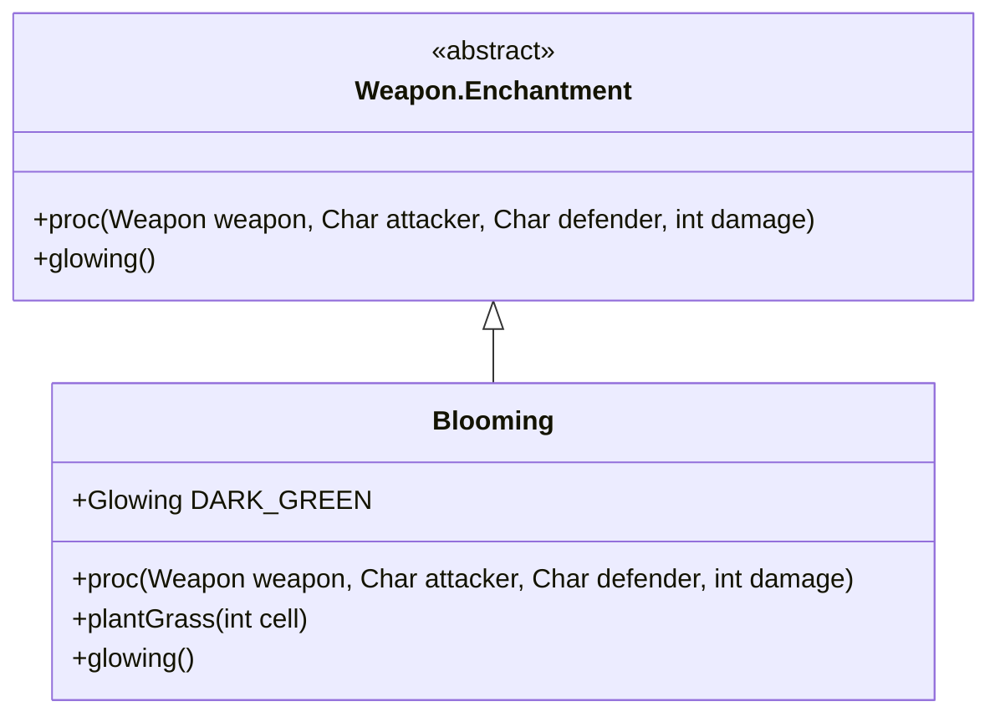

# Blooming 附魔文档

## 1. 基本信息
| 属性 | 值 |
|------|-----|
| 文件路径 | core/src/main/java/com/shatteredpixel/shatteredpixeldungeon/items/weapon/enchantments/Blooming.java |
| 包名 | com.shatteredpixel.shatteredpixeldungeon.items.weapon.enchantments |
| 类类型 | public class |
| 继承关系 | extends Weapon.Enchantment |
| 代码行数 | 117 行 |

## 2. 类职责说明
Blooming（绽放）附魔使武器在攻击时有机会在目标位置及周围生成高草。高草可以阻挡视线、触发植物效果，是环境控制型附魔。

## 4. 继承与协作关系


## 7. 方法详解

### proc
**签名**: `public int proc(Weapon weapon, Char attacker, Char defender, int damage)`
**功能**: 处理攻击效果，生成草
**实现逻辑**:
```java
int level = Math.max(0, weapon.buffedLvl());
// 触发概率: 等级0=33%, 等级1=50%, 等级2=60%
float procChance = (level+1f)/(level+3f) * procChanceMultiplier(attacker);
if (Random.Float() < procChance) {
    float powerMulti = Math.max(1f, procChance);
    
    // 计算草的数量: 1 + 0.1*等级
    float plants = (1f + 0.1f*level) * powerMulti;
    
    // 先在敌人位置种草
    if (plantGrass(defender.pos)){
        plants--;
        if (plants <= 0) return damage;
    }
    
    // 然后在周围随机位置种草
    ArrayList<Integer> positions = new ArrayList<>();
    for (int i : PathFinder.NEIGHBOURS8){
        if (defender.pos + i != attacker.pos) {
            positions.add(defender.pos + i);
        }
    }
    Random.shuffle(positions);
    
    for (int i : positions){
        if (plantGrass(i)){
            plants--;
            if (plants <= 0) return damage;
        }
    }
}
return damage;
```

### plantGrass
**功能**: 在指定位置种草
**返回值**: 是否成功种植

## 最佳实践
- 生成高草阻挡视线
- 高草可能生成植物
- 适合需要环境控制的战术