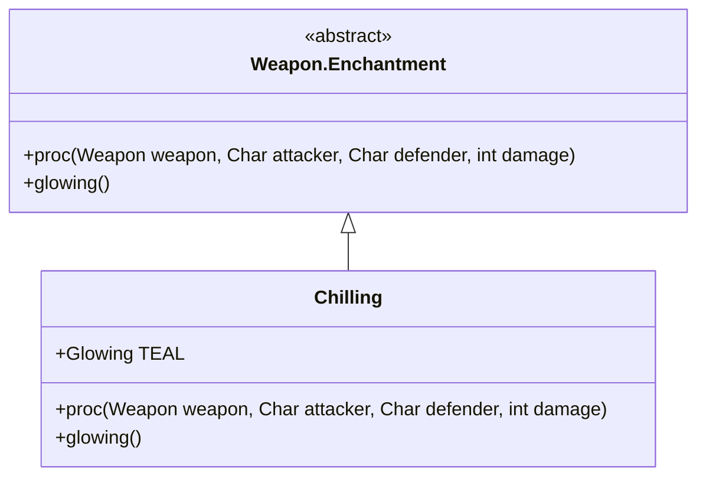

# Chilling 附魔文档

## 1. 基本信息
| 属性 | 值 |
|------|-----|
| 文件路径 | core/src/main/java/com/shatteredpixel/shatteredpixeldungeon/items/weapon/enchantments/Chilling.java |
| 包名 | com.shatteredpixel.shatteredpixeldungeon.items.weapon.enchantments |
| 类类型 | public class |
| 继承关系 | extends Weapon.Enchantment |
| 代码行数 | 71 行 |

## 2. 类职责说明
Chilling（冰霜）附魔使武器在攻击时有机会冻结敌人，使其行动速度减慢。被冰冻的敌人每回合行动时间增加，是优秀的控制型附魔。

## 4. 继承与协作关系


## 静态常量表
| 常量名 | 类型 | 值 | 说明 |
|--------|------|-----|------|
| TEAL | Glowing | 0x00FFFF | 青色发光效果 |

## 7. 方法详解

### proc
**签名**: `public int proc(Weapon weapon, Char attacker, Char defender, int damage)`
**功能**: 处理攻击效果，施加冰冻
**实现逻辑**:
```java
int level = Math.max(0, weapon.buffedLvl());
// 触发概率: 等级0=25%, 等级1=40%, 等级2=50%
float procChance = (level+1f)/(level+4f) * procChanceMultiplier(attacker);
if (Random.Float() < procChance) {
    float powerMulti = Math.max(1f, procChance);
    
    // 每次触发增加3回合冰冻，上限6回合
    float durationToAdd = 3f * powerMulti;
    Chill existing = defender.buff(Chill.class);
    if (existing != null){
        durationToAdd = Math.min(durationToAdd, (6f*powerMulti)-existing.cooldown());
    }
    
    if (durationToAdd > 0) {
        Buff.affect(defender, Chill.class, durationToAdd);
    }
    Splash.at(defender.sprite.center(), 0xFFB2D6FF, 5);
}
return damage;
```

## 触发概率表
| 武器等级 | 触发概率 |
|---------|---------|
| +0 | 25% |
| +1 | 40% |
| +2 | 50% |

## 最佳实践
- 优秀的控制型附魔
- 冰冻使敌人行动变慢
- 可以叠加最多6回合