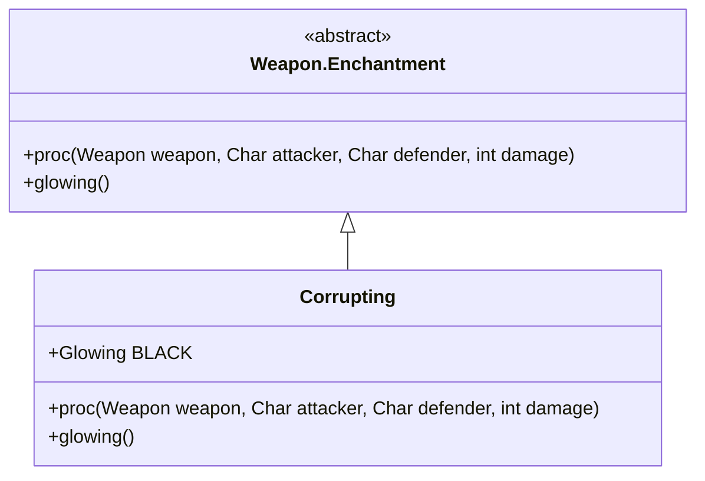

# Corrupting 附魔文档

## 1. 基本信息
| 属性 | 值 |
|------|-----|
| 文件路径 | core/src/main/java/com/shatteredpixel/shatteredpixeldungeon/items/weapon/enchantments/Corrupting.java |
| 包名 | com.shatteredpixel.shatteredpixeldungeon.items.weapon.enchantments |
| 类类型 | public class |
| 继承关系 | extends Weapon.Enchantment |
| 代码行数 | 78 行 |

## 2. 类职责说明
Corrupting（腐化）附魔使武器在击杀敌人时有机会将其腐化为友军。被腐化的敌人会为玩家战斗，是强大的转化型附魔。

## 4. 继承与协作关系


## 7. 方法详解

### proc
**签名**: `public int proc(Weapon weapon, Char attacker, Char defender, int damage)`
**功能**: 处理攻击效果，可能腐化敌人
**实现逻辑**:
```java
int level = Math.max(0, weapon.buffedLvl());
// 触发概率: 等级0=20%, 等级1=23%, 等级2=26%
float procChance = (level+5f)/(level+25f) * procChanceMultiplier(attacker);

// 条件: 伤害足以击杀、随机触发、敌人可被腐化、是Mob
if (damage >= defender.HP
        && Random.Float() < procChance
        && !defender.isImmune(Corruption.class)
        && defender.buff(Corruption.class) == null
        && defender instanceof Mob
        && defender.isAlive()){
    
    Mob enemy = (Mob) defender;
    Hero hero = (attacker instanceof Hero) ? (Hero) attacker : Dungeon.hero;
    
    // 治疗被腐化的敌人
    Corruption.corruptionHeal(enemy);
    
    // 施加腐化效果
    AllyBuff.affectAndLoot(enemy, hero, Corruption.class);
    
    // 高触发概率时给予激素涌动
    float powerMulti = Math.max(1f, procChance);
    if (powerMulti > 1.1f){
        Buff.affect(enemy, Adrenaline.class, Math.round(5*(powerMulti-1f)));
    }
    
    return 0;  // 不造成伤害
}
return damage;
```

## 触发条件
1. 伤害足以击杀敌人
2. 随机触发
3. 敌人可被腐化
4. 敌人是Mob类型

## 最佳实践
- 击杀敌人时可能将其转化为友军
- 被腐化的敌人会为玩家战斗
- 高触发概率时敌人获得激素涌动