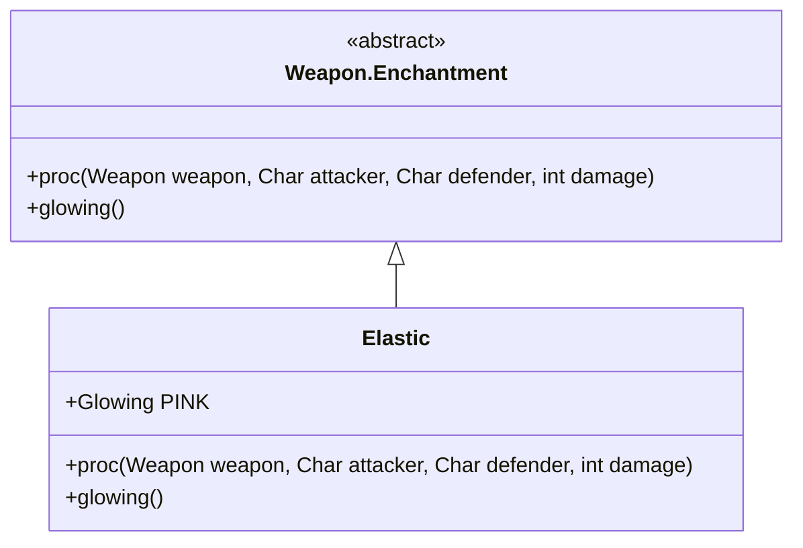

# Elastic 附魔文档

## 1. 基本信息
| 属性 | 值 |
|------|-----|
| 文件路径 | core/src/main/java/com/shatteredpixel/shatteredpixeldungeon/items/weapon/enchantments/Elastic.java |
| 包名 | com.shatteredpixel.shatteredpixeldungeon.items.weapon.enchantments |
| 类类型 | public class |
| 继承关系 | extends Weapon.Enchantment |
| 代码行数 | 70 行 |

## 2. 类职责说明
Elastic（弹性）附魔使武器在攻击时有机会将敌人击退。击退距离为2格，可以用来控制敌人的位置，创造战术空间。

## 4. 继承与协作关系


## 7. 方法详解

### proc
**签名**: `public int proc(Weapon weapon, Char attacker, Char defender, int damage)`
**功能**: 处理攻击效果，击退敌人
**实现逻辑**:
```java
int level = Math.max(0, weapon.buffedLvl());
// 触发概率: 等级0=20%, 等级1=33%, 等级2=43%
float procChance = (level+1f)/(level+5f) * procChanceMultiplier(attacker);
if (Random.Float() < procChance) {
    float powerMulti = Math.max(1f, procChance);
    
    // 计算击退轨迹
    Ballistica trajectory = new Ballistica(attacker.pos, defender.pos, Ballistica.STOP_TARGET);
    trajectory = new Ballistica(trajectory.collisionPos, trajectory.path.get(trajectory.path.size()-1), Ballistica.PROJECTILE);
    
    // 击退敌人
    WandOfBlastWave.throwChar(defender,
            trajectory,
            Math.round(2 * powerMulti),  // 击退距离
            !(weapon instanceof MissileWeapon || weapon instanceof SpiritBow),
            true,
            this);
}
return damage;
```

## 触发概率表
| 武器等级 | 触发概率 |
|---------|---------|
| +0 | 20% |
| +1 | 33% |
| +2 | 43% |

## 最佳实践
- 将敌人击退到陷阱上
- 创造安全距离
- 近战武器击退后会眩晕敌人