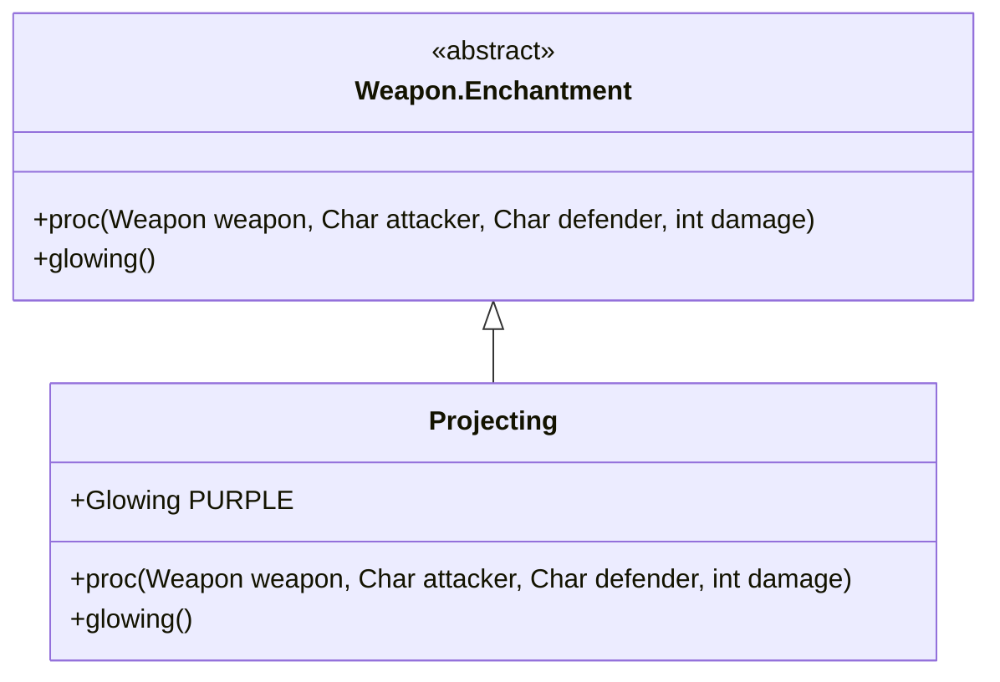

# Projecting 附魔文档

## 1. 基本信息
| 属性 | 值 |
|------|-----|
| 文件路径 | core/src/main/java/com/shatteredpixel/shatteredpixeldungeon/items/weapon/enchantments/Projecting.java |
| 包名 | com.shatteredpixel.shatteredpixeldungeon.items.weapon.enchantments |
| 类类型 | public class |
| 继承关系 | extends Weapon.Enchantment |
| 代码行数 | 44 行 |

## 2. 类职责说明
Projecting（投射）附魔增加武器的攻击范围。这是一种被动附魔，没有触发概率，而是持续提供额外的攻击距离。

## 4. 继承与协作关系


## 7. 方法详解

### proc
**签名**: `public int proc(Weapon weapon, Char attacker, Char defender, int damage)`
**功能**: 无效果（附魔效果是被动增加范围）
**返回值**: 原始伤害
**实现逻辑**:
```java
// 无触发效果
// 附魔效果通过 weapon.reachFactor() 和 MissileWeapon.throwPos() 实现
return damage;
```

## 效果说明
- 近战武器：增加攻击范围
- 投掷武器：可以投射到更远的位置
- 效果在武器类中处理，不在proc方法中

## 最佳实践
- 增加近战武器的攻击范围
- 投掷武器可以绕过障碍
- 适合需要距离优势的战术