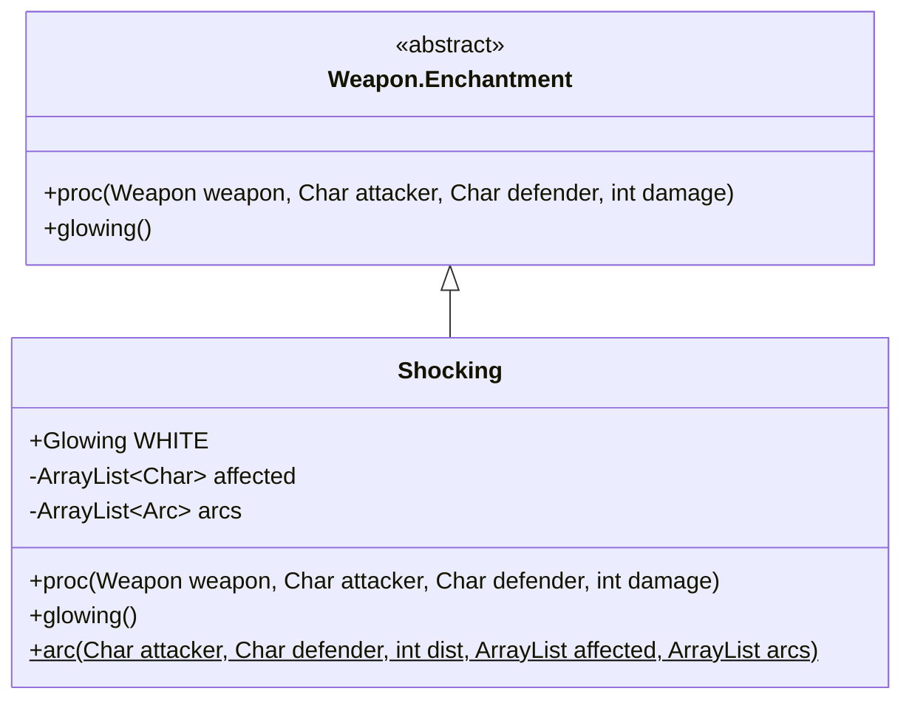

# Shocking 附魔文档

## 1. 基本信息
| 属性 | 值 |
|------|-----|
| 文件路径 | core/src/main/java/com/shatteredpixel/shatteredpixeldungeon/items/weapon/enchantments/Shocking.java |
| 包名 | com.shatteredpixel.shatteredpixeldungeon.items.weapon.enchantments |
| 类类型 | public class |
| 继承关系 | extends Weapon.Enchantment |
| 代码行数 | 106 行 |

## 2. 类职责说明
Shocking（雷电）附魔使武器在攻击时有机会释放闪电链，对目标周围的角色造成伤害。闪电会跳跃到附近的敌人身上，造成范围伤害。

## 4. 继承与协作关系


## 静态常量表
| 常量名 | 类型 | 值 | 说明 |
|--------|------|-----|------|
| WHITE | Glowing | 0xFFFFFF (50%透明) | 白色发光效果 |

## 7. 方法详解

### proc
**签名**: `public int proc(Weapon weapon, Char attacker, Char defender, int damage)`
**功能**: 处理攻击效果，释放闪电链
**实现逻辑**:
```java
int level = Math.max(0, weapon.buffedLvl());
// 固定33%触发概率，伤害随等级提升
float procChance = (1/3f) * procChanceMultiplier(attacker);
if (Random.Float() < procChance) {
    float powerMulti = Math.max(1f, procChance);
    
    affected.clear();
    arcs.clear();
    
    // 从攻击者到目标的闪电链
    arc(attacker, defender, 2, affected, arcs);
    
    // 对所有被击中的敌人造成伤害（不包括主要目标）
    affected.remove(defender);
    for (Char ch : affected) {
        if (ch.alignment != attacker.alignment) {
            ch.damage(Math.round(damage * 0.5f * powerMulti), this);
        }
    }
    
    attacker.sprite.parent.addToFront(new Lightning(arcs, null));
    Sample.INSTANCE.play(Assets.Sounds.LIGHTNING);
}
return damage;
```

### arc (静态方法)
**签名**: `public static void arc(Char attacker, Char defender, int dist, ArrayList<Char> affected, ArrayList<Lightning.Arc> arcs)`
**功能**: 递归生成闪电链
**实现逻辑**:
- 以目标为中心，在dist范围内寻找其他角色
- 对水中目标可以跳跃更远
- 递归生成闪电链直到没有更多目标

## 最佳实践
- 对付成群敌人效果最佳
- 闪电链会跳跃到附近敌人
- 水中目标更容易被连锁