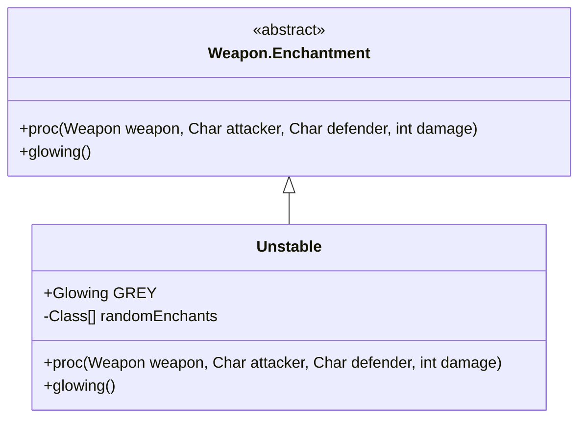

# Unstable 附魔文档

## 1. 基本信息
| 属性 | 值 |
|------|-----|
| 文件路径 | core/src/main/java/com/shatteredpixel/shatteredpixeldungeon/items/weapon/enchantments/Unstable.java |
| 包名 | com.shatteredpixel.shatteredpixeldungeon.items.weapon.enchantments |
| 类类型 | public class |
| 继承关系 | extends Weapon.Enchantment |
| 代码行数 | 67 行 |

## 2. 类职责说明
Unstable（不稳定）附魔使武器在攻击时随机触发其他附魔效果。每次攻击都会随机选择一种附魔效果触发，具有很高的不确定性。

## 4. 继承与协作关系


## 静态常量表
| 常量名 | 类型 | 说明 |
|--------|------|------|
| GREY | Glowing | 灰色发光效果 |
| randomEnchants | Class[] | 可随机触发的附魔列表 |

## 7. 方法详解

### proc
**签名**: `public int proc(Weapon weapon, Char attacker, Char defender, int damage)`
**功能**: 处理攻击效果，随机触发其他附魔
**实现逻辑**:
```java
// 处理动能附魔的保存伤害
int conservedDamage = 0;
if (attacker.buff(Kinetic.ConservedDamage.class) != null) {
    conservedDamage = attacker.buff(Kinetic.ConservedDamage.class).damageBonus();
    attacker.buff(Kinetic.ConservedDamage.class).detach();
}

// 随机选择一个附魔并触发
damage = Reflection.newInstance(Random.oneOf(randomEnchants)).proc(weapon, attacker, defender, damage);

return damage + conservedDamage;
```

## 可随机触发的附魔
- Blazing（炽焰）
- Blocking（格挡）
- Blooming（绽放）
- Chilling（冰霜）
- Kinetic（动能）
- Corrupting（腐化）
- Elastic（弹性）
- Grim（死神）
- Lucky（幸运）
- Shocking（雷电）
- Vampiric（吸血）

**注意**: Projecting（投射）不包括在内，因为它没有触发效果。

## 最佳实践
- 每次攻击随机触发一种附魔效果
- 不确定性很高，但可能触发强力效果
- 适合喜欢随机性的玩家