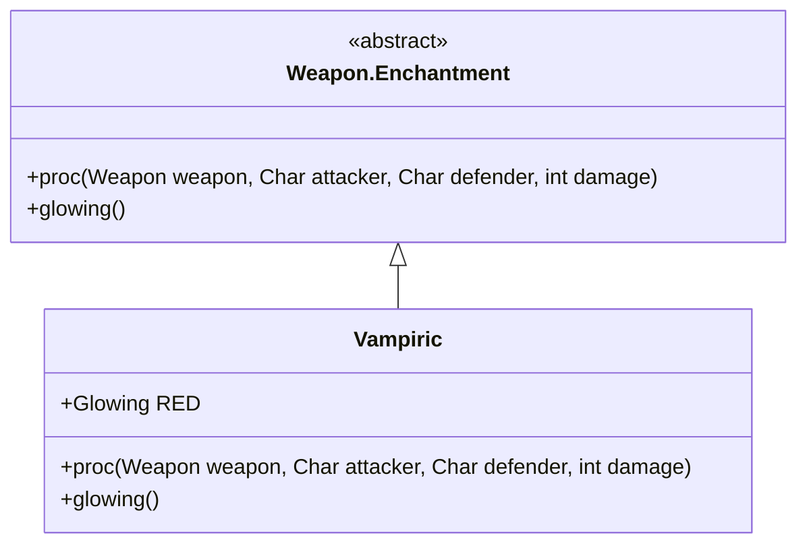

# Vampiric 附魔文档

## 1. 基本信息
| 属性 | 值 |
|------|-----|
| 文件路径 | core/src/main/java/com/shatteredpixel/shatteredpixeldungeon/items/weapon/enchantments/Vampiric.java |
| 包名 | com.shatteredpixel.shatteredpixeldungeon.items.weapon.enchantments |
| 类类型 | public class |
| 继承关系 | extends Weapon.Enchantment |
| 代码行数 | 71 行 |

## 2. 类职责说明
Vampiric（吸血）附魔使武器在攻击时有机会治疗攻击者，回复相当于造成伤害50%的生命值。触发概率随攻击者损失的生命值增加而提高。

## 4. 继承与协作关系


## 静态常量表
| 常量名 | 类型 | 值 | 说明 |
|--------|------|-----|------|
| RED | Glowing | 0x660022 | 深红色发光效果 |

## 7. 方法详解

### proc
**签名**: `public int proc(Weapon weapon, Char attacker, Char defender, int damage)`
**功能**: 处理攻击效果，治疗攻击者
**实现逻辑**:
```java
// 触发概率: 5%-30%基于损失的生命值百分比
float missingPercent = (attacker.HT - attacker.HP) / (float)attacker.HT;
float healChance = 0.05f + .25f*missingPercent;

healChance *= procChanceMultiplier(attacker);

if (Random.Float() < healChance
        && attacker.alignment != defender.alignment
        && (defender.alignment != Char.Alignment.NEUTRAL || defender instanceof Mimic)){
    
    float powerMulti = Math.max(1f, healChance);
    
    // 治疗50%的伤害值
    int healAmt = Math.round(damage * 0.5f * powerMulti);
    healAmt = Math.min(healAmt, attacker.HT - attacker.HP);
    
    if (healAmt > 0 && attacker.isAlive()) {
        attacker.HP += healAmt;
        attacker.sprite.showStatusWithIcon(CharSprite.POSITIVE, Integer.toString(healAmt), FloatingText.HEALING);
    }
}
return damage;
```

## 触发概率表
| 损失生命值 | 触发概率 |
|-----------|---------|
| 0% | 5% |
| 50% | 17.5% |
| 100% | 30% |

## 最佳实践
- 生命值越低触发概率越高
- 治疗50%的伤害值
- 适合持久作战