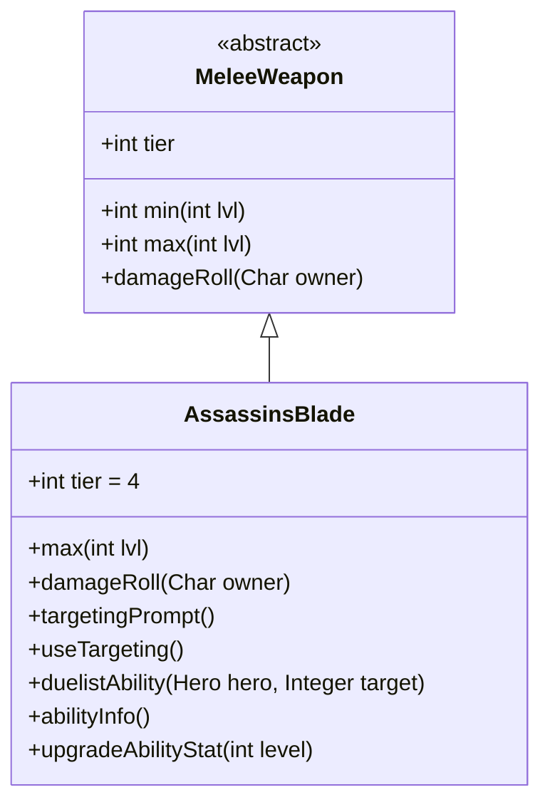

# AssassinsBlade 类文档

## 1. 基本信息
| 属性 | 值 |
|------|-----|
| 文件路径 | core/src/main/java/com/shatteredpixel/shatteredpixeldungeon/items/weapon/melee/AssassinsBlade.java |
| 包名 | com.shatteredpixel.shatteredpixeldungeon.items.weapon.melee |
| 类类型 | public class |
| 继承关系 | extends MeleeWeapon |
| 代码行数 | 96 行 |

## 2. 类职责说明
AssassinsBlade（刺客之刃）是一种 Tier 4 的近战武器，对偷袭的敌人造成更高的伤害。作为决斗家武器，其特殊能力「潜行」可以让英雄进入隐身状态。刺客之刃是专门为偷袭战术设计的武器，在敌人未警觉时效果更佳。

## 4. 继承与协作关系


## 静态常量表
| 常量名 | 类型 | 值 | 说明 |
|--------|------|-----|------|
| 无静态常量 | - | - | - |

## 实例字段表
| 字段名 | 类型 | 修饰符 | 说明 |
|--------|------|--------|------|
| image | int | 初始化块 | 物品图标，使用 ItemSpriteSheet.ASSASSINS_BLADE |
| hitSound | String | 初始化块 | 击中音效，使用 Assets.Sounds.HIT_STAB |
| hitSoundPitch | float | 初始化块 | 音效音高，设为 0.9f（低沉） |
| tier | int | 初始化块 | 武器等级，设为 4 |

## 7. 方法详解

### max
**签名**: `public int max(int lvl)`
**功能**: 计算指定等级下的最大伤害
**参数**: `lvl` - 武器等级
**返回值**: 最大伤害值
**实现逻辑**:
```java
return 4*(tier+1) +    // 20基础伤害，低于标准的25
       lvl*(tier+1);   // 每级+5伤害，标准成长
```

### damageRoll
**签名**: `public int damageRoll(Char owner)`
**功能**: 计算实际伤害，偷袭时伤害更高
**参数**: `owner` - 攻击者
**返回值**: 伤害值
**实现逻辑**:
```java
if (owner instanceof Hero) {
    Hero hero = (Hero)owner;
    Char enemy = hero.attackTarget();
    if (enemy instanceof Mob && ((Mob) enemy).surprisedBy(hero)) {
        // 偷袭时：伤害范围从 50%到100%的最大伤害
        // 而不是正常的 最小到最大
        int diff = max() - min();
        int damage = augment.damageFactor(Hero.heroDamageIntRange(
                min() + Math.round(diff*0.50f),
                max()));
        int exStr = hero.STR() - STRReq();
        if (exStr > 0) {
            damage += Hero.heroDamageIntRange(0, exStr);
        }
        return damage;
    }
}
return super.damageRoll(owner);
```
偷袭时伤害范围更窄且更高。

### targetingPrompt
**签名**: `public String targetingPrompt()`
**功能**: 返回目标选择提示文本
**参数**: 无
**返回值**: 从消息文件获取的提示字符串

### useTargeting
**签名**: `public boolean useTargeting()`
**功能**: 是否使用目标选择界面
**返回值**: 固定返回 false

### duelistAbility
**签名**: `protected void duelistAbility(Hero hero, Integer target)`
**功能**: 执行决斗家的「潜行」能力
**参数**: 
- `hero` - 执行能力的英雄
- `target` - 目标位置
**返回值**: 无
**实现逻辑**:
```java
// 能力参数：隐身持续3回合，移动后额外2+等级回合
Dagger.sneakAbility(hero, target, 3, 2+buffedLvl(), this);
```

### abilityInfo
**签名**: `public String abilityInfo()`
**功能**: 返回能力描述信息
**参数**: 无
**返回值**: 能力描述字符串

### upgradeAbilityStat
**签名**: `public String upgradeAbilityStat(int level)`
**功能**: 返回指定等级下的能力统计
**参数**: `level` - 武器等级
**返回值**: 额外隐身回合数

## 11. 使用示例
```java
// 创建一把刺客之刃
AssassinsBlade blade = new AssassinsBlade();
// Tier 4武器，偷袭伤害更高
// 决斗家可以使用「潜行」进入隐身

hero.belongings.weapon = blade;
// 利用隐身接近敌人进行偷袭
// 偷袭时伤害显著提高
```

## 注意事项
- 偷袭伤害范围从50%最大伤害到最大伤害
- 能力复用了 `Dagger.sneakAbility()` 方法
- 不使用目标选择界面
- 移动后隐身会延长

## 最佳实践
- 配合隐身进行偷袭
- 利用隐身接近敌人
- 偷袭时伤害显著提高
- 是刺客风格玩家的理想选择