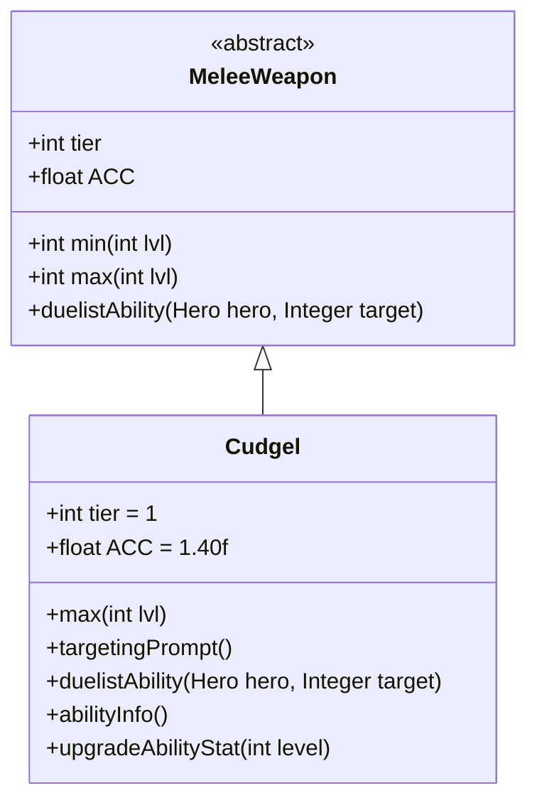

# Cudgel 类文档

## 1. 基本信息
| 属性 | 值 |
|------|-----|
| 文件路径 | core/src/main/java/com/shatteredpixel/shatteredpixeldungeon/items/weapon/melee/Cudgel.java |
| 包名 | com.shatteredpixel.shatteredpixeldungeon.items.weapon.melee |
| 类类型 | public class |
| 继承关系 | extends MeleeWeapon |
| 代码行数 | 75 行 |

## 2. 类职责说明
Cudgel（短棍）是一种 Tier 1 的近战武器，具有极高的准确度（ACC=1.40f）。作为决斗家武器，其特殊能力「重击」可以造成额外伤害并使敌人眩晕，对未被警觉的敌人效果更好。短棍是早期的高命中武器选择。

## 4. 继承与协作关系


## 静态常量表
| 常量名 | 类型 | 值 | 说明 |
|--------|------|-----|------|
| 无静态常量 | - | - | - |

## 实例字段表
| 字段名 | 类型 | 修饰符 | 说明 |
|--------|------|--------|------|
| image | int | 初始化块 | 物品图标，使用 ItemSpriteSheet.CUDGEL |
| hitSound | String | 初始化块 | 击中音效，使用 Assets.Sounds.HIT_CRUSH |
| hitSoundPitch | float | 初始化块 | 音效音高，设为 1.2f |
| tier | int | 初始化块 | 武器等级，设为 1 |
| ACC | float | 初始化块 | 准确度修正，设为 1.40f（40%加成） |
| bones | boolean | 初始化块 | 不出现在遗骸，设为 false |

## 7. 方法详解

### max
**签名**: `public int max(int lvl)`
**功能**: 计算指定等级下的最大伤害
**参数**: `lvl` - 武器等级
**返回值**: 最大伤害值
**实现逻辑**:
```java
return 4*(tier+1) +    // 8基础伤害，低于标准的10
       lvl*(tier+1);   // 每级+2伤害，标准成长
```

### targetingPrompt
**签名**: `public String targetingPrompt()`
**功能**: 返回目标选择提示文本
**参数**: 无
**返回值**: 从消息文件获取的提示字符串

### duelistAbility
**签名**: `protected void duelistAbility(Hero hero, Integer target)`
**功能**: 执行决斗家的「重击」能力
**参数**: 
- `hero` - 执行能力的英雄
- `target` - 目标位置
**返回值**: 无
**实现逻辑**:
```java
// 计算伤害加成：基础3 + 1.5*武器等级
// 约67%基础伤害加成，100%成长加成
int dmgBoost = augment.damageFactor(3 + Math.round(1.5f*buffedLvl()));
// 复用钉锤的重击能力
Mace.heavyBlowAbility(hero, target, 1, dmgBoost, this);
```

### abilityInfo
**签名**: `public String abilityInfo()`
**功能**: 返回能力描述信息
**参数**: 无
**返回值**: 能力描述字符串

### upgradeAbilityStat
**签名**: `public String upgradeAbilityStat(int level)`
**功能**: 返回指定等级下的能力统计
**参数**: `level` - 武器等级
**返回值**: 伤害范围字符串

## 11. 使用示例
```java
// 创建一根短棍
Cudgel cudgel = new Cudgel();
// Tier 1武器，极高准确度
// 决斗家可以使用「重击」能力

hero.belongings.weapon = cudgel;
// 高准确度使攻击几乎必中
// 对未被警觉的敌人使用能力效果最佳
```

## 注意事项
- 准确度加成极高（ACC=1.40f，40%加成）
- `bones = false` 不会出现在遗骸中
- 能力对已警觉敌人没有额外伤害
- 能力命中后会使敌人眩晕

## 最佳实践
- 利用极高准确度对付闪避敌人
- 配合偷袭战术最大化能力效果
- 眩晕效果可以打断敌人行动
- 是游戏初期最可靠的武器之一