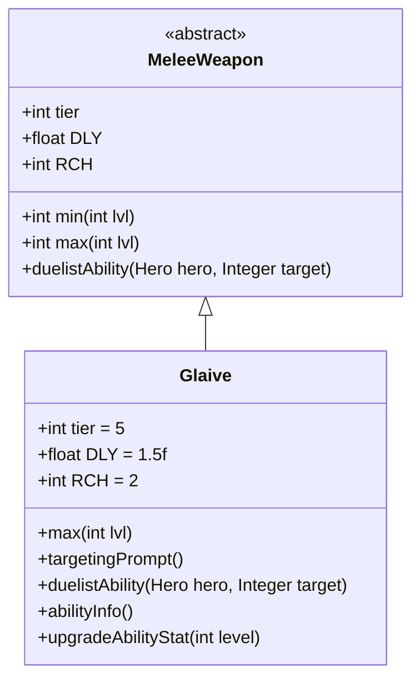

# Glaive 类文档

## 1. 基本信息
| 属性 | 值 |
|------|-----|
| 文件路径 | core/src/main/java/com/shatteredpixel/shatteredpixeldungeon/items/weapon/melee/Glaive.java |
| 包名 | com.shatteredpixel.shatteredpixeldungeon.items.weapon.melee |
| 类类型 | public class |
| 继承关系 | extends MeleeWeapon |
| 代码行数 | 74 行 |

## 2. 类职责说明
Glaive（关刀/长戟）是一种 Tier 5 的高级近战武器，具有额外的攻击范围（RCH=2）但攻击速度较慢（DLY=1.5f）。作为决斗家武器，其特殊能力「刺穿」可以造成高额伤害并将敌人击退。关刀是高伤害的长柄武器，适合保持距离作战。

## 4. 继承与协作关系


## 静态常量表
| 常量名 | 类型 | 值 | 说明 |
|--------|------|-----|------|
| 无静态常量 | - | - | - |

## 实例字段表
| 字段名 | 类型 | 修饰符 | 说明 |
|--------|------|--------|------|
| image | int | 初始化块 | 物品图标，使用 ItemSpriteSheet.GLAIVE |
| hitSound | String | 初始化块 | 击中音效，使用 Assets.Sounds.HIT_SLASH |
| hitSoundPitch | float | 初始化块 | 音效音高，设为 0.8f（低沉） |
| tier | int | 初始化块 | 武器等级，设为 5 |
| DLY | float | 初始化块 | 攻击延迟，设为 1.5f（0.67倍速） |
| RCH | int | 初始化块 | 攻击范围，设为 2（额外1格） |

## 7. 方法详解

### max
**签名**: `public int max(int lvl)`
**功能**: 计算指定等级下的最大伤害
**参数**: `lvl` - 武器等级
**返回值**: 最大伤害值
**实现逻辑**:
```java
return Math.round(6.67f*(tier+1)) +    // 40基础伤害，高于标准的30
       lvl*Math.round(1.33f*(tier+1)); // 每级+8伤害，高于标准的+6
```
关刀具有较高的伤害来补偿较慢的攻击速度。

### targetingPrompt
**签名**: `public String targetingPrompt()`
**功能**: 返回目标选择提示文本
**参数**: 无
**返回值**: 从消息文件获取的提示字符串

### duelistAbility
**签名**: `protected void duelistAbility(Hero hero, Integer target)`
**功能**: 执行决斗家的「刺穿」能力
**参数**: 
- `hero` - 执行能力的英雄
- `target` - 目标位置
**返回值**: 无
**实现逻辑**:
```java
// 计算伤害加成：12 + 2.5*武器等级
// 约55%基础伤害加成，55%成长加成
int dmgBoost = augment.damageFactor(12 + Math.round(2.5f*buffedLvl()));
// 复用长矛的刺穿能力
Spear.spikeAbility(hero, target, 1, dmgBoost, this);
```

### abilityInfo
**签名**: `public String abilityInfo()`
**功能**: 返回能力描述信息
**参数**: 无
**返回值**: 能力描述字符串

### upgradeAbilityStat
**签名**: `public String upgradeAbilityStat(int level)`
**功能**: 返回指定等级下的能力统计
**参数**: `level` - 武器等级
**返回值**: 伤害范围字符串

## 11. 使用示例
```java
// 创建一把关刀
Glaive glaive = new Glaive();
// Tier 5武器，高伤害但攻击较慢
// 决斗家可以使用「刺穿」能力击退敌人

hero.belongings.weapon = glaive;
// 利用额外攻击范围保持安全距离
// 使用能力将敌人击退
```

## 注意事项
- 攻击速度较慢（DLY=1.5f，约0.67倍速）
- 攻击范围为2格，可以隔格攻击
- 能力必须对非相邻敌人使用
- 击退效果可以创造战术空间

## 最佳实践
- 保持与敌人的距离，利用额外攻击范围
- 使用能力将敌人击退，创造安全空间
- 配合地形使用效果更佳
- 高伤害适合对付高生命值敌人