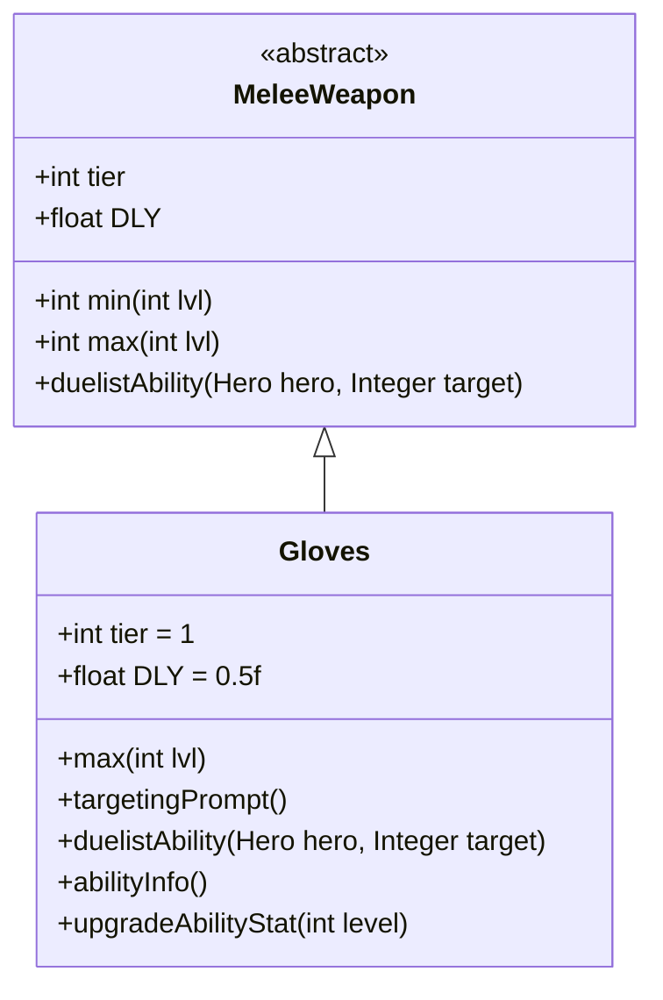

# Gloves 类文档

## 1. 基本信息
| 属性 | 值 |
|------|-----|
| 文件路径 | core/src/main/java/com/shatteredpixel/shatteredpixeldungeon/items/weapon/melee/Gloves.java |
| 包名 | com.shatteredpixel.shatteredpixeldungeon.items.weapon.melee |
| 类类型 | public class |
| 继承关系 | extends MeleeWeapon |
| 代码行数 | 74 行 |

## 2. 类职责说明
Gloves（拳套）是一种 Tier 1 的近战武器，具有极快的攻击速度（DLY=0.5f，即2倍速）。作为决斗家武器，其特殊能力「连击」可以根据之前的攻击次数增加伤害。拳套是游戏中最基础的快速武器，适合追求高攻击频率的玩家。

## 4. 继承与协作关系


## 静态常量表
| 常量名 | 类型 | 值 | 说明 |
|--------|------|-----|------|
| 无静态常量 | - | - | - |

## 实例字段表
| 字段名 | 类型 | 修饰符 | 说明 |
|--------|------|--------|------|
| image | int | 初始化块 | 物品图标，使用 ItemSpriteSheet.GLOVES |
| hitSound | String | 初始化块 | 击中音效，使用 Assets.Sounds.HIT |
| hitSoundPitch | float | 初始化块 | 音效音高，设为 1.3f（高音） |
| tier | int | 初始化块 | 武器等级，设为 1 |
| DLY | float | 初始化块 | 攻击延迟，设为 0.5f（2倍速） |
| bones | boolean | 初始化块 | 不出现在遗骸，设为 false |

## 7. 方法详解

### max
**签名**: `public int max(int lvl)`
**功能**: 计算指定等级下的最大伤害
**参数**: `lvl` - 武器等级
**返回值**: 最大伤害值
**实现逻辑**:
```java
return Math.round(2.5f*(tier+1)) +     // 5基础伤害，低于标准的10
       lvl*Math.round(0.5f*(tier+1));  // 每级+1伤害，低于标准的+2
```
拳套的伤害极低，但攻击速度是普通武器的2倍。

### targetingPrompt
**签名**: `public String targetingPrompt()`
**功能**: 返回目标选择提示文本
**参数**: 无
**返回值**: 从消息文件获取的提示字符串

### duelistAbility
**签名**: `protected void duelistAbility(Hero hero, Integer target)`
**功能**: 执行决斗家的「连击」能力
**参数**: 
- `hero` - 执行能力的英雄
- `target` - 目标位置
**返回值**: 无
**实现逻辑**:
```java
// 计算基础伤害加成：3 + 武器等级
// 约100%基础伤害加成，100%成长加成
int dmgBoost = augment.damageFactor(3 + buffedLvl());
// 复用Sai的连击能力
Sai.comboStrikeAbility(hero, target, 0, dmgBoost, this);
```

### abilityInfo
**签名**: `public String abilityInfo()`
**功能**: 返回能力描述信息
**参数**: 无
**返回值**: 能力描述字符串

### upgradeAbilityStat
**签名**: `public String upgradeAbilityStat(int level)`
**功能**: 返回指定等级下的能力统计
**参数**: `level` - 武器等级
**返回值**: 伤害加成字符串

## 11. 使用示例
```java
// 创建拳套
Gloves gloves = new Gloves();
// Tier 1武器，攻击速度极快
// 决斗家可以使用「连击」能力

hero.belongings.weapon = gloves;
// 连续攻击敌人积累连击数
// 然后使用能力打出高伤害
```

## 注意事项
- 攻击速度是普通武器的2倍（DLY=0.5f）
- 单次伤害极低（5基础 vs 标准10）
- `bones = false` 不会出现在遗骸中
- 能力复用了 `Sai.comboStrikeAbility()` 方法

## 最佳实践
- 配合连击数使用能力效果更佳
- 高攻击频率适合触发各种效果
- 音效音高最高（1.3f）体现快速攻击