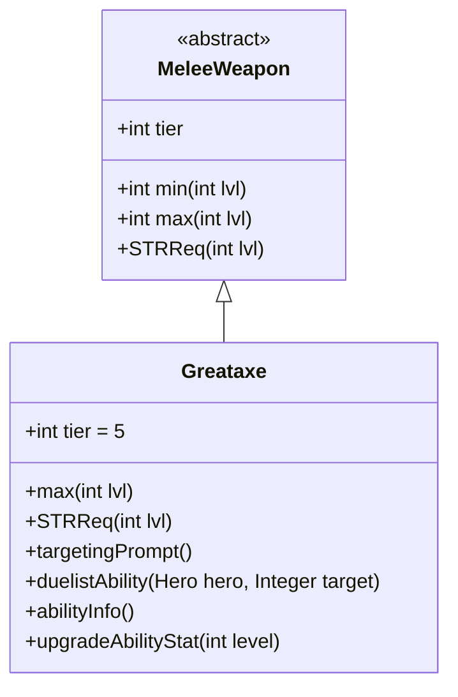

# Greataxe 类文档

## 1. 基本信息
| 属性 | 值 |
|------|-----|
| 文件路径 | core/src/main/java/com/shatteredpixel/shatteredpixeldungeon/items/weapon/melee/Greataxe.java |
| 包名 | com.shatteredpixel.shatteredpixeldungeon.items.weapon.melee |
| 类类型 | public class |
| 继承关系 | extends MeleeWeapon |
| 代码行数 | 131 行 |

## 2. 类职责说明
Greataxe（巨斧）是一种 Tier 5 的高级近战武器，具有极高的基础伤害（45点）但需要更高的力量。作为决斗家武器，其特殊能力「狂暴」只能在生命值低于50%时使用，造成大量额外伤害。巨斧是高风险高回报的武器，适合残血反杀战术。

## 4. 继承与协作关系


## 静态常量表
| 常量名 | 类型 | 值 | 说明 |
|--------|------|-----|------|
| 无静态常量 | - | - | - |

## 实例字段表
| 字段名 | 类型 | 修饰符 | 说明 |
|--------|------|--------|------|
| image | int | 初始化块 | 物品图标，使用 ItemSpriteSheet.GREATAXE |
| hitSound | String | 初始化块 | 击中音效，使用 Assets.Sounds.HIT_SLASH |
| hitSoundPitch | float | 初始化块 | 音效音高，设为 1f（正常） |
| tier | int | 初始化块 | 武器等级，设为 5 |

## 7. 方法详解

### max
**签名**: `public int max(int lvl)`
**功能**: 计算指定等级下的最大伤害
**参数**: `lvl` - 武器等级
**返回值**: 最大伤害值
**实现逻辑**:
```java
return 5*(tier+4) +    // 45基础伤害，远高于标准的30
       lvl*(tier+1);   // 每级+6伤害，标准成长
```
巨斧拥有游戏中最高的基础伤害。

### STRReq
**签名**: `public int STRReq(int lvl)`
**功能**: 计算力量需求
**参数**: `lvl` - 武器等级
**返回值**: 力量需求值
**实现逻辑**:
```java
int req = STRReq(tier+1, lvl); // 20基础力量需求，高于标准的18
if (masteryPotionBonus){
    req -= 2;  // 掌握药水加成减少2点
}
return req;
```

### targetingPrompt
**签名**: `public String targetingPrompt()`
**功能**: 返回目标选择提示文本
**参数**: 无
**返回值**: 从消息文件获取的提示字符串

### duelistAbility
**签名**: `protected void duelistAbility(Hero hero, Integer target)`
**功能**: 执行决斗家的「狂暴」能力
**参数**: 
- `hero` - 执行能力的英雄
- `target` - 目标位置
**返回值**: 无
**实现逻辑**:
```java
// 检查生命值是否低于50%
if (hero.HP / (float)hero.HT >= 0.5f){
    GLog.w(Messages.get(this, "ability_cant_use"));
    return;  // 生命值过高则无法使用
}

// 验证目标...

// 执行攻击
hero.sprite.attack(enemy.pos, new Callback() {
    @Override
    public void call() {
        beforeAbilityUsed(hero, enemy);
        AttackIndicator.target(enemy);

        // 计算伤害加成：15 + 2*武器等级
        // 约60%基础伤害加成，55%成长加成
        int dmgBoost = augment.damageFactor(15 + 2*buffedLvl());

        if (hero.attack(enemy, 1, dmgBoost, Char.INFINITE_ACCURACY)){
            Sample.INSTANCE.play(Assets.Sounds.HIT_STRONG);
        }

        Invisibility.dispel();
        if (!enemy.isAlive()){
            hero.next();  // 击杀后立即行动
            onAbilityKill(hero, enemy);
        } else {
            hero.spendAndNext(hero.attackDelay());
        }
        afterAbilityUsed(hero);
    }
});
```
关键特点：
1. 只能在生命值低于50%时使用
2. 造成大量额外伤害
3. 击杀敌人后立即行动（不消耗回合）

### abilityInfo
**签名**: `public String abilityInfo()`
**功能**: 返回能力描述信息
**参数**: 无
**返回值**: 能力描述字符串

### upgradeAbilityStat
**签名**: `public String upgradeAbilityStat(int level)`
**功能**: 返回指定等级下的能力统计
**参数**: `level` - 武器等级
**返回值**: 伤害范围字符串

## 11. 使用示例
```java
// 创建一把巨斧
Greataxe axe = new Greataxe();
// Tier 5武器，极高伤害但需要高力量
// 决斗家可以在低血量时使用「狂暴」能力

hero.belongings.weapon = axe;
// 当生命值低于50%时可以使用能力
// 击杀敌人后立即行动，适合残血反杀
```

## 注意事项
- 基础伤害极高（45 vs 标准30）
- 力量需求较高（20 vs 标准18）
- 能力只能在生命值低于50%时使用
- 击杀敌人后立即行动（不消耗回合）

## 最佳实践
- 配合生命值控制战术使用
- 在危急时刻使用能力反杀
- 击杀后立即行动可以连续攻击
- 高力量需求可能需要装备支持