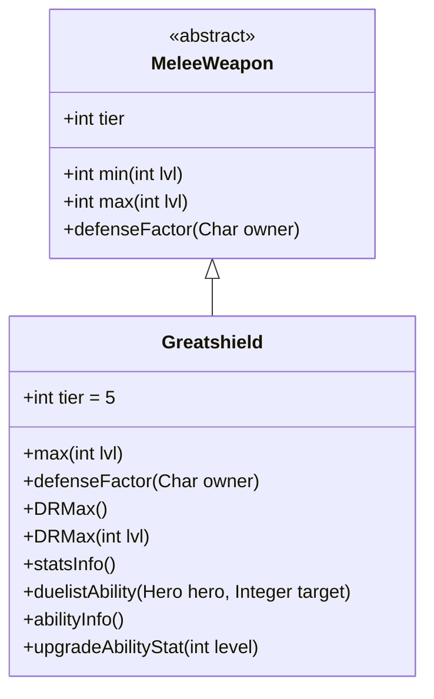

# Greatshield 类文档

## 1. 基本信息
| 属性 | 值 |
|------|-----|
| 文件路径 | core/src/main/java/com/shatteredpixel/shatteredpixeldungeon/items/weapon/melee/Greatshield.java |
| 包名 | com.shatteredpixel.shatteredpixeldungeon.items.weapon.melee |
| 类类型 | public class |
| 继承关系 | extends MeleeWeapon |
| 代码行数 | 83 行 |

## 2. 类职责说明
Greatshield（巨盾）是一种 Tier 5 的防御型近战武器，具有极低的攻击伤害但提供大量防御加成。作为决斗家武器，其特殊能力「防御姿态」可以进入持续数回合的防御状态。巨盾是终极防御武器，适合需要极高生存能力的玩家。

## 4. 继承与协作关系


## 静态常量表
| 常量名 | 类型 | 值 | 说明 |
|--------|------|-----|------|
| 无静态常量 | - | - | - |

## 实例字段表
| 字段名 | 类型 | 修饰符 | 说明 |
|--------|------|--------|------|
| image | int | 初始化块 | 物品图标，使用 ItemSpriteSheet.GREATSHIELD |
| tier | int | 初始化块 | 武器等级，设为 5 |

## 7. 方法详解

### max
**签名**: `public int max(int lvl)`
**功能**: 计算指定等级下的最大伤害
**参数**: `lvl` - 武器等级
**返回值**: 最大伤害值
**实现逻辑**:
```java
return Math.round(3f*(tier+1)) +   // 18基础伤害，远低于标准的30
       lvl*(tier-1);               // 每级+3伤害，远低于标准的+6
```
巨盾的攻击伤害极低，这是顶级防御武器的代价。

### defenseFactor
**签名**: `public int defenseFactor(Char owner)`
**功能**: 返回防御因子（伤害减免值）
**参数**: `owner` - 拥有者
**返回值**: 防御值
**实现逻辑**: `return DRMax();`

### DRMax
**签名**: `public int DRMax()` / `public int DRMax(int lvl)`
**功能**: 计算最大伤害减免值
**参数**: `lvl` - 武器等级（可选）
**返回值**: 伤害减免值
**实现逻辑**:
```java
return 6 + 2*lvl;  // 基础6点 + 每级2点
```
巨盾提供游戏中最高的伤害减免。

### statsInfo
**签名**: `public String statsInfo()`
**功能**: 返回额外属性信息
**参数**: 无
**返回值**: 防御属性描述字符串

### duelistAbility
**签名**: `protected void duelistAbility(Hero hero, Integer target)`
**功能**: 执行决斗家的「防御姿态」能力
**参数**: 
- `hero` - 执行能力的英雄
- `target` - 目标位置（不需要）
**返回值**: 无
**实现逻辑**:
```java
// 能力持续3+武器等级回合
RoundShield.guardAbility(hero, 3+buffedLvl(), this);
```

### abilityInfo
**签名**: `public String abilityInfo()`
**功能**: 返回能力描述信息
**参数**: 无
**返回值**: 能力描述字符串

### upgradeAbilityStat
**签名**: `public String upgradeAbilityStat(int level)`
**功能**: 返回指定等级下的能力统计
**参数**: `level` - 武器等级
**返回值**: 持续时间字符串

## 11. 使用示例
```java
// 创建一面巨盾
Greatshield shield = new Greatshield();
// Tier 5武器，极低伤害但极高防御
// 决斗家可以使用「防御姿态」格挡攻击

hero.belongings.weapon = shield;
// 获得极高的伤害减免（6+2*等级）
// 使用能力进入防御姿态格挡攻击
```

## 注意事项
- 攻击伤害极低（18基础 vs 标准30）
- 提供游戏中最高的被动防御加成
- 防御值随等级成长（每级+2）
- 能力复用了 `RoundShield.guardAbility()` 方法

## 最佳实践
- 需要极限生存能力时使用
- 配合其他防御装备效果叠加
- 升级武器获得更高的防御加成
- 不适合追求伤害的玩家