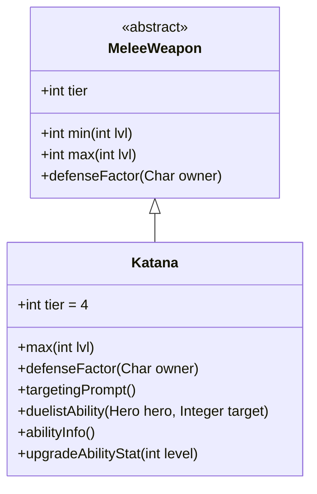

# Katana 类文档

## 1. 基本信息
| 属性 | 值 |
|------|-----|
| 文件路径 | core/src/main/java/com/shatteredpixel/shatteredpixeldungeon/items/weapon/melee/Katana.java |
| 包名 | com.shatteredpixel.shatteredpixeldungeon.items.weapon.melee |
| 类类型 | public class |
| 继承关系 | extends MeleeWeapon |
| 代码行数 | 78 行 |

## 2. 类职责说明
Katana（武士刀）是一种 Tier 4 的近战武器，具有较低的伤害但提供防御加成。作为决斗家武器，其特殊能力「突刺」可以跳跃到敌人附近进行攻击。武士刀结合了攻击和防御，是攻防平衡的武器。

## 4. 继承与协作关系


## 静态常量表
| 常量名 | 类型 | 值 | 说明 |
|--------|------|-----|------|
| 无静态常量 | - | - | - |

## 实例字段表
| 字段名 | 类型 | 修饰符 | 说明 |
|--------|------|--------|------|
| image | int | 初始化块 | 物品图标，使用 ItemSpriteSheet.KATANA |
| hitSound | String | 初始化块 | 击中音效，使用 Assets.Sounds.HIT_SLASH |
| hitSoundPitch | float | 初始化块 | 音效音高，设为 1.1f |
| tier | int | 初始化块 | 武器等级，设为 4 |

## 7. 方法详解

### max
**签名**: `public int max(int lvl)`
**功能**: 计算指定等级下的最大伤害
**参数**: `lvl` - 武器等级
**返回值**: 最大伤害值
**实现逻辑**:
```java
return 4*(tier+1) +    // 20基础伤害，低于标准的25
       lvl*(tier+1);   // 每级+5伤害，标准成长
```

### defenseFactor
**签名**: `public int defenseFactor(Char owner)`
**功能**: 返回防御因子
**参数**: `owner` - 拥有者
**返回值**: 固定返回3
**实现逻辑**: `return 3;` // 提供3点额外防御

### targetingPrompt
**签名**: `public String targetingPrompt()`
**功能**: 返回目标选择提示文本
**参数**: 无
**返回值**: 从消息文件获取的提示字符串

### duelistAbility
**签名**: `protected void duelistAbility(Hero hero, Integer target)`
**功能**: 执行决斗家的「突刺」能力
**参数**: 
- `hero` - 执行能力的英雄
- `target` - 目标位置
**返回值**: 无
**实现逻辑**:
```java
// 计算伤害加成：基础8 + 2*武器等级
// 约67%伤害加成
int dmgBoost = augment.damageFactor(8 + Math.round(2f*buffedLvl()));
// 复用刺剑的突刺能力
Rapier.lungeAbility(hero, target, 1, dmgBoost, this);
```

### abilityInfo
**签名**: `public String abilityInfo()`
**功能**: 返回能力描述信息
**参数**: 无
**返回值**: 能力描述字符串

### upgradeAbilityStat
**签名**: `public String upgradeAbilityStat(int level)`
**功能**: 返回指定等级下的能力统计
**参数**: `level` - 武器等级
**返回值**: 伤害范围字符串

## 11. 使用示例
```java
// 创建一把武士刀
Katana katana = new Katana();
// Tier 4武器，提供防御加成
// 决斗家可以使用「突刺」快速接近敌人

hero.belongings.weapon = katana;
// 获得3点被动防御加成
// 使用能力跳跃到敌人身边并攻击
```

## 注意事项
- 提供3点被动防御加成
- 能力复用了 `Rapier.lungeAbility()` 方法
- 突刺能力需要目标在2格或更远距离
- 音效音高略高，体现刀锋锐利

## 最佳实践
- 利用突刺能力快速接近远程敌人
- 配合防御加成提高生存能力
- 注意目标距离限制
- 武士刀是攻防平衡的选择