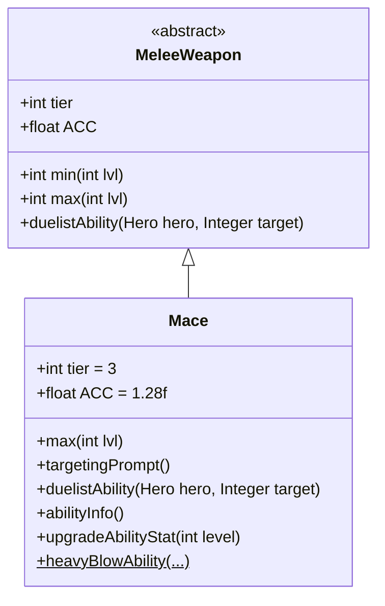

# Mace 类文档

## 1. 基本信息
| 属性 | 值 |
|------|-----|
| 文件路径 | core/src/main/java/com/shatteredpixel/shatteredpixeldungeon/items/weapon/melee/Mace.java |
| 包名 | com.shatteredpixel.shatteredpixeldungeon.items.weapon.melee |
| 类类型 | public class |
| 继承关系 | extends MeleeWeapon |
| 代码行数 | 131 行 |

## 2. 类职责说明
Mace（钉锤）是一种 Tier 3 的近战武器，具有高准确度（ACC=1.28f）。作为决斗家武器，其特殊能力「重击」可以造成额外伤害并使敌人眩晕。钉锤对未被警觉的敌人效果更好，适合偷袭战术。

## 4. 继承与协作关系


## 静态常量表
| 常量名 | 类型 | 值 | 说明 |
|--------|------|-----|------|
| 无静态常量 | - | - | - |

## 实例字段表
| 字段名 | 类型 | 修饰符 | 说明 |
|--------|------|--------|------|
| image | int | 初始化块 | 物品图标，使用 ItemSpriteSheet.MACE |
| hitSound | String | 初始化块 | 击中音效，使用 Assets.Sounds.HIT_CRUSH |
| hitSoundPitch | float | 初始化块 | 音效音高，设为 1f（正常） |
| tier | int | 初始化块 | 武器等级，设为 3 |
| ACC | float | 初始化块 | 准确度修正，设为 1.28f（28%加成） |

## 7. 方法详解

### max
**签名**: `public int max(int lvl)`
**功能**: 计算指定等级下的最大伤害
**参数**: `lvl` - 武器等级
**返回值**: 最大伤害值
**实现逻辑**:
```java
return 4*(tier+1) +    // 16基础伤害，低于标准的20
       lvl*(tier+1);   // 每级+4伤害，标准成长
```
钉锤的伤害较低，但准确度加成补偿了这一点。

### targetingPrompt
**签名**: `public String targetingPrompt()`
**功能**: 返回目标选择提示文本
**参数**: 无
**返回值**: 从消息文件获取的提示字符串

### duelistAbility
**签名**: `protected void duelistAbility(Hero hero, Integer target)`
**功能**: 执行决斗家的「重击」能力
**参数**: 
- `hero` - 执行能力的英雄
- `target` - 目标位置
**返回值**: 无
**实现逻辑**:
```java
// 计算伤害加成：基础5 + 1.5*武器等级
// 约55%基础伤害加成，60%成长加成
int dmgBoost = augment.damageFactor(5 + Math.round(1.5f*buffedLvl()));
Mace.heavyBlowAbility(hero, target, 1, dmgBoost, this);
```

### abilityInfo
**签名**: `public String abilityInfo()`
**功能**: 返回能力描述信息
**参数**: 无
**返回值**: 能力描述字符串

### upgradeAbilityStat
**签名**: `public String upgradeAbilityStat(int level)`
**功能**: 返回指定等级下的能力统计
**参数**: `level` - 武器等级
**返回值**: 伤害范围字符串

### heavyBlowAbility (静态方法)
**签名**: `public static void heavyBlowAbility(Hero hero, Integer target, float dmgMulti, int dmgBoost, MeleeWeapon wep)`
**功能**: 执行重击能力的核心逻辑
**参数**: 
- `hero` - 执行能力的英雄
- `target` - 目标位置
- `dmgMulti` - 伤害倍率
- `dmgBoost` - 伤害加成
- `wep` - 使用的武器
**返回值**: 无
**实现逻辑**:
```java
// 验证目标...

// 如果敌人没有被惊动（偷袭），则保留伤害加成
// 否则移除额外伤害
if (enemy instanceof Mob && !((Mob) enemy).surprisedBy(hero)){
    dmgMulti = Math.min(1, dmgMulti);
    dmgBoost = 0;  // 移除伤害加成
}

// 执行攻击
hero.sprite.attack(enemy.pos, new Callback() {
    @Override
    public void call() {
        wep.beforeAbilityUsed(hero, enemy);
        AttackIndicator.target(enemy);
        if (hero.attack(enemy, finalDmgMulti, finalDmgBoost, Char.INFINITE_ACCURACY)) {
            Sample.INSTANCE.play(Assets.Sounds.HIT_STRONG);
            if (enemy.isAlive()){
                // 使敌人眩晕
                Buff.affect(enemy, Daze.class, Daze.DURATION);
            } else {
                wep.onAbilityKill(hero, enemy);
            }
        }
        // ...
    }
});
```
关键特点：
1. 对未被警觉的敌人造成全额伤害加成
2. 对已警觉的敌人只造成基础伤害
3. 命中后使敌人眩晕

## 11. 使用示例
```java
// 创建一把钉锤
Mace mace = new Mace();
// Tier 3武器，高准确度
// 决斗家可以使用「重击」能力造成额外伤害并眩晕

hero.belongings.weapon = mace;
// 高准确度使攻击更稳定
// 对未被警觉的敌人使用能力效果最佳
```

## 注意事项
- 准确度加成（ACC=1.28f）使攻击更稳定
- 能力对已警觉敌人没有额外伤害
- 能力使用无限准确度确保命中
- 眩晕效果可以打断敌人行动

## 最佳实践
- 利用偷袭最大化能力效果
- 配合隐身或潜行效果更佳
- 使用粉碎音效（HIT_CRUSH）
- 对强力敌人使用眩晕控制

## 复用说明
`heavyBlowAbility` 是静态方法，被以下武器复用：
- WarHammer
- HandAxe