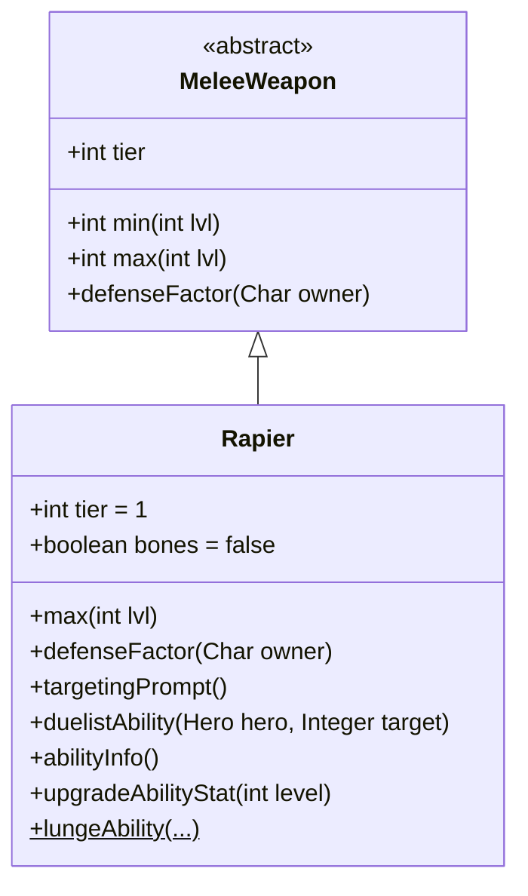

# Rapier 类文档

## 1. 基本信息
| 属性 | 值 |
|------|-----|
| 文件路径 | core/src/main/java/com/shatteredpixel/shatteredpixeldungeon/items/weapon/melee/Rapier.java |
| 包名 | com.shatteredpixel.shatteredpixeldungeon.items.weapon.melee |
| 类类型 | public class |
| 继承关系 | extends MeleeWeapon |
| 代码行数 | 177 行 |

## 2. 类职责说明
Rapier（刺剑）是一种 Tier 1 的近战武器，具有独特的「突刺」能力，可以让英雄跳跃到敌人附近并进行攻击。刺剑还提供少量防御加成。这是一把灵活的机动型武器，适合需要快速接近敌人的场景。

## 4. 继承与协作关系


## 静态常量表
| 常量名 | 类型 | 值 | 说明 |
|--------|------|-----|------|
| 无静态常量 | - | - | - |

## 实例字段表
| 字段名 | 类型 | 修饰符 | 说明 |
|--------|------|--------|------|
| image | int | 初始化块 | 物品图标，使用 ItemSpriteSheet.RAPIER |
| hitSound | String | 初始化块 | 击中音效，使用 Assets.Sounds.HIT_SLASH |
| hitSoundPitch | float | 初始化块 | 音效音高，设为 1.3f（高音） |
| tier | int | 初始化块 | 武器等级，设为 1 |
| bones | boolean | 初始化块 | 是否出现在遗骸中，设为 false |

## 7. 方法详解

### max
**签名**: `public int max(int lvl)`
**功能**: 计算指定等级下的最大伤害
**参数**: `lvl` - 武器等级
**返回值**: 最大伤害值
**实现逻辑**:
```java
return 4*(tier+1) +    // 8基础伤害，低于标准的10
       lvl*(tier+1);   // 每级+2伤害，标准成长
```

### defenseFactor
**签名**: `public int defenseFactor(Char owner)`
**功能**: 返回防御因子
**参数**: `owner` - 拥有者
**返回值**: 固定返回1
**实现逻辑**: `return 1;` // 提供1点额外防御

### targetingPrompt
**签名**: `public String targetingPrompt()`
**功能**: 返回目标选择提示文本
**参数**: 无
**返回值**: 从消息文件获取的提示字符串

### duelistAbility
**签名**: `protected void duelistAbility(Hero hero, Integer target)`
**功能**: 执行决斗家的「突刺」能力
**参数**: 
- `hero` - 执行能力的英雄
- `target` - 目标位置
**返回值**: 无
**实现逻辑**:
```java
// 计算伤害加成：5 + 1.5*武器等级
// 约111%基础伤害加成，100%成长加成
int dmgBoost = augment.damageFactor(5 + Math.round(1.5f*buffedLvl()));
lungeAbility(hero, target, 1, dmgBoost, this);
```

### abilityInfo
**签名**: `public String abilityInfo()`
**功能**: 返回能力描述信息
**参数**: 无
**返回值**: 能力描述字符串

### upgradeAbilityStat
**签名**: `public String upgradeAbilityStat(int level)`
**功能**: 返回指定等级下的能力统计
**参数**: `level` - 武器等级
**返回值**: 伤害范围字符串

### lungeAbility (静态方法)
**签名**: `public static void lungeAbility(Hero hero, Integer target, float dmgMulti, int dmgBoost, MeleeWeapon wep)`
**功能**: 执行突刺能力的核心逻辑
**参数**: 
- `hero` - 执行能力的英雄
- `target` - 目标位置
- `dmgMulti` - 伤害倍率
- `dmgBoost` - 伤害加成
- `wep` - 使用的武器
**返回值**: 无
**实现逻辑**:
```java
// 验证目标...
Char enemy = Actor.findChar(target);
// 决斗家可以跳出视野攻击，但如果没目标会浪费能力

// 检查距离限制
if (hero.rooted || Dungeon.level.distance(hero.pos, target) < 2
        || Dungeon.level.distance(hero.pos, target)-1 > wep.reachFactor(hero)){
    GLog.w(Messages.get(wep, "ability_target_range"));
    if (hero.rooted) PixelScene.shake(1, 1f);  // 定身时屏幕震动
    return;
}

// 寻找最佳跳跃位置
int lungeCell = -1;
for (int i : PathFinder.NEIGHBOURS8){
    if (Dungeon.level.distance(hero.pos+i, target) <= wep.reachFactor(hero)
            && Actor.findChar(hero.pos+i) == null
            && (Dungeon.level.passable[hero.pos+i] || ...)){
        // 选择离目标最近的位置
        if (lungeCell == -1 || Dungeon.level.trueDistance(...) < ...){
            lungeCell = hero.pos + i;
        }
    }
}

// 执行跳跃
hero.sprite.jump(hero.pos, dest, 0, 0.1f, new Callback() {
    @Override
    public void call() {
        // 更新英雄位置
        hero.pos = dest;
        Dungeon.level.occupyCell(hero);
        Dungeon.observe();
        
        // 如果有敌人且可以攻击，则攻击
        if (enemy != null && hero.canAttack(enemy)) {
            // 执行攻击...
        } else {
            // 没有目标则退回部分充能
            Charger charger = Buff.affect(hero, Charger.class);
            charger.partialCharge -= 1;
            // ...
        }
    }
});
```
关键特点：
1. 跳跃到敌人附近并攻击
2. 使用跳跃动画而非普通移动
3. 如果没有可攻击的目标会浪费部分充能

## 11. 使用示例
```java
// 创建一把刺剑
Rapier rapier = new Rapier();
// Tier 1武器，提供少量防御
// 决斗家可以使用「突刺」快速接近敌人

hero.belongings.weapon = rapier;
// 使用能力跳跃到敌人身边并攻击
// 注意：需要目标在2格以上距离
```

## 注意事项
- `bones = false` 意味着不会出现在遗骸中
- 提供1点额外防御
- 能力需要目标在2格或更远距离
- 定身状态下无法使用能力（会触发屏幕震动）
- 能力有跳跃动画效果

## 最佳实践
- 利用突刺能力快速接近远程敌人
- 注意目标距离限制（不能太近或太远）
- 确保有可攻击的目标避免浪费充能
- 配合高机动性战术使用