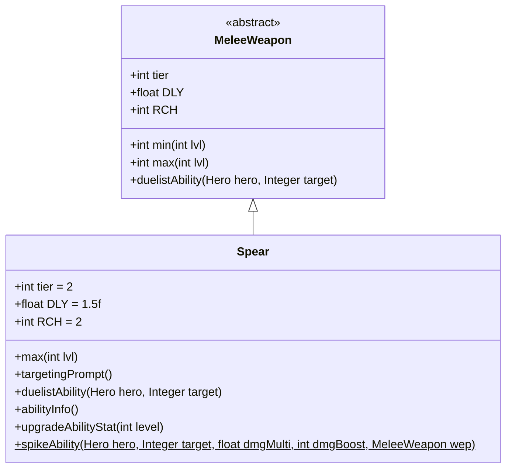

# Spear 类文档

## 1. 基本信息
| 属性 | 值 |
|------|-----|
| 文件路径 | core/src/main/java/com/shatteredpixel/shatteredpixeldungeon/items/weapon/melee/Spear.java |
| 包名 | com.shatteredpixel.shatteredpixeldungeon.items.weapon.melee |
| 类类型 | public class |
| 继承关系 | extends MeleeWeapon |
| 代码行数 | 131 行 |

## 2. 类职责说明
Spear（长矛）是一种 Tier 2 的近战武器，具有额外攻击范围（RCH=2）和较慢的攻击速度（DLY=1.5f）。作为决斗家武器，其特殊能力「刺穿」可以造成高额伤害并将敌人击退。长矛是典型的长柄武器，适合保持距离作战。

## 4. 继承与协作关系


## 静态常量表
| 常量名 | 类型 | 值 | 说明 |
|--------|------|-----|------|
| 无静态常量 | - | - | - |

## 实例字段表
| 字段名 | 类型 | 修饰符 | 说明 |
|--------|------|--------|------|
| image | int | 初始化块 | 物品图标，使用 ItemSpriteSheet.SPEAR |
| hitSound | String | 初始化块 | 击中音效，使用 Assets.Sounds.HIT_STAB |
| hitSoundPitch | float | 初始化块 | 音效音高，设为 0.9f（较低沉） |
| tier | int | 初始化块 | 武器等级，设为 2 |
| DLY | float | 初始化块 | 攻击延迟，设为 1.5f（0.67倍速） |
| RCH | int | 初始化块 | 攻击范围，设为 2（额外1格） |

## 7. 方法详解

### max
**签名**: `public int max(int lvl)`
**功能**: 计算指定等级下的最大伤害
**参数**: `lvl` - 武器等级
**返回值**: 最大伤害值
**实现逻辑**:
```java
return Math.round(6.67f*(tier+1)) +    // 20基础伤害，高于标准的15
       lvl*Math.round(1.33f*(tier+1)); // 每级+4伤害，高于标准的+3
```
长矛的伤害略高于标准，补偿较慢的攻击速度。

### targetingPrompt
**签名**: `public String targetingPrompt()`
**功能**: 返回目标选择提示文本
**参数**: 无
**返回值**: 从消息文件获取的提示字符串

### duelistAbility
**签名**: `protected void duelistAbility(Hero hero, Integer target)`
**功能**: 执行决斗家的「刺穿」能力
**参数**: 
- `hero` - 执行能力的英雄
- `target` - 目标位置
**返回值**: 无
**实现逻辑**:
```java
// 计算伤害加成：基础9点 + 2*武器等级
// 约83%基础伤害加成，80%成长伤害加成
int dmgBoost = augment.damageFactor(9 + Math.round(2f*buffedLvl()));
Spear.spikeAbility(hero, target, 1, dmgBoost, this);
```

### abilityInfo
**签名**: `public String abilityInfo()`
**功能**: 返回能力描述信息
**参数**: 无
**返回值**: 能力描述字符串

### upgradeAbilityStat
**签名**: `public String upgradeAbilityStat(int level)`
**功能**: 返回指定等级下的能力伤害统计
**参数**: `level` - 武器等级
**返回值**: 伤害范围字符串

### spikeAbility (静态方法)
**签名**: `public static void spikeAbility(Hero hero, Integer target, float dmgMulti, int dmgBoost, MeleeWeapon wep)`
**功能**: 执行刺穿能力的核心逻辑
**参数**: 
- `hero` - 执行能力的英雄
- `target` - 目标位置
- `dmgMulti` - 伤害倍率
- `dmgBoost` - 伤害加成
- `wep` - 使用的武器
**返回值**: 无
**实现逻辑**:
```java
if (target == null) {
    return;  // 无目标则退出
}

Char enemy = Actor.findChar(target);
// 验证目标有效性
if (enemy == null || enemy == hero || hero.isCharmedBy(enemy) || !Dungeon.level.heroFOV[target]) {
    GLog.w(Messages.get(wep, "ability_no_target"));
    return;
}

hero.belongings.abilityWeapon = wep;
// 验证攻击距离（不能攻击相邻敌人）
if (!hero.canAttack(enemy) || Dungeon.level.adjacent(hero.pos, enemy.pos)){
    GLog.w(Messages.get(wep, "ability_target_range"));
    hero.belongings.abilityWeapon = null;
    return;
}
hero.belongings.abilityWeapon = null;

hero.sprite.attack(enemy.pos, new Callback() {
    @Override
    public void call() {
        wep.beforeAbilityUsed(hero, enemy);
        AttackIndicator.target(enemy);
        int oldPos = enemy.pos;
        
        // 执行攻击
        if (hero.attack(enemy, dmgMulti, dmgBoost, Char.INFINITE_ACCURACY)) {
            // 如果敌人存活且位置未变，则击退
            if (enemy.isAlive() && enemy.pos == oldPos && !Pushing.pushingExistsForChar(enemy)){
                // 计算击退轨迹
                Ballistica trajectory = new Ballistica(hero.pos, enemy.pos, Ballistica.STOP_TARGET);
                trajectory = new Ballistica(trajectory.collisionPos, trajectory.path.get(trajectory.path.size() - 1), Ballistica.PROJECTILE);
                // 击退敌人1格
                WandOfBlastWave.throwChar(enemy, trajectory, 1, true, false, hero);
            } else if (!enemy.isAlive()) {
                wep.onAbilityKill(hero, enemy);
            }
            Sample.INSTANCE.play(Assets.Sounds.HIT_STRONG);
        }
        Invisibility.dispel();
        hero.spendAndNext(hero.attackDelay());
        wep.afterAbilityUsed(hero);
    }
});
```
这个能力的关键特点：
1. 必须攻击非相邻的敌人（利用长矛的范围优势）
2. 攻击命中后会将敌人击退1格
3. 使用无限准确度确保命中

## 11. 使用示例
```java
// 创建一把长矛
Spear spear = new Spear();
// Tier 2武器，攻击范围2格，攻击速度较慢
// 决斗家可以使用「刺穿」能力造成伤害并击退敌人

hero.belongings.weapon = spear;
// 利用额外攻击范围保持安全距离
```

## 注意事项
- 攻击速度较慢（DLY=1.5f，约0.67倍速）
- 攻击范围为2格，可以隔格攻击
- 能力必须对非相邻敌人使用
- 击退效果可以创造战术空间

## 最佳实践
- 保持与敌人的距离，利用额外攻击范围
- 使用能力将敌人击退，创造安全空间
- 配合地形（如门口、走廊）使用更有效
- 对高威胁敌人使用能力造成大量伤害