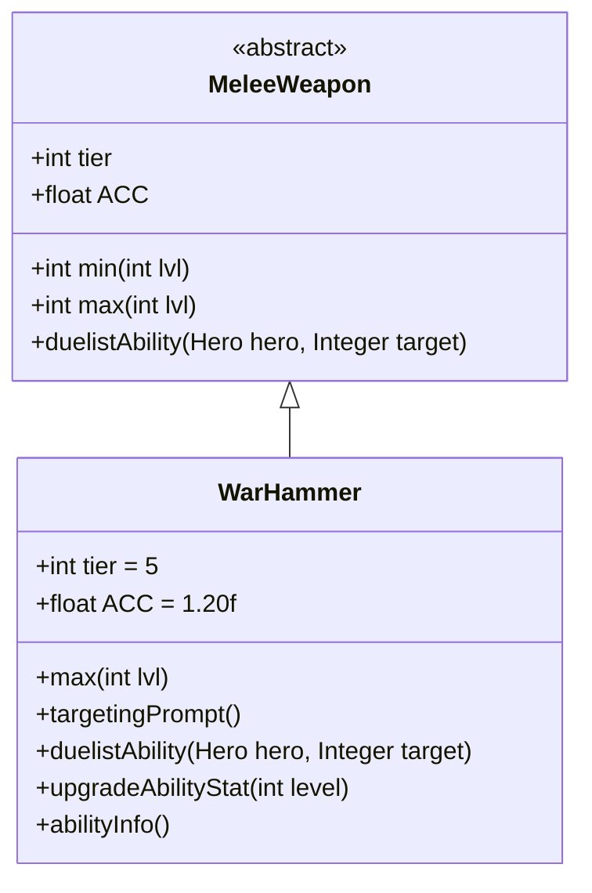

# WarHammer 类文档

## 1. 基本信息
| 属性 | 值 |
|------|-----|
| 文件路径 | core/src/main/java/com/shatteredpixel/shatteredpixeldungeon/items/weapon/melee/WarHammer.java |
| 包名 | com.shatteredpixel.shatteredpixeldungeon.items.weapon.melee |
| 类类型 | public class |
| 继承关系 | extends MeleeWeapon |
| 代码行数 | 73 行 |

## 2. 类职责说明
WarHammer（战锤）是一种 Tier 5 的高级近战武器，具有高准确度（ACC=1.2f）但较低的基础伤害。作为决斗家武器，其特殊能力「重击」可以造成额外的爆发伤害。这是钉锤类武器的升级版本，适合追求稳定命中的玩家。

## 4. 继承与协作关系


## 静态常量表
| 常量名 | 类型 | 值 | 说明 |
|--------|------|-----|------|
| 无静态常量 | - | - | - |

## 实例字段表
| 字段名 | 类型 | 修饰符 | 说明 |
|--------|------|--------|------|
| image | int | 初始化块 | 物品图标，使用 ItemSpriteSheet.WAR_HAMMER |
| hitSound | String | 初始化块 | 击中音效，使用 Assets.Sounds.HIT_CRUSH |
| hitSoundPitch | float | 初始化块 | 音效音高，设为 1f（正常） |
| tier | int | 初始化块 | 武器等级，设为 5 |
| ACC | float | 初始化块 | 准确度修正，设为 1.20f（20%准确度加成） |

## 7. 方法详解

### max
**签名**: `public int max(int lvl)`
**功能**: 计算指定等级下的最大伤害
**参数**: `lvl` - 武器等级
**返回值**: 最大伤害值
**实现逻辑**:
```java
return 4*(tier+1) +    // 24基础伤害，低于标准的30
       lvl*(tier+1);   // 每级+6伤害，标准成长
```
战锤的基础伤害较低，但准确度加成补偿了这一点。

### targetingPrompt
**签名**: `public String targetingPrompt()`
**功能**: 返回目标选择提示文本
**参数**: 无
**返回值**: 从消息文件获取的提示字符串
**实现逻辑**: 调用 `Messages.get(this, "prompt")` 获取本地化的提示文本。

### duelistAbility
**签名**: `protected void duelistAbility(Hero hero, Integer target)`
**功能**: 执行决斗家的「重击」能力
**参数**: 
- `hero` - 执行能力的英雄
- `target` - 目标位置
**返回值**: 无
**实现逻辑**:
```java
// 计算伤害加成：基础6点 + 1.5*武器等级
// 约40%基础伤害加成，45%成长伤害加成
int dmgBoost = augment.damageFactor(6 + Math.round(1.5f*buffedLvl()));
// 调用Mace的重击能力实现
Mace.heavyBlowAbility(hero, target, 1, dmgBoost, this);
```
这个能力造成额外伤害，复用了钉锤类的能力实现。

### upgradeAbilityStat
**签名**: `public String upgradeAbilityStat(int level)`
**功能**: 返回指定等级下的能力伤害统计
**参数**: `level` - 武器等级
**返回值**: 伤害范围字符串
**实现逻辑**:
```java
int dmgBoost = 6 + Math.round(1.5f*level);
return augment.damageFactor(min(level)+dmgBoost) + "-" + 
       augment.damageFactor(max(level)+dmgBoost);
```

### abilityInfo
**签名**: `public String abilityInfo()`
**功能**: 返回能力描述信息
**参数**: 无
**返回值**: 能力描述字符串
**实现逻辑**:
```java
int dmgBoost = levelKnown ? 6 + Math.round(1.5f*buffedLvl()) : 6;
if (levelKnown){
    return Messages.get(this, "ability_desc", 
        augment.damageFactor(min()+dmgBoost), 
        augment.damageFactor(max()+dmgBoost));
} else {
    return Messages.get(this, "typical_ability_desc", 
        min(0)+dmgBoost, max(0)+dmgBoost);
}
```

## 11. 使用示例
```java
// 创建一把战锤
WarHammer hammer = new WarHammer();
// Tier 5武器，高准确度但较低伤害
// 决斗家可以使用「重击」能力造成爆发伤害

hero.belongings.weapon = hammer;
// 高准确度使攻击更容易命中
```

## 注意事项
- 准确度加成（ACC=1.2f）使攻击更稳定
- 基础伤害较低（24 vs 标准30）
- 能力复用了 `Mace.heavyBlowAbility()` 方法
- 使用粉碎音效（HIT_CRUSH）而非斩击音效

## 最佳实践
- 对高闪避敌人使用，准确度加成更有效
- 配合暴击装备或buff效果更佳
- 使用能力时选择高价值目标