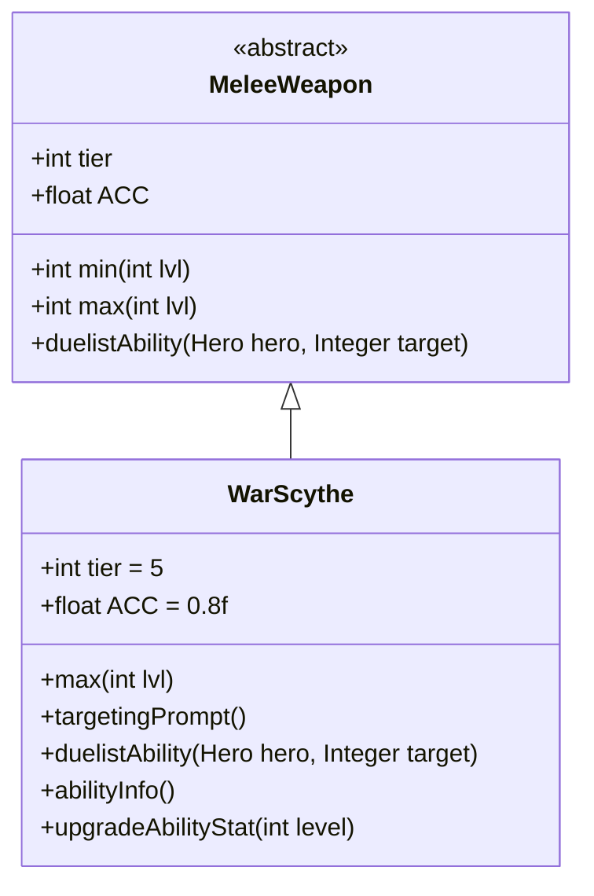

# WarScythe 类文档

## 1. 基本信息
| 属性 | 值 |
|------|-----|
| 文件路径 | core/src/main/java/com/shatteredpixel/shatteredpixeldungeon/items/weapon/melee/WarScythe.java |
| 包名 | com.shatteredpixel.shatteredpixeldungeon.items.weapon.melee |
| 类类型 | public class |
| 继承关系 | extends MeleeWeapon |
| 代码行数 | 73 行 |

## 2. 类职责说明
WarScythe（战镰）是一种 Tier 5 的高级近战武器，具有高伤害但准确度较低（ACC=0.8f）。它的特殊能力「收割」会造成大量流血伤害而非直接伤害。这是镰刀类武器的升级版本，比普通镰刀更强大。

## 4. 继承与协作关系


## 静态常量表
| 常量名 | 类型 | 值 | 说明 |
|--------|------|-----|------|
| 无静态常量 | - | - | - |

## 实例字段表
| 字段名 | 类型 | 修饰符 | 说明 |
|--------|------|--------|------|
| image | int | 初始化块 | 物品图标，使用 ItemSpriteSheet.WAR_SCYTHE |
| hitSound | String | 初始化块 | 击中音效，使用 Assets.Sounds.HIT_SLASH |
| hitSoundPitch | float | 初始化块 | 音效音高，设为 0.9f（较低沉） |
| tier | int | 初始化块 | 武器等级，设为 5 |
| ACC | float | 初始化块 | 准确度修正，设为 0.8f（20%准确度惩罚） |

## 7. 方法详解

### max
**签名**: `public int max(int lvl)`
**功能**: 计算指定等级下的最大伤害
**参数**: `lvl` - 武器等级
**返回值**: 最大伤害值
**实现逻辑**:
```java
return Math.round(6.67f*(tier+1)) +    // 40基础伤害，高于标准的30
       lvl*(tier+1);                   // 每级+6伤害，标准成长
```
战镰具有较高的基础伤害来补偿准确度惩罚。

### targetingPrompt
**签名**: `public String targetingPrompt()`
**功能**: 返回目标选择提示文本
**参数**: 无
**返回值**: 从消息文件获取的提示字符串
**实现逻辑**: 调用 `Messages.get(this, "prompt")` 获取本地化的提示文本。

### duelistAbility
**签名**: `protected void duelistAbility(Hero hero, Integer target)`
**功能**: 执行决斗家的「收割」能力
**参数**: 
- `hero` - 执行能力的英雄
- `target` - 目标位置
**返回值**: 无
**实现逻辑**:
```java
// 计算流血量：基础30 + 4.5*武器等级
// 约133%基础伤害，129%成长伤害
int bleedAmt = augment.damageFactor(Math.round(30f + 4.5f*buffedLvl()));
// 调用Sickle的收割能力，不造成直接伤害（dmgMulti=0）
Sickle.harvestAbility(hero, target, 0f, bleedAmt, this);
```
这个能力造成大量流血伤害，相当于平均伤害的约130%。

### abilityInfo
**签名**: `public String abilityInfo()`
**功能**: 返回能力描述信息
**参数**: 无
**返回值**: 能力描述字符串
**实现逻辑**:
```java
int bleedAmt = levelKnown ? Math.round(30f + 4.5f*buffedLvl()) : 30;
if (levelKnown){
    return Messages.get(this, "ability_desc", augment.damageFactor(bleedAmt));
} else {
    return Messages.get(this, "typical_ability_desc", bleedAmt);
}
```

### upgradeAbilityStat
**签名**: `public String upgradeAbilityStat(int level)`
**功能**: 返回指定等级下的能力伤害统计
**参数**: `level` - 武器等级
**返回值**: 流血伤害数值字符串
**实现逻辑**:
```java
return Integer.toString(augment.damageFactor(Math.round(30f + 4.5f*level)));
```

## 11. 使用示例
```java
// 创建一把战镰
WarScythe scythe = new WarScythe();
// Tier 5武器，高伤害但准确度较低
// 决斗家可以使用「收割」能力造成流血效果

hero.belongings.weapon = scythe;
// 使用能力对敌人造成大量流血伤害
```

## 注意事项
- 准确度惩罚（ACC=0.8f）意味着攻击更容易被闪避
- 能力造成的流血伤害会在多个回合内生效
- 能力复用了 `Sickle.harvestAbility()` 方法
- 高基础伤害补偿了准确度的不足

## 最佳实践
- 配合提高命中率的装备或buff使用
- 对高生命值敌人使用流血能力效果更佳
- 升级武器可以显著提升流血伤害