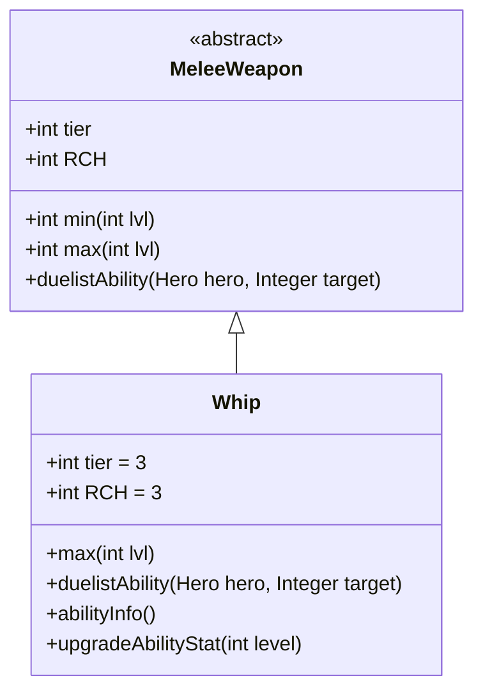

# Whip 类文档

## 1. 基本信息
| 属性 | 值 |
|------|-----|
| 文件路径 | core/src/main/java/com/shatteredpixel/shatteredpixeldungeon/items/weapon/melee/Whip.java |
| 包名 | com.shatteredpixel.shatteredpixeldungeon.items.weapon.melee |
| 类类型 | public class |
| 继承关系 | extends MeleeWeapon |
| 代码行数 | 111 行 |

## 2. 类职责说明
Whip（鞭子）是一种 Tier 3 的近战武器，具有极高的攻击范围（RCH=3）。它的基础伤害较低，但可以同时攻击所有在视野范围内、可触及的敌人。作为决斗家武器，其特殊能力「横扫」可以一次性攻击多个敌人。

## 4. 继承与协作关系


## 静态常量表
| 常量名 | 类型 | 值 | 说明 |
|--------|------|-----|------|
| 无静态常量 | - | - | - |

## 实例字段表
| 字段名 | 类型 | 修饰符 | 说明 |
|--------|------|--------|------|
| image | int | 初始化块 | 物品图标，使用 ItemSpriteSheet.WHIP |
| hitSound | String | 初始化块 | 击中音效，使用 Assets.Sounds.HIT |
| hitSoundPitch | float | 初始化块 | 音效音高，设为 1.1f |
| tier | int | 初始化块 | 武器等级，设为 3 |
| RCH | int | 初始化块 | 攻击范围，设为 3（普通武器为1） |

## 7. 方法详解

### max
**签名**: `public int max(int lvl)`
**功能**: 计算指定等级下的最大伤害
**参数**: `lvl` - 武器等级
**返回值**: 最大伤害值
**实现逻辑**:
```java
return 5*(tier) +      // 15基础伤害，低于标准的20
       lvl*(tier);     // 每级+3伤害，低于标准的+4
```
鞭子的伤害被降低了，以平衡其极高的攻击范围。

### duelistAbility
**签名**: `protected void duelistAbility(Hero hero, Integer target)`
**功能**: 执行决斗家的「横扫」能力，攻击所有可触及的敌人
**参数**: 
- `hero` - 执行能力的英雄
- `target` - 目标位置（此能力忽略单个目标）
**返回值**: 无
**实现逻辑**:
```java
ArrayList<Char> targets = new ArrayList<>();
Char closest = null;

hero.belongings.abilityWeapon = this;
// 遍历所有角色，筛选有效目标
for (Char ch : Actor.chars()){
    if (ch.alignment == Char.Alignment.ENEMY  // 是敌人
            && !hero.isCharmedBy(ch)           // 未被魅惑
            && Dungeon.level.heroFOV[ch.pos]   // 在视野内
            && hero.canAttack(ch)){             // 可攻击
        targets.add(ch);
        // 记录最近的敌人
        if (closest == null || 
            Dungeon.level.trueDistance(hero.pos, closest.pos) > 
            Dungeon.level.trueDistance(hero.pos, ch.pos)){
            closest = ch;
        }
    }
}
hero.belongings.abilityWeapon = null;

if (targets.isEmpty()) {
    GLog.w(Messages.get(this, "ability_no_target"));
    return;  // 没有目标则退出
}

throwSound();
Char finalClosest = closest;
hero.sprite.attack(hero.pos, new Callback() {
    @Override
    public void call() {
        beforeAbilityUsed(hero, finalClosest);
        for (Char ch : targets) {
            // 攻击每个目标，不造成额外伤害
            hero.attack(ch, 1, 0, Char.INFINITE_ACCURACY);
            if (!ch.isAlive()){
                onAbilityKill(hero, ch);
            }
        }
        Invisibility.dispel();
        hero.spendAndNext(hero.attackDelay());
        afterAbilityUsed(hero);
    }
});
```
这个能力可以同时攻击视野内所有可触及的敌人，非常适合被包围时使用。

### abilityInfo
**签名**: `public String abilityInfo()`
**功能**: 返回能力描述信息
**参数**: 无
**返回值**: 能力描述字符串
**实现逻辑**:
```java
if (levelKnown){
    return Messages.get(this, "ability_desc", 
        augment.damageFactor(min()), augment.damageFactor(max()));
} else {
    return Messages.get(this, "typical_ability_desc", min(0), max(0));
}
```

### upgradeAbilityStat
**签名**: `public String upgradeAbilityStat(int level)`
**功能**: 返回指定等级下的能力伤害统计
**参数**: `level` - 武器等级
**返回值**: 伤害范围字符串
**实现逻辑**:
```java
return augment.damageFactor(min(level)) + "-" + 
       augment.damageFactor(max(level));
```

## 11. 使用示例
```java
// 创建一把鞭子
Whip whip = new Whip();
// 鞭子具有极长的攻击范围（3格）
// 决斗家可以使用「横扫」能力攻击所有可触及的敌人

// 当被多个敌人包围时使用能力
hero.belongings.weapon = whip;
// 能力会自动攻击视野内所有可触及的敌人
```

## 注意事项
- 攻击范围 RCH=3 是普通武器的3倍
- 基础伤害较低（15 vs 标准20）以平衡范围优势
- 能力攻击所有目标时使用无限准确度（INFINITE_ACCURACY）
- 能力不造成额外伤害，但可以同时攻击多个敌人

## 最佳实践
- 在被多个敌人包围时使用「横扫」能力
- 利用长攻击范围进行安全的远程近战
- 配合减速或控制效果，在敌人接近前消灭它们