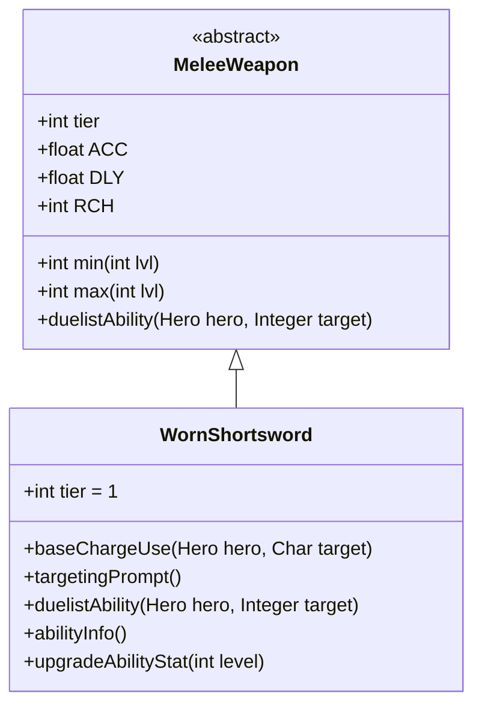

# WornShortsword 类文档

## 1. 基本信息
| 属性 | 值 |
|------|-----|
| 文件路径 | core/src/main/java/com/shatteredpixel/shatteredpixeldungeon/items/weapon/melee/WornShortsword.java |
| 包名 | com.shatteredpixel.shatteredpixeldungeon.items.weapon.melee |
| 类类型 | public class |
| 继承关系 | extends MeleeWeapon |
| 代码行数 | 78 行 |

## 2. 类职责说明
WornShortsword（磨损短剑）是一种 Tier 1 的入门级近战武器，代表一把使用过、略显破旧的短剑。它的属性略低于普通短剑，并且不会出现在遗骸（bones）中，适合游戏初期使用。作为决斗家（Duelist）武器，它拥有「劈砍（Cleave）」能力。

## 4. 继承与协作关系


## 静态常量表
| 常量名 | 类型 | 值 | 说明 |
|--------|------|-----|------|
| 无静态常量 | - | - | - |

## 实例字段表
| 字段名 | 类型 | 修饰符 | 说明 |
|--------|------|--------|------|
| image | int | 初始化块 | 物品图标，使用 ItemSpriteSheet.WORN_SHORTSWORD |
| hitSound | String | 初始化块 | 击中音效，使用 Assets.Sounds.HIT_SLASH |
| hitSoundPitch | float | 初始化块 | 音效音高，设为 1.1f（略高） |
| tier | int | 初始化块 | 武器等级，设为 1 |
| bones | boolean | 初始化块 | 是否出现在遗骸中，设为 false |

## 7. 方法详解

### baseChargeUse
**签名**: `protected int baseChargeUse(Hero hero, Char target)`
**功能**: 计算使用能力所需的充能点数
**参数**: 
- `hero` - 使用能力的英雄
- `target` - 攻击目标
**返回值**: 所需充能点数（0 或 1）
**实现逻辑**: 
```java
if (hero.buff(Sword.CleaveTracker.class) != null){
    return 0;  // 如果有劈砍追踪器buff，则免费
} else {
    return 1;  // 否则需要1点充能
}
```
这个方法实现了连击机制：如果英雄已经处于劈砍状态，则下一次能力使用不消耗充能。

### targetingPrompt
**签名**: `public String targetingPrompt()`
**功能**: 返回目标选择提示文本
**参数**: 无
**返回值**: 从消息文件获取的提示字符串
**实现逻辑**: 调用 `Messages.get(this, "prompt")` 获取本地化的提示文本。

### duelistAbility
**签名**: `protected void duelistAbility(Hero hero, Integer target)`
**功能**: 执行决斗家的「劈砍」能力
**参数**: 
- `hero` - 执行能力的英雄
- `target` - 目标位置
**返回值**: 无
**实现逻辑**:
```java
// 计算伤害加成：基础3点 + 武器等级
int dmgBoost = augment.damageFactor(3 + buffedLvl());
// 调用Sword类的劈砍能力实现，传入参数：
// dmgMulti=1（伤害倍率100%）
// dmgBoost=计算出的伤害加成
Sword.cleaveAbility(hero, target, 1, dmgBoost, this);
```
这个能力造成额外伤害，基础提升约55%，成长提升约67%。

### abilityInfo
**签名**: `public String abilityInfo()`
**功能**: 返回能力描述信息
**参数**: 无
**返回值**: 能力描述字符串
**实现逻辑**:
```java
int dmgBoost = levelKnown ? 3 + buffedLvl() : 3;
if (levelKnown){
    // 如果等级已知，显示实际伤害范围
    return Messages.get(this, "ability_desc", 
        augment.damageFactor(min()+dmgBoost), 
        augment.damageFactor(max()+dmgBoost));
} else {
    // 否则显示基础伤害范围
    return Messages.get(this, "typical_ability_desc", 
        min(0)+dmgBoost, max(0)+dmgBoost);
}
```

### upgradeAbilityStat
**签名**: `public String upgradeAbilityStat(int level)`
**功能**: 返回指定等级下的能力伤害统计
**参数**: `level` - 武器等级
**返回值**: 伤害范围字符串（如 "5-10"）
**实现逻辑**:
```java
int dmgBoost = 3 + level;
return augment.damageFactor(min(level)+dmgBoost) + "-" + 
       augment.damageFactor(max(level)+dmgBoost);
```

## 11. 使用示例
```java
// 在游戏中创建一把磨损短剑
WornShortsword sword = new WornShortsword();
// 作为Tier 1武器，适合游戏初期使用
// 决斗家可以使用其「劈砍」能力造成额外伤害
hero.belongings.weapon = sword;
```

## 注意事项
- `bones = false` 意味着这把武器不会出现在其他玩家死亡的遗骸中
- 能力实现复用了 `Sword.cleaveAbility()` 方法
- 音效音高设置为1.1f，使击中声音听起来更轻快

## 最佳实践
- 作为游戏初期的过渡武器使用
- 当获得更好的武器后可以替换
- 决斗家职业可以最大化利用其能力