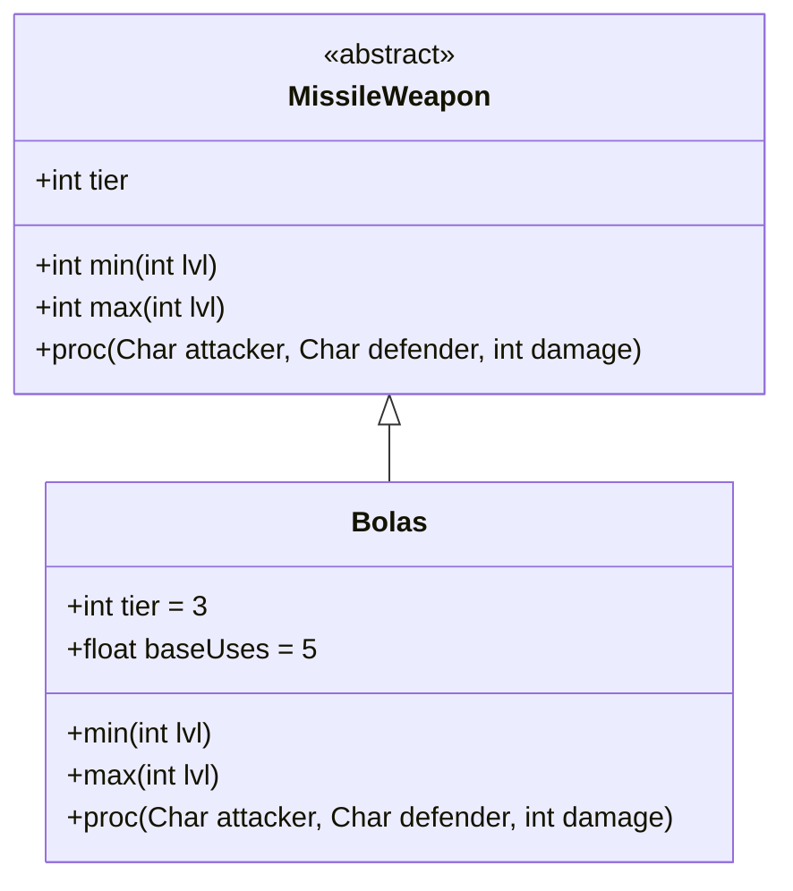

# Bolas 类文档

## 1. 基本信息
| 属性 | 值 |
|------|-----|
| 文件路径 | core/src/main/java/com/shatteredpixel/shatteredpixeldungeon/items/weapon/missiles/Bolas.java |
| 包名 | com.shatteredpixel.shatteredpixeldungeon.items.weapon.missiles |
| 类类型 | public class |
| 继承关系 | extends MissileWeapon |
| 代码行数 | 58 行 |

## 2. 类职责说明
Bolas（流星锤/捕兽索）是一种 Tier 3 的投掷武器，命中后会致残敌人，使其无法移动。伤害较低但具有强大的控制效果，适合用来限制敌人的行动。

## 4. 继承与协作关系


## 静态常量表
| 常量名 | 类型 | 值 | 说明 |
|--------|------|-----|------|
| 无静态常量 | - | - | - |

## 实例字段表
| 字段名 | 类型 | 修饰符 | 说明 |
|--------|------|--------|------|
| image | int | 初始化块 | 物品图标 ItemSpriteSheet.BOLAS |
| hitSound | String | 初始化块 | 击中音效 Assets.Sounds.HIT |
| hitSoundPitch | float | 初始化块 | 音效音高 1f |
| tier | int | 初始化块 | 武器等级 3 |
| baseUses | float | 初始化块 | 基础使用次数 5 |

## 7. 方法详解

### min
**签名**: `public int min(int lvl)`
**功能**: 计算最小伤害
**参数**: `lvl` - 武器等级
**返回值**: 最小伤害值
**实现逻辑**: `return 2 * (tier-1) + 0*lvl;` // 基础4点，无成长

### max
**签名**: `public int max(int lvl)`
**功能**: 计算最大伤害
**参数**: `lvl` - 武器等级
**返回值**: 最大伤害值
**实现逻辑**: `return 3 * tier + (tier-1)*lvl;` // 基础9点，每级+2

### proc
**签名**: `public int proc(Char attacker, Char defender, int damage)`
**功能**: 处理命中效果，致残敌人
**参数**: 
- `attacker` - 攻击者
- `defender` - 防御者
- `damage` - 原始伤害
**返回值**: 处理后的伤害
**实现逻辑**:
```java
// 致残敌人，持续 Cripple.DURATION/2 回合
Buff.prolong(defender, Cripple.class, Cripple.DURATION/2);
return super.proc(attacker, defender, damage);
```

## 11. 使用示例
```java
// 创建流星锤
Bolas bolas = new Bolas();
// Tier 3投掷武器，致残敌人

hero.belongings.collect(bolas);
// 命中后敌人无法移动
// 适合对付近战敌人
```

## 注意事项
- 伤害较低（基础4-9点）
- 必定致残命中的敌人
- 致残效果持续约5回合
- 基础使用次数较低（5次）

## 最佳实践
- 用来限制危险敌人的移动
- 对付近战敌人效果最佳
- 配合远程攻击消灭被致残的敌人
- 控制型投掷武器