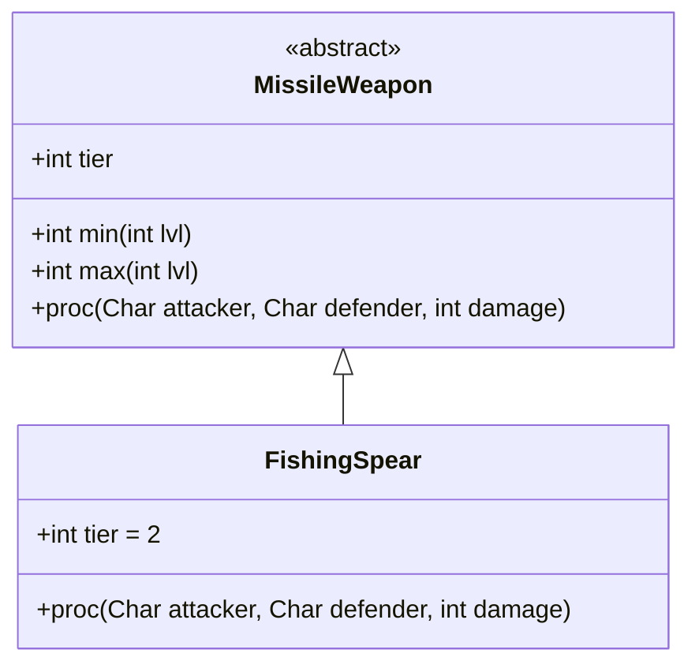

# FishingSpear 类文档

## 1. 基本信息
| 属性 | 值 |
|------|-----|
| 文件路径 | core/src/main/java/com/shatteredpixel/shatteredpixeldungeon/items/weapon/missiles/FishingSpear.java |
| 包名 | com.shatteredpixel.shatteredpixeldungeon.items.weapon.missiles |
| 类类型 | public class |
| 继承关系 | extends MissileWeapon |
| 代码行数 | 46 行 |

## 2. 类职责说明
FishingSpear（鱼叉）是一种 Tier 2 的特殊投掷武器，对水中的食人鱼造成极高伤害（至少造成目标当前生命值一半的伤害）。这是专门用于对付水中敌人的武器。

## 4. 继承与协作关系


## 静态常量表
| 常量名 | 类型 | 值 | 说明 |
|--------|------|-----|------|
| 无静态常量 | - | - | - |

## 实例字段表
| 字段名 | 类型 | 修饰符 | 说明 |
|--------|------|--------|------|
| image | int | 初始化块 | 物品图标 ItemSpriteSheet.FISHING_SPEAR |
| hitSound | String | 初始化块 | 击中音效 Assets.Sounds.HIT_STAB |
| hitSoundPitch | float | 初始化块 | 音效音高 1.1f |
| tier | int | 初始化块 | 武器等级 2 |

## 7. 方法详解

### proc
**签名**: `public int proc(Char attacker, Char defender, int damage)`
**功能**: 处理命中效果，对食人鱼造成额外伤害
**参数**: 
- `attacker` - 攻击者
- `defender` - 防御者
- `damage` - 原始伤害
**返回值**: 处理后的伤害
**实现逻辑**:
```java
if (defender instanceof Piranha){
    // 对食人鱼：至少造成当前生命值一半的伤害
    damage = Math.max(damage, defender.HP/2);
}
return super.proc(attacker, defender, damage);
```

## 11. 使用示例
```java
// 创建鱼叉
FishingSpear spear = new FishingSpear();
// Tier 2投掷武器，对食人鱼有特效

hero.belongings.collect(spear);
// 遇到食人鱼时使用效果极佳
```

## 注意事项
- 专门针对食人鱼设计
- 对食人鱼至少造成50%当前生命值的伤害
- 对其他敌人使用标准伤害
- Tier 2的常规伤害

## 最佳实践
- 专门用于对付食人鱼
- 可以快速清理水中的食人鱼
- 不适合作为常规投掷武器