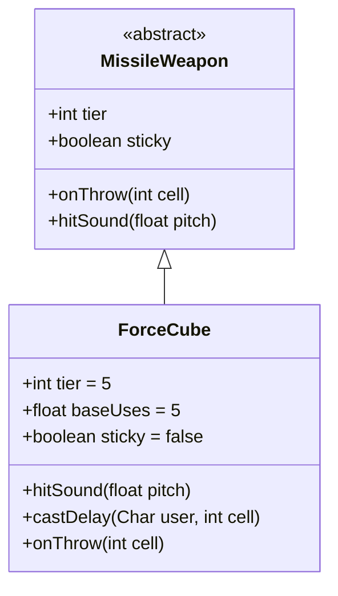

# ForceCube 类文档

## 1. 基本信息
| 属性 | 值 |
|------|-----|
| 文件路径 | core/src/main/java/com/shatteredpixel/shatteredpixeldungeon/items/weapon/missiles/ForceCube.java |
| 包名 | com.shatteredpixel.shatteredpixeldungeon.items.weapon.missiles |
| 类类型 | public class |
| 继承关系 | extends MissileWeapon |
| 代码行数 | 139 行 |

## 2. 类职责说明
ForceCube（力量方块）是一种 Tier 5 的特殊投掷武器，投掷后会产生爆炸效果，对目标位置及周围8格的所有角色造成伤害。它不会直接击中敌人，而是通过爆炸范围伤害来攻击。

## 4. 继承与协作关系


## 静态常量表
| 常量名 | 类型 | 值 | 说明 |
|--------|------|-----|------|
| 无静态常量 | - | - | - |

## 实例字段表
| 字段名 | 类型 | 修饰符 | 说明 |
|--------|------|--------|------|
| image | int | 初始化块 | 物品图标 ItemSpriteSheet.FORCE_CUBE |
| tier | int | 初始化块 | 武器等级 5 |
| baseUses | float | 初始化块 | 基础使用次数 5 |
| sticky | boolean | 初始化块 | false - 不粘在敌人身上 |

## 7. 方法详解

### hitSound
**签名**: `public void hitSound(float pitch)`
**功能**: 播放击中音效
**参数**: `pitch` - 音效音高
**实现逻辑**: 无操作，因为力量方块不会直接击中敌人

### castDelay
**签名**: `public float castDelay(Char user, int cell)`
**功能**: 计算投掷延迟
**参数**: 
- `user` - 投掷者
- `cell` - 目标格子
**返回值**: 延迟时间
**实现逻辑**:
```java
// 投掷到空格或自己身上也会触发爆炸
if (!Dungeon.level.pit[cell] && Actor.findChar(cell) == null){
    return delayFactor(user);  // 使用攻击延迟
} else {
    return super.castDelay(user, cell);
}
```

### onThrow
**签名**: `protected void onThrow(int cell)`
**功能**: 处理投掷逻辑，产生爆炸
**参数**: `cell` - 目标格子
**实现逻辑**:
```java
// 深坑且没有敌人则直接掉落
if ((Dungeon.level.pit[cell] && Actor.findChar(cell) == null)){
    super.onThrow(cell);
    return;
}

// 消耗耐久度
MissileWeapon parentTemp = parent;
rangedHit(null, cell);
parent = parentTemp;
Dungeon.level.pressCell(cell);

// 收集目标：中心格和周围8格
ArrayList<Char> targets = new ArrayList<>();
Char primaryTarget = Actor.findChar(cell);
if (primaryTarget != null) targets.add(primaryTarget);

for (int i : PathFinder.NEIGHBOURS8){
    Dungeon.level.pressCell(cell+i);
    if (Actor.findChar(cell + i) != null) targets.add(Actor.findChar(cell + i));
}

// 按距离排序（从远到近，主要为了弹性附魔）
Collections.sort(targets, ...);

// 攻击所有目标
for (Char target : targets){
    curUser.shoot(target, this);
    // 处理误伤自己死亡的情况
    if (target == Dungeon.hero && !target.isAlive()){
        Badges.validateDeathFromFriendlyMagic();
        Dungeon.fail(this);
        GLog.n(Messages.get(this, "ondeath"));
    }
}

// 产生爆炸效果
WandOfBlastWave.BlastWave.blast(cell);
Sample.INSTANCE.play(Assets.Sounds.BLAST);
```

## 11. 使用示例
```java
// 创建力量方块
ForceCube cube = new ForceCube();
// Tier 5投掷武器，范围爆炸

hero.belongings.collect(cube);
// 投掷后产生3x3范围爆炸
// 小心不要误伤自己！
```

## 注意事项
- `sticky = false` 不粘在敌人身上
- 造成3x3范围伤害
- 可以误伤自己
- 也会触发陷阱和地形效果

## 最佳实践
- 对付成群的敌人效果最佳
- 注意爆炸范围，避免误伤
- 可以利用爆炸触发陷阱
- 狙击手子职业会标记主目标