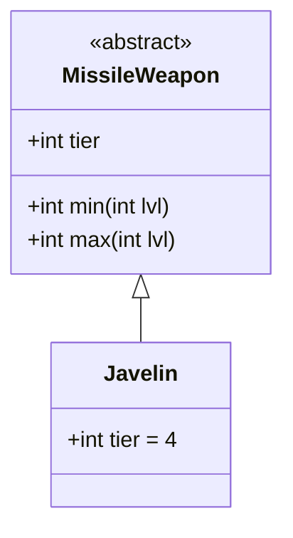

# Javelin 类文档

## 1. 基本信息
| 属性 | 值 |
|------|-----|
| 文件路径 | core/src/main/java/com/shatteredpixel/shatteredpixeldungeon/items/weapon/missiles/Javelin.java |
| 包名 | com.shatteredpixel.shatteredpixeldungeon.items.weapon.missiles |
| 类类型 | public class |
| 继承关系 | extends MissileWeapon |
| 代码行数 | 37 行 |

## 2. 类职责说明
Javelin（标枪）是一种 Tier 4 的高级投掷武器，具有较高的伤害。它是标准的投掷武器，没有特殊效果但伤害可靠。

## 4. 继承与协作关系


## 静态常量表
| 常量名 | 类型 | 值 | 说明 |
|--------|------|-----|------|
| 无静态常量 | - | - | - |

## 实例字段表
| 字段名 | 类型 | 修饰符 | 说明 |
|--------|------|--------|------|
| image | int | 初始化块 | 物品图标 ItemSpriteSheet.JAVELIN |
| hitSound | String | 初始化块 | 击中音效 Assets.Sounds.HIT_STAB |
| hitSoundPitch | float | 初始化块 | 音效音高 1f |
| tier | int | 初始化块 | 武器等级 4 |

## 7. 方法详解

使用父类 MissileWeapon 的所有方法，无重写。

### 继承的伤害计算
- **最小伤害**: 2 * tier + lvl = 8 + lvl
- **最大伤害**: 5 * tier + tier * lvl = 20 + 4*lvl
- **力量需求**: STRReq(tier, lvl) - 1

## 11. 使用示例
```java
// 创建标枪
Javelin javelin = new Javelin();
// Tier 4投掷武器，高伤害

hero.belongings.collect(javelin);
// 高等级的标准投掷武器
```

## 注意事项
- 标准投掷武器，无特殊效果
- 使用父类的默认属性
- 基础使用次数为8次（默认值）
- Tier 4的高伤害

## 最佳实践
- 作为高等级投掷武器的标准选择
- 稳定的高伤害输出
- 适合需要强大远程攻击的情况