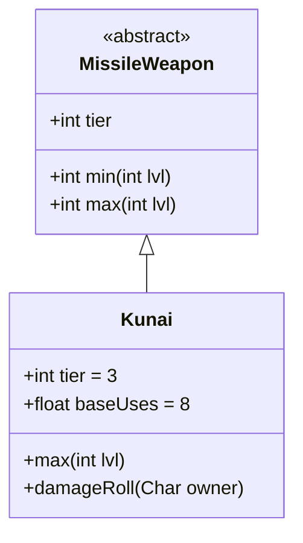

# Kunai 类文档

## 1. 基本信息
| 属性 | 值 |
|------|-----|
| 文件路径 | core/src/main/java/com/shatteredpixel/shatteredpixeldungeon/items/weapon/missiles/Kunai.java |
| 包名 | com.shatteredpixel.shatteredpixeldungeon.items.weapon.missiles |
| 类类型 | public class |
| 继承关系 | extends MissileWeapon |
| 代码行数 | 68 行 |

## 2. 类职责说明
Kunai（苦无）是一种 Tier 3 的投掷武器，对偷袭的敌人造成更高的伤害。苦无是忍者风格的武器，适合配合隐身或偷袭战术使用，耐久度较高。

## 4. 继承与协作关系


## 静态常量表
| 常量名 | 类型 | 值 | 说明 |
|--------|------|-----|------|
| 无静态常量 | - | - | - |

## 实例字段表
| 字段名 | 类型 | 修饰符 | 说明 |
|--------|------|--------|------|
| image | int | 初始化块 | 物品图标 ItemSpriteSheet.KUNAI |
| hitSound | String | 初始化块 | 击中音效 Assets.Sounds.HIT_STAB |
| hitSoundPitch | float | 初始化块 | 音效音高 1.1f |
| tier | int | 初始化块 | 武器等级 3 |
| baseUses | float | 初始化块 | 基础使用次数 8 |

## 7. 方法详解

### max
**签名**: `public int max(int lvl)`
**功能**: 计算最大伤害
**参数**: `lvl` - 武器等级
**返回值**: 最大伤害值
**实现逻辑**:
```java
return 4 * tier + tier*lvl;
// 基础12点伤害，每级+3
```

### damageRoll
**签名**: `public int damageRoll(Char owner)`
**功能**: 计算伤害，偷袭时伤害更高
**参数**: `owner` - 攻击者
**返回值**: 伤害值
**实现逻辑**:
```java
if (owner instanceof Hero) {
    Hero hero = (Hero)owner;
    Char enemy = hero.attackTarget();
    if (enemy instanceof Mob && ((Mob) enemy).surprisedBy(hero)) {
        // 偷袭时：伤害范围从 60%到100%的最大伤害
        int diff = max() - min();
        int damage = augment.damageFactor(Hero.heroDamageIntRange(
                min() + Math.round(diff*0.6f),
                max()));
        int exStr = hero.STR() - STRReq();
        if (exStr > 0) {
            damage += Hero.heroDamageIntRange(0, exStr);
        }
        return damage;
    }
}
return super.damageRoll(owner);
```

## 11. 使用示例
```java
// 创建苦无
Kunai kunai = new Kunai();
// Tier 3投掷武器，偷袭伤害高，耐久度高

hero.belongings.collect(kunai);
// 配合隐身进行偷袭效果更佳
```

## 注意事项
- 偷袭时伤害范围从60%最大伤害到最大伤害
- 耐久度较高（基础使用次数8次）
- 是投掷刀的升级版本
- 音效音高略高

## 最佳实践
- 配合隐身或潜行进行偷袭
- 利用较高的耐久度持续作战
- 是中等级偷袭型投掷武器