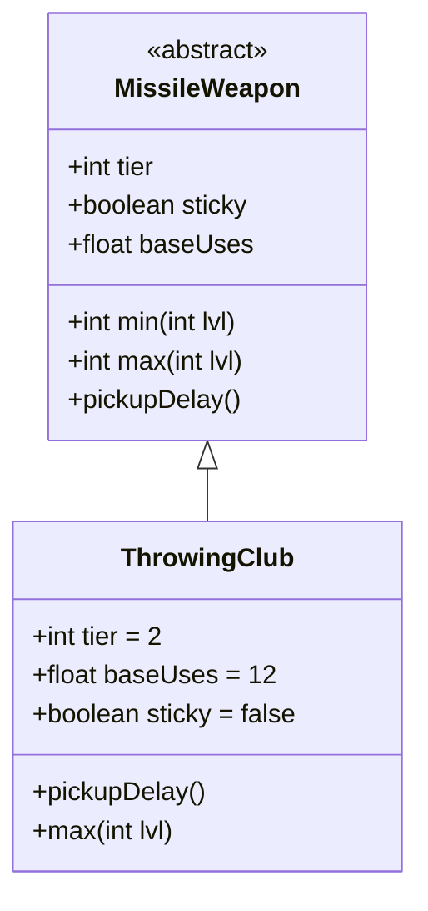

# ThrowingClub 类文档

## 1. 基本信息
| 属性 | 值 |
|------|-----|
| 文件路径 | core/src/main/java/com/shatteredpixel/shatteredpixeldungeon/items/weapon/missiles/ThrowingClub.java |
| 包名 | com.shatteredpixel.shatteredpixeldungeon.items.weapon.missiles |
| 类类型 | public class |
| 继承关系 | extends MissileWeapon |
| 代码行数 | 49 行 |

## 2. 类职责说明
ThrowingClub（投掷棒）是一种 Tier 2 的投掷武器，具有较高的耐久度（基础使用次数12次）。投掷棒不会粘在敌人身上，并且可以立即捡起（无捡起延迟）。

## 4. 继承与协作关系


## 静态常量表
| 常量名 | 类型 | 值 | 说明 |
|--------|------|-----|------|
| 无静态常量 | - | - | - |

## 实例字段表
| 字段名 | 类型 | 修饰符 | 说明 |
|--------|------|--------|------|
| image | int | 初始化块 | 物品图标 ItemSpriteSheet.THROWING_CLUB |
| hitSound | String | 初始化块 | 击中音效 Assets.Sounds.HIT_CRUSH |
| hitSoundPitch | float | 初始化块 | 音效音高 1.1f |
| tier | int | 初始化块 | 武器等级 2 |
| baseUses | float | 初始化块 | 基础使用次数 12 |
| sticky | boolean | 初始化块 | false - 不粘在敌人身上 |

## 7. 方法详解

### pickupDelay
**签名**: `public float pickupDelay()`
**功能**: 返回捡起延迟
**返回值**: 0（立即捡起）
**实现逻辑**: `return 0;`

### max
**签名**: `public int max(int lvl)`
**功能**: 计算最大伤害
**参数**: `lvl` - 武器等级
**返回值**: 最大伤害值
**实现逻辑**: `return 4 * tier + tier * lvl;` // 基础8点

## 11. 使用示例
```java
// 创建投掷棒
ThrowingClub club = new ThrowingClub();
// Tier 2投掷武器，高耐久

hero.belongings.collect(club);
// 可以立即捡起，耐久度较高
```

## 注意事项
- `sticky = false` 不粘在敌人身上
- 可以立即捡起（无延迟）
- 基础使用次数较高（12次）
- 使用粉碎音效

## 最佳实践
- 利用高耐久度长期作战
- 立即捡起特性方便回收
- 是投掷锤的低等级版本