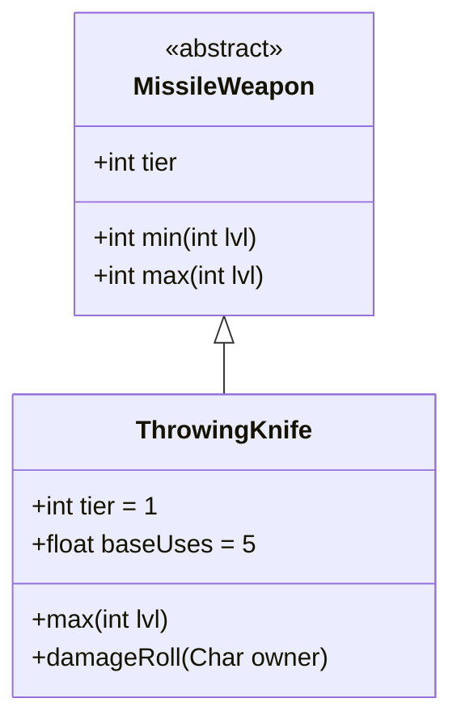

# ThrowingKnife 类文档

## 1. 基本信息
| 属性 | 值 |
|------|-----|
| 文件路径 | core/src/main/java/com/shatteredpixel/shatteredpixeldungeon/items/weapon/missiles/ThrowingKnife.java |
| 包名 | com.shatteredpixel.shatteredpixeldungeon.items.weapon.missiles |
| 类类型 | public class |
| 继承关系 | extends MissileWeapon |
| 代码行数 | 69 行 |

## 2. 类职责说明
ThrowingKnife（投掷刀）是一种 Tier 1 的基础投掷武器，对偷袭的敌人造成更高的伤害。投掷刀是早期游戏中最常见的投掷武器，适合配合隐身或偷袭战术使用。

## 4. 继承与协作关系


## 静态常量表
| 常量名 | 类型 | 值 | 说明 |
|--------|------|-----|------|
| 无静态常量 | - | - | - |

## 实例字段表
| 字段名 | 类型 | 修饰符 | 说明 |
|--------|------|--------|------|
| image | int | 初始化块 | 物品图标 ItemSpriteSheet.THROWING_KNIFE |
| hitSound | String | 初始化块 | 击中音效 Assets.Sounds.HIT_SLASH |
| hitSoundPitch | float | 初始化块 | 音效音高 1.2f |
| bones | boolean | 初始化块 | false - 不出现在遗骸中 |
| tier | int | 初始化块 | 武器等级 1 |
| baseUses | float | 初始化块 | 基础使用次数 5 |

## 7. 方法详解

### max
**签名**: `public int max(int lvl)`
**功能**: 计算最大伤害
**参数**: `lvl` - 武器等级
**返回值**: 最大伤害值
**实现逻辑**:
```java
return 6 * tier + (tier == 1 ? 2*lvl : tier*lvl);
// 基础6点伤害，每级+2
```

### damageRoll
**签名**: `public int damageRoll(Char owner)`
**功能**: 计算伤害，偷袭时伤害更高
**参数**: `owner` - 攻击者
**返回值**: 伤害值
**实现逻辑**:
```java
if (owner instanceof Hero) {
    Hero hero = (Hero)owner;
    Char enemy = hero.attackTarget();
    if (enemy instanceof Mob && ((Mob) enemy).surprisedBy(hero)) {
        // 偷袭时：伤害范围从 75%到100%的最大伤害
        int diff = max() - min();
        int damage = augment.damageFactor(Hero.heroDamageIntRange(
                min() + Math.round(diff*0.75f),
                max()));
        // 力量加成
        int exStr = hero.STR() - STRReq();
        if (exStr > 0) {
            damage += Hero.heroDamageIntRange(0, exStr);
        }
        return damage;
    }
}
return super.damageRoll(owner);
```

## 11. 使用示例
```java
// 创建投掷刀
ThrowingKnife knife = new ThrowingKnife();
// Tier 1投掷武器，偷袭伤害高
// 基础使用次数5次

hero.belongings.collect(knife);
// 配合隐身进行偷袭效果更佳
```

## 注意事项
- `bones = false` 不出现在遗骸中
- 偷袭时伤害范围从75%最大伤害到最大伤害
- 基础使用次数较低（5次）
- 音效音高较高，体现轻快的特点

## 最佳实践
- 配合隐身或潜行进行偷袭
- 利用偷袭的高伤害快速击杀敌人
- 是早期游戏的基础投掷武器