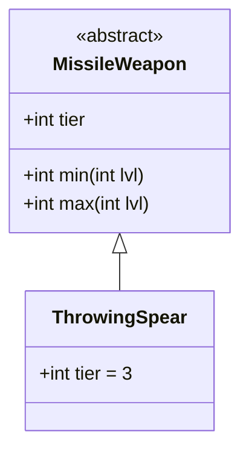

# ThrowingSpear 类文档

## 1. 基本信息
| 属性 | 值 |
|------|-----|
| 文件路径 | core/src/main/java/com/shatteredpixel/shatteredpixeldungeon/items/weapon/missiles/ThrowingSpear.java |
| 包名 | com.shatteredpixel.shatteredpixeldungeon.items.weapon.missiles |
| 类类型 | public class |
| 继承关系 | extends MissileWeapon |
| 代码行数 | 37 行 |

## 2. 类职责说明
ThrowingSpear（投掷矛）是一种 Tier 3 的标准投掷武器，具有平衡的伤害和耐久度。它是游戏中最标准的投掷武器之一，没有特殊效果但可靠稳定。

## 4. 继承与协作关系


## 静态常量表
| 常量名 | 类型 | 值 | 说明 |
|--------|------|-----|------|
| 无静态常量 | - | - | - |

## 实例字段表
| 字段名 | 类型 | 修饰符 | 说明 |
|--------|------|--------|------|
| image | int | 初始化块 | 物品图标 ItemSpriteSheet.THROWING_SPEAR |
| hitSound | String | 初始化块 | 击中音效 Assets.Sounds.HIT_STAB |
| hitSoundPitch | float | 初始化块 | 音效音高 1f |
| tier | int | 初始化块 | 武器等级 3 |

## 7. 方法详解

使用父类 MissileWeapon 的所有方法，无重写。

### 继承的伤害计算
- **最小伤害**: 2 * tier + lvl = 6 + lvl
- **最大伤害**: 5 * tier + tier * lvl = 15 + 3*lvl
- **力量需求**: STRReq(tier, lvl) - 1

## 11. 使用示例
```java
// 创建投掷矛
ThrowingSpear spear = new ThrowingSpear();
// Tier 3投掷武器，标准属性

hero.belongings.collect(spear);
// 稳定可靠的投掷武器
```

## 注意事项
- 标准投掷武器，无特殊效果
- 使用父类的默认属性
- 基础使用次数为8次（默认值）

## 最佳实践
- 作为中等级投掷武器的标准选择
- 稳定的伤害输出
- 适合需要可靠远程攻击的情况