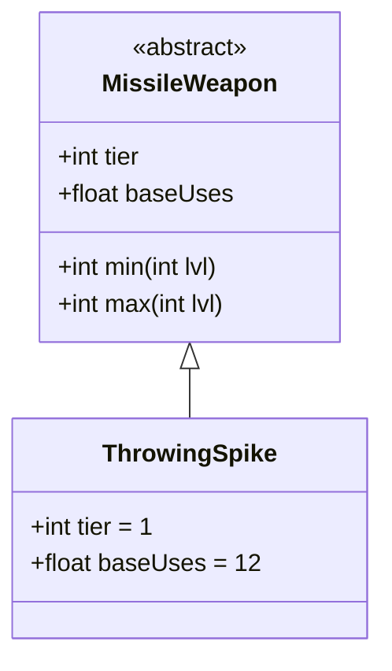

# ThrowingSpike 类文档

## 1. 基本信息
| 属性 | 值 |
|------|-----|
| 文件路径 | core/src/main/java/com/shatteredpixel/shatteredpixeldungeon/items/weapon/missiles/ThrowingSpike.java |
| 包名 | com.shatteredpixel.shatteredpixeldungeon.items.weapon.missiles |
| 类类型 | public class |
| 继承关系 | extends MissileWeapon |
| 代码行数 | 40 行 |

## 2. 类职责说明
ThrowingSpike（投掷钉）是一种 Tier 1 的基础投掷武器，具有极高的耐久度（基础使用次数12次）。它是持久耐用的低等级投掷武器选择。

## 4. 继承与协作关系


## 静态常量表
| 常量名 | 类型 | 值 | 说明 |
|--------|------|-----|------|
| 无静态常量 | - | - | - |

## 实例字段表
| 字段名 | 类型 | 修饰符 | 说明 |
|--------|------|--------|------|
| image | int | 初始化块 | 物品图标 ItemSpriteSheet.THROWING_SPIKE |
| hitSound | String | 初始化块 | 击中音效 Assets.Sounds.HIT_STAB |
| hitSoundPitch | float | 初始化块 | 音效音高 1.2f |
| bones | boolean | 初始化块 | false - 不出现在遗骸中 |
| baseUses | float | 初始化块 | 基础使用次数 12 |
| tier | int | 初始化块 | 武器等级 1 |

## 7. 方法详解

使用父类 MissileWeapon 的所有方法，无重写。

### 继承的伤害计算
- **最小伤害**: 2 * tier + lvl = 2 + lvl
- **最大伤害**: 5 * tier + tier * lvl = 5 + lvl

## 11. 使用示例
```java
// 创建投掷钉
ThrowingSpike spike = new ThrowingSpike();
// Tier 1投掷武器，耐久度极高

hero.belongings.collect(spike);
// 可以使用很长时间的低等级投掷武器
```

## 注意事项
- `bones = false` 不出现在遗骸中
- 基础使用次数极高（12次，是默认的1.5倍）
- Tier 1标准伤害
- 音效音高较高

## 最佳实践
- 适合需要大量投掷武器的情况
- 耐久度高，可以长期使用
- 早期游戏的经济选择