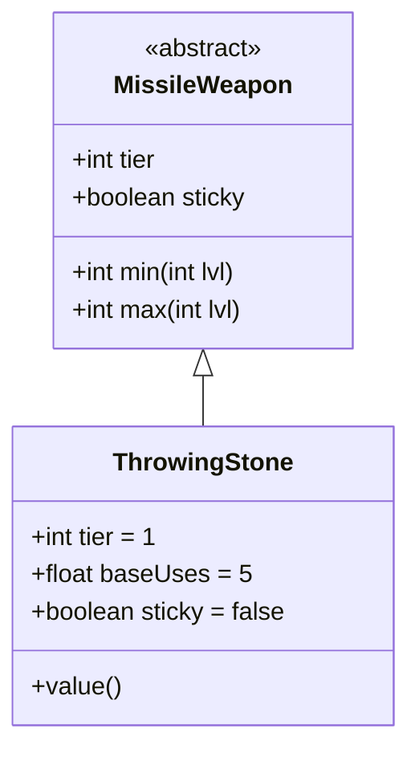

# ThrowingStone 类文档

## 1. 基本信息
| 属性 | 值 |
|------|-----|
| 文件路径 | core/src/main/java/com/shatteredpixel/shatteredpixeldungeon/items/weapon/missiles/ThrowingStone.java |
| 包名 | com.shatteredpixel.shatteredpixeldungeon.items.weapon.missiles |
| 类类型 | public class |
| 继承关系 | extends MissileWeapon |
| 代码行数 | 45 行 |

## 2. 类职责说明
ThrowingStone（投掷石）是一种 Tier 1 的最基础投掷武器，伤害很低但容易获取。石块不会粘在敌人身上，会直接掉落在地上。

## 4. 继承与协作关系


## 静态常量表
| 常量名 | 类型 | 值 | 说明 |
|--------|------|-----|------|
| 无静态常量 | - | - | - |

## 实例字段表
| 字段名 | 类型 | 修饰符 | 说明 |
|--------|------|--------|------|
| image | int | 初始化块 | 物品图标 ItemSpriteSheet.THROWING_STONE |
| hitSound | String | 初始化块 | 击中音效 Assets.Sounds.HIT |
| hitSoundPitch | float | 初始化块 | 音效音高 1.1f |
| bones | boolean | 初始化块 | false - 不出现在遗骸中 |
| tier | int | 初始化块 | 武器等级 1 |
| baseUses | float | 初始化块 | 基础使用次数 5 |
| sticky | boolean | 初始化块 | false - 不粘在敌人身上 |

## 7. 方法详解

### value
**签名**: `public int value()`
**功能**: 计算物品价值
**返回值**: 正常价值的一半
**实现逻辑**: `return Math.round(super.value()/2f);`

## 11. 使用示例
```java
// 创建投掷石
ThrowingStone stone = new ThrowingStone();
// Tier 1投掷武器，最基础

hero.belongings.collect(stone);
// 早期游戏的紧急远程攻击手段
```

## 注意事项
- `bones = false` 不出现在遗骸中
- `sticky = false` 命中后不会粘在敌人身上
- 伤害很低（Tier 1标准伤害）
- 价值只有正常的一半

## 最佳实践
- 游戏早期的紧急远程攻击
- 可以无限捡回使用（不粘在敌人身上）
- 不适合作为主要武器