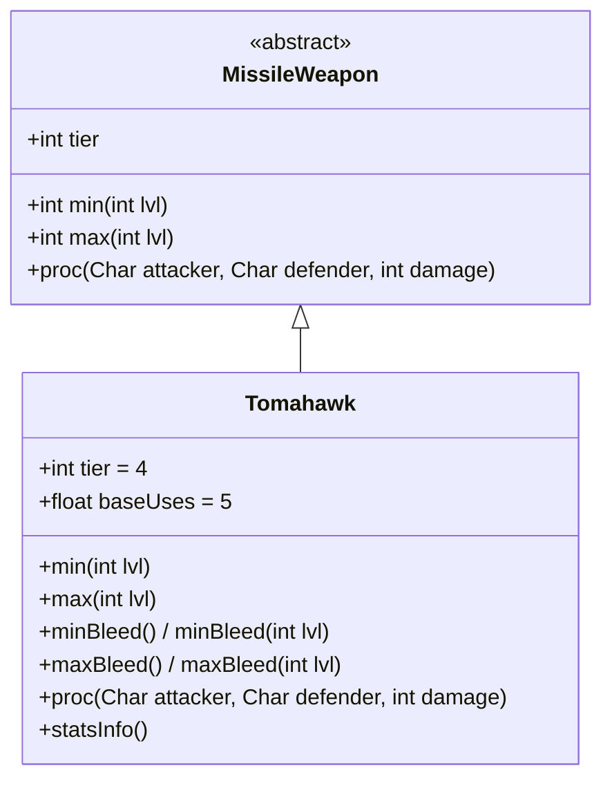

# Tomahawk 类文档

## 1. 基本信息
| 属性 | 值 |
|------|-----|
| 文件路径 | core/src/main/java/com/shatteredpixel/shatteredpixeldungeon/items/weapon/missiles/Tomahawk.java |
| 包名 | com.shatteredpixel.shatteredpixeldungeon.items.weapon.missiles |
| 类类型 | public class |
| 继承关系 | extends MissileWeapon |
| 代码行数 | 95 行 |

## 2. 类职责说明
Tomahawk（战斧/投掷斧）是一种 Tier 4 的投掷武器，命中后会造成流血效果。流血伤害无视护甲，是持续伤害的有效手段。

## 4. 继承与协作关系


## 静态常量表
| 常量名 | 类型 | 值 | 说明 |
|--------|------|-----|------|
| 无静态常量 | - | - | - |

## 实例字段表
| 字段名 | 类型 | 修饰符 | 说明 |
|--------|------|--------|------|
| image | int | 初始化块 | 物品图标 ItemSpriteSheet.TOMAHAWK |
| hitSound | String | 初始化块 | 击中音效 Assets.Sounds.HIT_SLASH |
| hitSoundPitch | float | 初始化块 | 音效音高 0.9f |
| tier | int | 初始化块 | 武器等级 4 |
| baseUses | float | 初始化块 | 基础使用次数 5 |

## 7. 方法详解

### min
**签名**: `public int min(int lvl)`
**功能**: 计算最小伤害
**参数**: `lvl` - 武器等级
**返回值**: 最小伤害值
**实现逻辑**: `return Math.round(1.5f * tier) + lvl;` // 基础6点

### max
**签名**: `public int max(int lvl)`
**功能**: 计算最大伤害
**参数**: `lvl` - 武器等级
**返回值**: 最大伤害值
**实现逻辑**: `return Math.round(4f * tier) + (tier-1)*lvl;` // 基础16点

### minBleed / maxBleed
**签名**: `public float minBleed()` / `public float minBleed(int lvl)` / `public float maxBleed()` / `public float maxBleed(int lvl)`
**功能**: 计算流血伤害范围
**参数**: `lvl` - 武器等级（可选）
**返回值**: 流血伤害值
**实现逻辑**:
```java
// minBleed
return 3 + lvl/2f;

// maxBleed
return 6 + lvl;
```

### proc
**签名**: `public int proc(Char attacker, Char defender, int damage)`
**功能**: 处理命中效果，施加流血
**参数**: 
- `attacker` - 攻击者
- `defender` - 防御者
- `damage` - 原始伤害
**返回值**: 处理后的伤害
**实现逻辑**:
```java
// 施加流血效果
Buff.affect(defender, Bleeding.class).set(
    augment.damageFactor(Random.NormalFloat(minBleed(), maxBleed()))
);
return super.proc(attacker, defender, damage);
```

### statsInfo
**签名**: `public String statsInfo()`
**功能**: 返回额外属性信息
**返回值**: 流血伤害描述字符串

## 11. 使用示例
```java
// 创建战斧
Tomahawk axe = new Tomahawk();
// Tier 4投掷武器，造成流血

hero.belongings.collect(axe);
// 命中敌人后会造成持续的流血伤害
```

## 注意事项
- 命中后必定造成流血效果
- 流血伤害无视护甲
- 直接伤害略低于标准值
- 基础使用次数较低（5次）

## 最佳实践
- 对付高护甲敌人效果显著
- 流血是持续伤害，可以叠加
- 配合其他持续伤害效果更佳