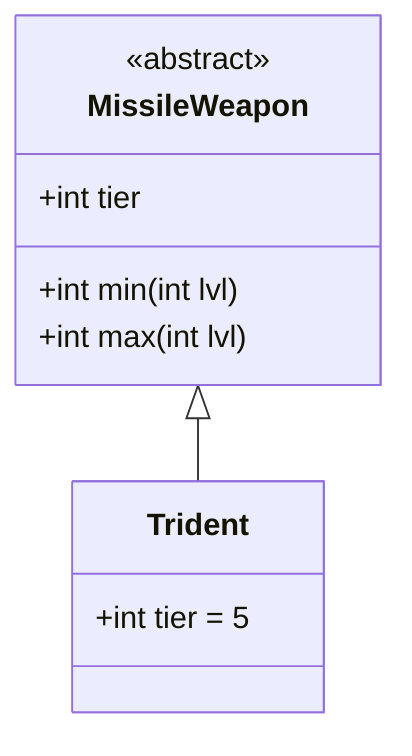

# Trident 类文档

## 1. 基本信息
| 属性 | 值 |
|------|-----|
| 文件路径 | core/src/main/java/com/shatteredpixel/shatteredpixeldungeon/items/weapon/missiles/Trident.java |
| 包名 | com.shatteredpixel.shatteredpixeldungeon.items.weapon.missiles |
| 类类型 | public class |
| 继承关系 | extends MissileWeapon |
| 代码行数 | 37 行 |

## 2. 类职责说明
Trident（三叉戟）是一种 Tier 5 的顶级投掷武器，具有最高的基础伤害。它是游戏中最强大的标准投掷武器。

## 4. 继承与协作关系


## 静态常量表
| 常量名 | 类型 | 值 | 说明 |
|--------|------|-----|------|
| 无静态常量 | - | - | - |

## 实例字段表
| 字段名 | 类型 | 修饰符 | 说明 |
|--------|------|--------|------|
| image | int | 初始化块 | 物品图标 ItemSpriteSheet.TRIDENT |
| hitSound | String | 初始化块 | 击中音效 Assets.Sounds.HIT_SLASH |
| hitSoundPitch | float | 初始化块 | 音效音高 0.9f（低沉） |
| tier | int | 初始化块 | 武器等级 5 |

## 7. 方法详解

使用父类 MissileWeapon 的所有方法，无重写。

### 继承的伤害计算
- **最小伤害**: 2 * tier + lvl = 10 + lvl
- **最大伤害**: 5 * tier + tier * lvl = 25 + 5*lvl
- **力量需求**: STRReq(tier, lvl) - 1

## 11. 使用示例
```java
// 创建三叉戟
Trident trident = new Trident();
// Tier 5投掷武器，最高伤害

hero.belongings.collect(trident);
// 游戏中最强大的标准投掷武器
```

## 注意事项
- 标准投掷武器，无特殊效果
- 使用父类的默认属性
- 基础使用次数为8次（默认值）
- Tier 5的最高伤害
- 音效音高较低，体现沉重感

## 最佳实践
- 作为终极投掷武器使用
- 配合天赋和戒指最大化伤害
- 适合对付高生命值敌人