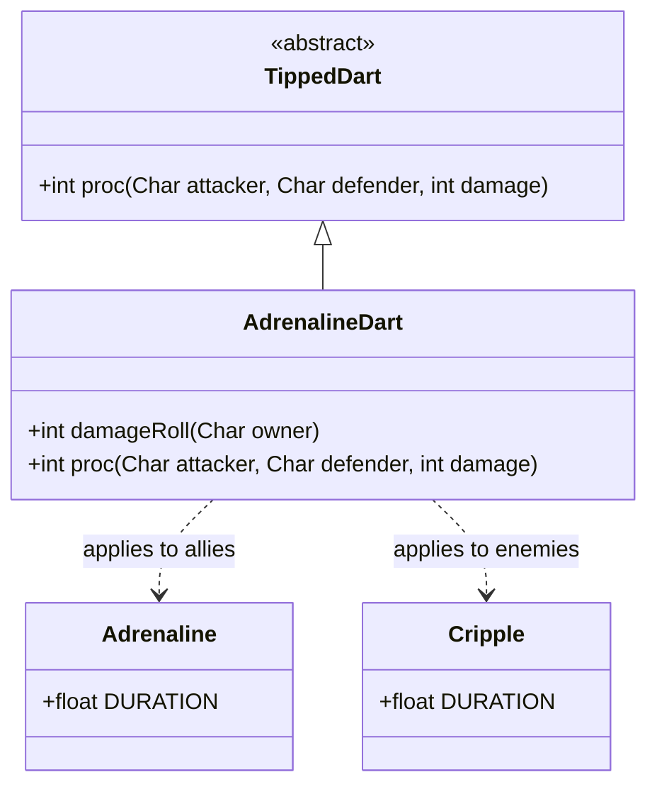

# AdrenalineDart 类文档

## 1. 基本信息
| 属性 | 值 |
|------|-----|
| 文件路径 | core/src/main/java/com/shatteredpixel/shatteredpixeldungeon/items/weapon/missiles/darts/AdrenalineDart.java |
| 包名 | com.shatteredpixel.shatteredpixeldungeon.items.weapon.missiles.darts |
| 类类型 | public class |
| 继承关系 | extends TippedDart |
| 代码行数 | 60 行 |

## 2. 类职责说明
AdrenalineDart（激素涌动飞镖）是由Swiftthistle（Swiftthistle.Seed）种子制作的药尖飞镖。它具有双重效果：对友军施加激素涌动增益（提升移动和攻击速度），对敌人施加致残效果（大幅降低移动速度）。这使得它既可以作为支援道具也可以作为控制道具使用。

## 4. 继承与协作关系


## 静态常量表
| 常量名 | 类型 | 值 | 说明 |
|--------|------|-----|------|
| 无 | - | - | 此类无静态常量 |

## 实例字段表
| 字段名 | 类型 | 修饰符 | 说明 |
|--------|------|--------|------|
| image | int | - | 物品图标，使用ItemSpriteSheet.ADRENALINE_DART |

## 7. 方法详解

### damageRoll
**签名**: `public int damageRoll(Char owner)`
**功能**: 计算伤害值，对友军不造成伤害
**参数**: 
- `owner` - 武器持有者
**返回值**: 伤害值
**实现逻辑**: 
```java
// 第38-45行
if (owner instanceof Hero) {                         // 如果持有者是英雄
    if (((Hero) owner).attackTarget().alignment == owner.alignment){
        return 0;                                    // 对友军不造成伤害
    }
}
return super.damageRoll(owner);                      // 对敌人正常计算伤害
```

### proc
**签名**: `public int proc(Char attacker, Char defender, int damage)`
**功能**: 处理命中效果
**参数**: 
- `attacker` - 攻击者
- `defender` - 防御者
- `damage` - 基础伤害
**返回值**: 处理后的伤害值
**实现逻辑**: 
```java
// 第48-59行
if (processingChargedShot && defender == attacker) {
    // 充能射击时不对英雄自己生效（避免误伤）
} else if (attacker.alignment == defender.alignment){
    // 友军：施加激素涌动增益
    Buff.prolong( defender, Adrenaline.class, Adrenaline.DURATION);
} else {
    // 敌人：施加致残效果
    Buff.prolong( defender, Cripple.class, Cripple.DURATION/2);
}

return super.proc(attacker, defender, damage);
```

## 11. 使用示例
```java
// 对友军使用（如召唤物或宠物）
// 施加激素涌动，提升其战斗效率

// 对敌人使用
// 施加致残，使其难以追击或逃跑

// 充能射击场景
// 范围内的友军获得激素涌动，敌人被致残
// 但不会影响英雄自己
```

## 注意事项
1. **双重效果**: 对友军和敌人有完全不同的效果
2. **充能射击保护**: 充能射击时不会对自己施加任何效果
3. **友军不受伤**: 攻击友军时伤害为0
4. **制作材料**: 需要Swiftthistle.Seed

## 最佳实践
1. 可用于支援召唤物或宠物
2. 用于追击逃跑的敌人（致残效果）
3. 不适合作为主要伤害来源
4. 配合充能射击可以同时影响多个目标