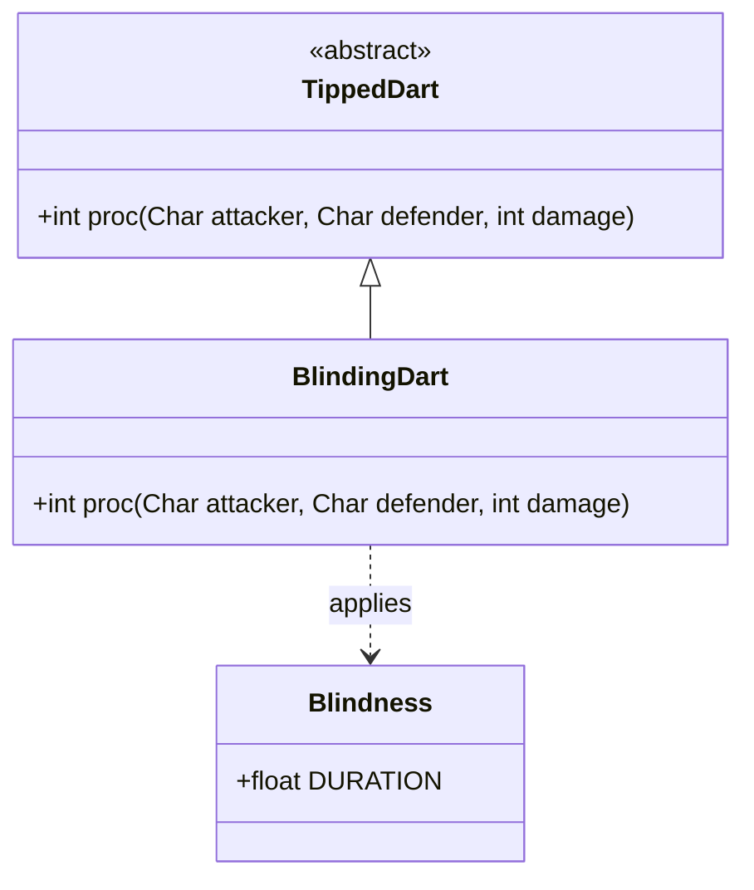

# BlindingDart 类文档

## 1. 基本信息
| 属性 | 值 |
|------|-----|
| 文件路径 | core/src/main/java/com/shatteredpixel/shatteredpixeldungeon/items/weapon/missiles/darts/BlindingDart.java |
| 包名 | com.shatteredpixel.shatteredpixeldungeon.items.weapon.missiles.darts |
| 类类型 | public class |
| 继承关系 | extends TippedDart |
| 代码行数 | 46 行 |

## 2. 类职责说明
BlindingDart（致盲飞镖）是由Blindweed（Blindweed.Seed）种子制作的药尖飞镖。命中后对目标施加致盲效果，使其无法看到周围环境，大幅降低命中率，并且无法远程攻击。这是一个纯控制型道具，适合用来削弱敌人或逃跑。

## 4. 继承与协作关系


## 静态常量表
| 常量名 | 类型 | 值 | 说明 |
|--------|------|-----|------|
| 无 | - | - | 此类无静态常量 |

## 实例字段表
| 字段名 | 类型 | 修饰符 | 说明 |
|--------|------|--------|------|
| image | int | - | 物品图标，使用ItemSpriteSheet.BLINDING_DART |

## 7. 方法详解

### proc
**签名**: `public int proc(Char attacker, Char defender, int damage)`
**功能**: 处理命中效果，施加致盲
**参数**: 
- `attacker` - 攻击者
- `defender` - 防御者
- `damage` - 基础伤害
**返回值**: 处理后的伤害值
**实现逻辑**: 
```java
// 第37-45行
// 充能射击时只致盲敌人，不影响友军
if (!processingChargedShot || attacker.alignment != defender.alignment) {
    Buff.affect(defender, Blindness.class, Blindness.DURATION);  // 施加致盲效果
}

return super.proc(attacker, defender, damage);
```

## 11. 使用示例
```java
// 对敌人使用致盲飞镖
// 敌人会失去视野，命中率下降，无法远程攻击

// 配合充能射击
// 范围内的所有敌人都会被致盲

// 战术用途
// - 削弱远程敌人
// - 逃跑时使用
// - 配合潜行天赋
```

## 注意事项
1. **充能射击保护**: 充能射击时不会致盲友军
2. **纯控制效果**: 致盲不造成额外伤害
3. **持续时间**: 使用Blindness.DURATION标准持续时间
4. **制作材料**: 需要Blindweed.Seed

## 最佳实践
1. 对付远程攻击的敌人非常有效
2. 用于逃跑或脱离战斗
3. 配合潜行类天赋可以更安全地移动
4. 不要对友军使用（正常情况不可能误伤）