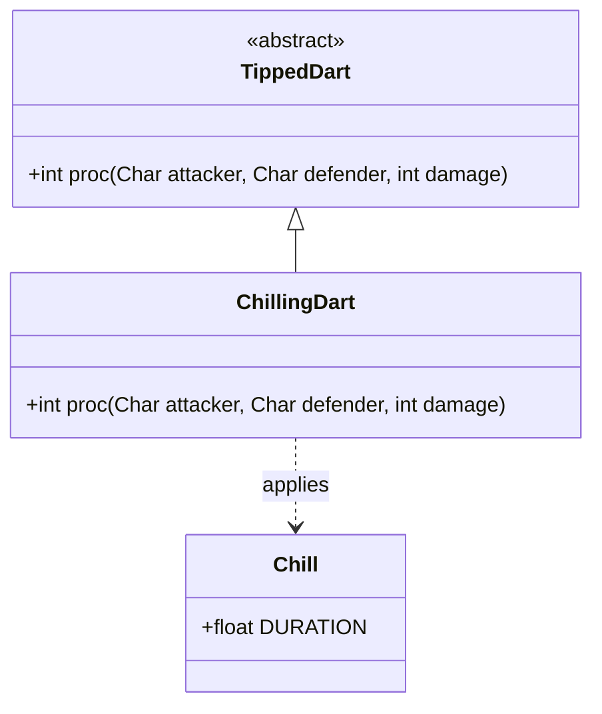

# ChillingDart 类文档

## 1. 基本信息
| 属性 | 值 |
|------|-----|
| 文件路径 | core/src/main/java/com/shatteredpixel/shatteredpixeldungeon/items/weapon/missiles/darts/ChillingDart.java |
| 包名 | com.shatteredpixel.shatteredpixeldungeon.items.weapon.missiles.darts |
| 类类型 | public class |
| 继承关系 | extends TippedDart |
| 代码行数 | 50 行 |

## 2. 类职责说明
ChillingDart（寒霜飞镖）是由Icecap（Icecap.Seed）种子制作的药尖飞镖。命中后对目标施加寒霜效果，降低其行动速度。如果目标站在水中，寒霜持续时间会加倍。这是一个减速控制道具，适合用于减缓敌人行动。

## 4. 继承与协作关系


## 静态常量表
| 常量名 | 类型 | 值 | 说明 |
|--------|------|-----|------|
| 无 | - | - | 此类无静态常量 |

## 实例字段表
| 字段名 | 类型 | 修饰符 | 说明 |
|--------|------|--------|------|
| image | int | - | 物品图标，使用ItemSpriteSheet.CHILLING_DART |

## 7. 方法详解

### proc
**签名**: `public int proc(Char attacker, Char defender, int damage)`
**功能**: 处理命中效果，施加寒霜
**参数**: 
- `attacker` - 攻击者
- `defender` - 防御者
- `damage` - 基础伤害
**返回值**: 处理后的伤害值
**实现逻辑**: 
```java
// 第37-49行
// 充能射击时只对敌人施加寒霜
if (!processingChargedShot || attacker.alignment != defender.alignment) {
    if (Dungeon.level.water[defender.pos]) {         // 如果目标在水中
        Buff.prolong(defender, Chill.class, Chill.DURATION);  // 完整持续时间
    } else {
        Buff.prolong(defender, Chill.class, 6f);     // 普通情况6秒
    }
}

return super.proc(attacker, defender, damage);
```

## 11. 使用示例
```java
// 对站在水中的敌人使用
// 寒霜效果持续更长时间

// 普通情况使用
// 降低敌人的行动速度

// 配合充能射击
// 范围内所有敌人被减速
```

## 注意事项
1. **水中加成**: 目标站在水中时，寒霜持续时间加倍
2. **充能射击保护**: 充能射击时不会减速友军
3. **持续时间**: 水中为Chill.DURATION，陆地上为6秒
4. **制作材料**: 需要Icecap.Seed

## 最佳实践
1. 优先对站在水中的敌人使用
2. 用于减缓快速敌人的追击
3. 配合燃烧效果可以产生蒸汽
4. 与冰冻法杖配合使用效果更佳