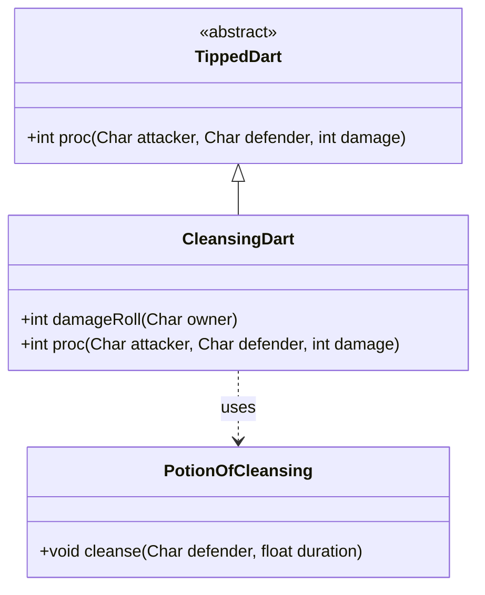

# CleansingDart 类文档

## 1. 基本信息
| 属性 | 值 |
|------|-----|
| 文件路径 | core/src/main/java/com/shatteredpixel/shatteredpixeldungeon/items/weapon/missiles/darts/CleansingDart.java |
| 包名 | com.shatteredpixel.shatteredpixeldungeon.items.weapon.missiles.darts |
| 类类型 | public class |
| 继承关系 | extends TippedDart |
| 代码行数 | 89 行 |

## 2. 类职责说明
CleansingDart（净化飞镖）是由Mageroyal（Mageroyal.Seed）种子制作的药尖飞镖。它具有双重效果：对友军施加净化效果（免疫负面状态），对敌人移除所有正面增益效果并使其进入游荡状态。这是一个强大的支援/削弱混合道具。

## 4. 继承与协作关系


## 静态常量表
| 常量名 | 类型 | 值 | 说明 |
|--------|------|-----|------|
| 无 | - | - | 此类无静态常量 |

## 实例字段表
| 字段名 | 类型 | 修饰符 | 说明 |
|--------|------|--------|------|
| image | int | - | 物品图标，使用ItemSpriteSheet.CLEANSING_DART |

## 7. 方法详解

### damageRoll
**签名**: `public int damageRoll(Char owner)`
**功能**: 计算伤害值，对友军不造成伤害
**参数**: 
- `owner` - 武器持有者
**返回值**: 伤害值
**实现逻辑**: 
```java
// 第42-49行
if (owner instanceof Hero) {
    if (((Hero) owner).attackTarget().alignment == owner.alignment){
        return 0;                                    // 对友军不造成伤害
    }
}
return super.damageRoll(owner);
```

### proc
**签名**: `public int proc(Char attacker, final Char defender, int damage)`
**功能**: 处理命中效果
**参数**: 
- `attacker` - 攻击者
- `defender` - 防御者
- `damage` - 基础伤害
**返回值**: 处理后的伤害值
**实现逻辑**: 
```java
// 第52-88行
if (processingChargedShot && defender == attacker) {
    // 充能射击时不影响英雄自己
} else if (attacker.alignment == defender.alignment){
    // 友军：施加净化效果
    PotionOfCleansing.cleanse(defender, PotionOfCleansing.Cleanse.DURATION*2f);
} else {
    // 敌人：移除所有正面增益（除了ChampionEnemy和ChargedShot）
    for (Buff b : defender.buffs()){
        if (!(b instanceof ChampionEnemy)
                && b.type == Buff.buffType.POSITIVE
                && !(b instanceof Crossbow.ChargedShot)){
            b.detach();
        }
    }
    
    // 检查目标是否因移除增益而死亡
    if (!defender.isAlive()){
        defender.die(attacker);
        return super.proc(attacker, defender, damage);
    }
    
    // 使敌人进入游荡状态
    if (defender instanceof Mob) {
        new FlavourBuff(){
            {actPriority = VFX_PRIO;}
            public boolean act() {
                if (((Mob) defender).state == ((Mob) defender).HUNTING 
                    || ((Mob) defender).state == ((Mob) defender).FLEEING){
                    ((Mob) defender).state = ((Mob) defender).WANDERING;
                }
                ((Mob) defender).beckon(Dungeon.level.randomDestination(defender));
                defender.sprite.showLost();
                return super.act();
            }
        }.attachTo(defender);
    }
}

return super.proc(attacker, defender, damage);
```

## 11. 使用示例
```java
// 对友军使用
// 施加净化效果，免疫负面状态

// 对敌人使用
// 移除敌人的所有增益效果
// 使敌人进入游荡状态，失去追踪能力

// 特殊情况：移除增益可能杀死敌人
// 例如：移除狂暴状态可能导致敌人死亡
```

## 注意事项
1. **ChampionEnemy保护**: 敌方精英的ChampionEnemy增益不会被移除
2. **充能射击保护**: 弩的充能射击增益不会被移除
3. **可能杀死敌人**: 移除某些增益（如狂暴）可能导致敌人死亡
4. **状态改变**: 敌人会从追踪/逃跑状态变为游荡状态
5. **制作材料**: 需要Mageroyal.Seed

## 最佳实践
1. 对付有强力增益的敌人非常有效
2. 用于支援队友，提供免疫负面状态
3. 可以使追踪的敌人失去目标
4. 注意不要误伤有增益的友军