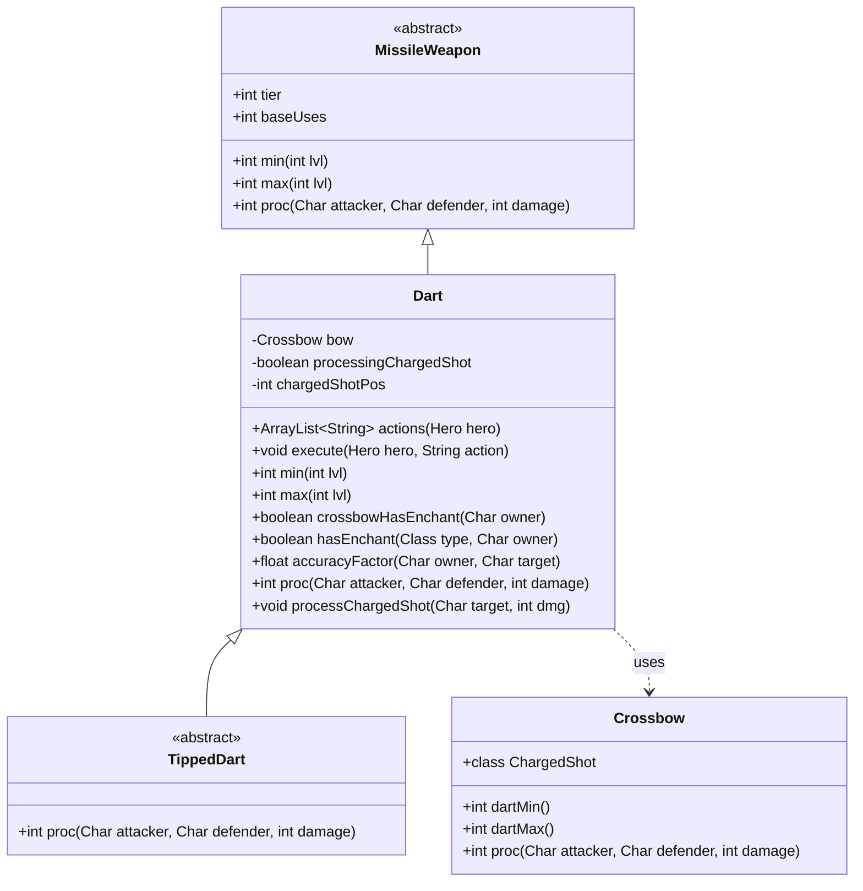

# Dart 类文档

## 1. 基本信息
| 属性 | 值 |
|------|-----|
| 文件路径 | core/src/main/java/com/shatteredpixel/shatteredpixeldungeon/items/weapon/missiles/darts/Dart.java |
| 包名 | com.shatteredpixel.shatteredpixeldungeon.items.weapon.missiles.darts |
| 类类型 | public class |
| 继承关系 | extends MissileWeapon |
| 代码行数 | 367 行 |

## 2. 类职责说明
Dart（飞镖）是基础的投掷武器类，也是所有药尖飞镖（TippedDart）的父类。它实现了与弩（Crossbow）的协同机制，可以蘸取种子制作药尖飞镖，并支持弩的充能射击特殊技能。飞镖是一种低成本、可堆叠的远程武器，基础伤害较低但数量充足。

## 4. 继承与协作关系


## 静态常量表
| 常量名 | 类型 | 值 | 说明 |
|--------|------|-----|------|
| AC_TIP | String | "TIP" | 蘸取动作的标识符，用于将种子应用到飞镖上 |

## 实例字段表
| 字段名 | 类型 | 修饰符 | 说明 |
|--------|------|--------|------|
| bow | Crossbow | protected static | 当前装备的弩引用，用于弩与飞镖的协同 |
| processingChargedShot | boolean | protected | 标记是否正在处理充能射击效果 |
| chargedShotPos | int | private | 充能射击的目标位置 |
| itemSelector | WndBag.ItemSelector | private final | 种子选择器，用于蘸取飞镖时选择种子 |

## 7. 方法详解

### actions
**签名**: `public ArrayList<String> actions(Hero hero)`
**功能**: 获取飞镖可用的动作列表
**参数**: 
- `hero` - 执行动作的英雄
**返回值**: 包含所有可用动作的字符串列表
**实现逻辑**: 
```java
// 第69-73行
ArrayList<String> actions = super.actions( hero );  // 获取父类的动作列表
actions.add( AC_TIP );                              // 添加"蘸取"动作
return actions;                                     // 返回完整动作列表
```

### execute
**签名**: `public void execute(Hero hero, String action)`
**功能**: 执行指定的动作
**参数**: 
- `hero` - 执行动作的英雄
- `action` - 要执行的动作名称
**返回值**: 无
**实现逻辑**: 
```java
// 第76-81行
super.execute(hero, action);                        // 调用父类的execute方法
if (action.equals(AC_TIP)){                        // 如果是"蘸取"动作
    GameScene.selectItem(itemSelector);             // 打开物品选择界面选择种子
}
```

### min
**签名**: `public int min(int lvl)`
**功能**: 计算飞镖的最小伤害值
**参数**: 
- `lvl` - 武器等级（通常来自神射戒）
**返回值**: 最小伤害值
**实现逻辑**: 
```java
// 第84-98行
if (bow != null){                                   // 如果装备了弩
    if (!(this instanceof TippedDart) && Dungeon.hero.buff(Crossbow.ChargedShot.class) != null){
        // 充能射击时，普通飞镖伤害提升50%
        return bow.dartMin()                        // 弩的基础飞镖伤害
                + 4 + bow.buffedLvl()               // 充能加成
                + lvl;                              // 等级加成
    } else {
        // 普通情况
        return bow.dartMin() + lvl;                 // 弩基础伤害 + 等级加成
    }
} else {
    // 没有弩时伤害较低
    return 1 + lvl;                                 // 基础1点 + 等级加成
}
```

### max
**签名**: `public int max(int lvl)`
**功能**: 计算飞镖的最大伤害值
**参数**: 
- `lvl` - 武器等级
**返回值**: 最大伤害值
**实现逻辑**: 
```java
// 第101-115行
if (bow != null){                                   // 如果装备了弩
    if (!(this instanceof TippedDart) && Dungeon.hero.buff(Crossbow.ChargedShot.class) != null){
        // 充能射击时，普通飞镖伤害提升
        return bow.dartMax()                        // 弩的最大飞镖伤害
                + 4 + bow.buffedLvl()               // 充能加成
                + 2*lvl;                            // 等级加成（每级+2）
    } else {
        return bow.dartMax() + 2*lvl;               // 弩基础伤害 + 等级加成
    }
} else {
    return 2 + 2*lvl;                               // 基础2点 + 等级加成
}
```

### updateCrossbow
**签名**: `private void updateCrossbow()`
**功能**: 更新当前装备的弩引用
**参数**: 无
**返回值**: 无
**实现逻辑**: 
```java
// 第119-130行
if (Dungeon.hero == null) {                         // 如果没有英雄实例
    bow = null;                                     // 弓引用置空
} else if (Dungeon.hero.belongings.weapon() instanceof Crossbow){
    bow = (Crossbow) Dungeon.hero.belongings.weapon();  // 主武器是弩
} else if (Dungeon.hero.belongings.secondWep() instanceof Crossbow) {
    // 副武器是弩（玩家可以快速切换，这是QoL优化）
    bow = (Crossbow) Dungeon.hero.belongings.secondWep();
} else {
    bow = null;                                     // 没有装备弩
}
```

### crossbowHasEnchant
**签名**: `public boolean crossbowHasEnchant(Char owner)`
**功能**: 检查弩是否有附魔效果
**参数**: 
- `owner` - 武器持有者
**返回值**: 如果弩有附魔且持有者不受魔法免疫影响，返回true
**实现逻辑**: 
```java
// 第132-134行
return bow != null                                  // 装备了弩
    && bow.enchantment != null                      // 弩有附魔
    && owner.buff(MagicImmune.class) == null;       // 持有者没有魔法免疫
```

### hasEnchant
**签名**: `public boolean hasEnchant(Class<? extends Enchantment> type, Char owner)`
**功能**: 检查是否拥有指定类型的附魔
**参数**: 
- `type` - 附魔类型
- `owner` - 武器持有者
**返回值**: 如果有指定附魔返回true
**实现逻辑**: 
```java
// 第137-143行
if (bow != null && bow.hasEnchant(type, owner)){    // 如果弩有该附魔
    return true;
} else {
    return super.hasEnchant(type, owner);           // 检查飞镖本身的附魔
}
```

### accuracyFactor
**签名**: `public float accuracyFactor(Char owner, Char target)`
**功能**: 计算命中率修正因子
**参数**: 
- `owner` - 攻击者
- `target` - 目标
**返回值**: 命中率修正因子，INFINITE_ACCURACY表示必中
**实现逻辑**: 
```java
// 第146-153行
// 注意：这里不更新弩引用，因为飞镖是当前活跃武器
if (bow != null && owner.buff(Crossbow.ChargedShot.class) != null){
    return Char.INFINITE_ACCURACY;                  // 充能射击必中
} else {
    return super.accuracyFactor(owner, target);     // 使用父类的命中率计算
}
```

### proc
**签名**: `public int proc(Char attacker, Char defender, int damage)`
**功能**: 处理命中效果
**参数**: 
- `attacker` - 攻击者
- `defender` - 防御者
- `damage` - 基础伤害
**返回值**: 处理后的伤害值
**实现逻辑**: 
```java
// 第156-166行
if (bow != null && !processingChargedShot){         // 如果装备了弩且不是在处理充能射击
    damage = bow.proc(attacker, defender, damage);  // 应用弩的附魔效果
}

int dmg = super.proc(attacker, defender, damage);   // 调用父类的proc
if (!processingChargedShot) {                       // 如果不是在处理充能射击
    processChargedShot(defender, damage);           // 处理充能射击的AOE效果
}
return dmg;
```

### throwPos
**签名**: `public int throwPos(Hero user, int dst)`
**功能**: 获取投掷目标位置
**参数**: 
- `user` - 投掷者
- `dst` - 目标位置
**返回值**: 实际投掷位置
**实现逻辑**: 
```java
// 第169-172行
updateCrossbow();                                   // 更新弩引用
return super.throwPos(user, dst);                   // 返回父类计算的投掷位置
```

### onThrow
**签名**: `protected void onThrow(int cell)`
**功能**: 处理投掷落地事件
**参数**: 
- `cell` - 落地位置
**返回值**: 无
**实现逻辑**: 
```java
// 第175-180行
updateCrossbow();                                   // 更新弩引用
// 需要在这里设置，因为命中效果可能会移动目标
chargedShotPos = cell;                              // 记录充能射击位置
super.onThrow(cell);                                // 调用父类的onThrow
```

### processChargedShot
**签名**: `protected void processChargedShot(Char target, int dmg)`
**功能**: 处理充能射击的范围效果
**参数**: 
- `target` - 主要目标
- `dmg` - 伤害值
**返回值**: 无
**实现逻辑**: 
```java
// 第184-211行
processingChargedShot = true;                       // 标记正在处理充能射击
if (chargedShotPos != -1 && bow != null && Dungeon.hero.buff(Crossbow.ChargedShot.class) != null) {
    // 构建距离地图，范围3格
    PathFinder.buildDistanceMap(chargedShotPos, Dungeon.level.passable, 3);
    // 必须克隆，因为一些命中效果会使用PathFinder
    int[] distance = PathFinder.distance.clone();
    
    for (Char ch : Actor.chars()){                  // 遍历所有角色
        if (ch == target){                          // 主要目标
            // 添加延迟检查击杀的Actor（用于弩的击杀技能）
            Actor.add(new Actor() {
                { actPriority = VFX_PRIO; }
                protected boolean act() {
                    if (!ch.isAlive()){
                        bow.onAbilityKill(Dungeon.hero, ch);
                    }
                    Actor.remove(this);
                    return true;
                }
            });
        } else if (distance[ch.pos] != Integer.MAX_VALUE){
            // 对范围内的其他目标应用proc效果
            proc(Dungeon.hero, ch, dmg);
        }
    }
}
chargedShotPos = -1;                                // 重置位置
processingChargedShot = false;                      // 重置标记
```

### decrementDurability
**签名**: `protected void decrementDurability()`
**功能**: 减少耐久度
**参数**: 无
**返回值**: 无
**实现逻辑**: 
```java
// 第214-219行
super.decrementDurability();                        // 调用父类方法
if (Dungeon.hero.buff(Crossbow.ChargedShot.class) != null) {
    Dungeon.hero.buff(Crossbow.ChargedShot.class).detach();  // 移除充能射击buff
}
```

### throwSound
**签名**: `public void throwSound()`
**功能**: 播放投掷音效
**参数**: 无
**返回值**: 无
**实现逻辑**: 
```java
// 第222-229行
updateCrossbow();                                   // 更新弩引用
if (bow != null) {                                  // 如果装备了弩
    Sample.INSTANCE.play(Assets.Sounds.ATK_CROSSBOW, 1, Random.Float(0.87f, 1.15f));
} else {
    super.throwSound();                             // 使用父类的音效
}
```

### info
**签名**: `public String info()`
**功能**: 获取武器信息描述
**参数**: 无
**返回值**: 武器信息字符串
**实现逻辑**: 
```java
// 第232-244行
updateCrossbow();                                   // 更新弩引用
if (bow != null && !bow.isIdentified()){            // 如果弩未鉴定
    Crossbow realBow = bow;                         // 保存真实的弩引用
    bow = new Crossbow();                           // 创建临时弩用于鉴定信息
    String info = super.info();                     // 获取信息
    bow = realBow;                                  // 恢复真实引用
    return info;
} else {
    return super.info();
}
```

### isUpgradable
**签名**: `public boolean isUpgradable()`
**功能**: 飞镖不可升级
**参数**: 无
**返回值**: 总是返回false
**实现逻辑**: 第247-249行，直接返回false

### isIdentified
**签名**: `public boolean isIdentified()`
**功能**: 飞镖默认已鉴定
**参数**: 无
**返回值**: 总是返回true
**实现逻辑**: 第252-254行，直接返回true

### defaultQuantity
**签名**: `public int defaultQuantity()`
**功能**: 获取默认数量
**参数**: 无
**返回值**: 默认2个
**实现逻辑**: 第257-259行，返回2

### value
**签名**: `public int value()`
**功能**: 计算出售价值
**参数**: 无
**返回值**: 出售价格
**实现逻辑**: 
```java
// 第262-264行
return Math.round(super.value()/2f);                // 正常价值的一半
```

## 11. 使用示例
```java
// 创建基础飞镖
Dart dart = new Dart();
dart.quantity(10);  // 设置数量为10

// 蘸取种子制作药尖飞镖
// 玩家点击飞镖选择"TIP"动作，然后选择种子
// 例如：使用Sungrass.Seed制作HealingDart

// 配合弩使用（充能射击）
// 当英雄装备弩并激活充能射击时：
// - 命中率100%
// - 伤害提升
// - 3格范围内的敌人也会受到proc效果
```

## 注意事项
1. **弩协同**: 飞镖与弩有深度协同，装备弩时伤害显著提升
2. **充能射击**: 弩的特殊技能需要使用普通飞镖（非药尖飞镖）才能触发完整效果
3. **耐久度**: 基础飞镖耐久度设为1000，实际上几乎无限使用
4. **蘸取机制**: 1颗种子可以蘸取最多2个飞镖

## 最佳实践
1. 搭配弩使用飞镖可以获得最佳效果
2. 保留基础飞镖用于充能射击，药尖飞镖用于特殊效果
3. 使用天鹅绒袋（VelvetPouch）存储飞镖和种子
4. 考虑神射戒提升飞镖伤害