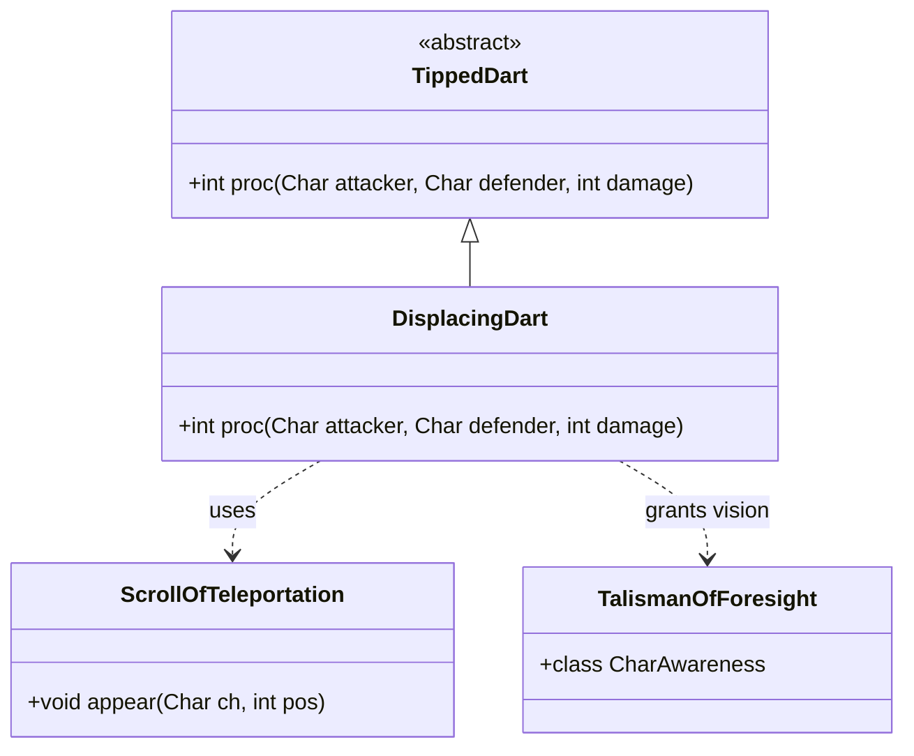

# DisplacingDart 类文档

## 1. 基本信息
| 属性 | 值 |
|------|-----|
| 文件路径 | core/src/main/java/com/shatteredpixel/shatteredpixeldungeon/items/weapon/missiles/darts/DisplacingDart.java |
| 包名 | com.shatteredpixel.shatteredpixeldungeon.items.weapon.missiles.darts |
| 类类型 | public class |
| 继承关系 | extends TippedDart |
| 代码行数 | 110 行 |

## 2. 类职责说明
DisplacingDart（传送飞镖）是由Fadeleaf（Fadeleaf.Seed）种子制作的药尖飞镖。命中后会将目标传送到距离攻击者8-10格远的位置。这是一个强大的位移控制道具，可以用来拉开与敌人的距离或将敌人传送到不利位置。

## 4. 继承与协作关系


## 静态常量表
| 常量名 | 类型 | 值 | 说明 |
|--------|------|-----|------|
| 无 | - | - | 此类无静态常量 |

## 实例字段表
| 字段名 | 类型 | 修饰符 | 说明 |
|--------|------|--------|------|
| image | int | - | 物品图标，使用ItemSpriteSheet.DISPLACING_DART |

## 7. 方法详解

### proc
**签名**: `public int proc(Char attacker, Char defender, int damage)`
**功能**: 处理命中效果，传送目标
**参数**: 
- `attacker` - 攻击者
- `defender` - 防御者
- `damage` - 基础伤害
**返回值**: 处理后的伤害值
**实现逻辑**: 
```java
// 第44-109行
// 充能射击时只传送敌人，不传送友军
if (processingChargedShot && attacker.alignment == defender.alignment) {
    return super.proc(attacker, defender, damage);
}

// 检查目标是否不可移动
if (!defender.properties().contains(Char.Property.IMMOVABLE)){
    
    ArrayList<Integer> visiblePositions = new ArrayList<>();
    ArrayList<Integer> nonVisiblePositions = new ArrayList<>();

    // 构建距离地图
    PathFinder.buildDistanceMap(attacker.pos, BArray.or(Dungeon.level.passable, Dungeon.level.avoid, null));

    // 查找距离8-10格的有效传送位置
    for (int pos = 0; pos < Dungeon.level.length(); pos++){
        if (Dungeon.level.passable[pos]
                && PathFinder.distance[pos] >= 8
                && PathFinder.distance[pos] <= 10
                && (!Char.hasProp(defender, Char.Property.LARGE) || Dungeon.level.openSpace[pos])
                && Actor.findChar(pos) == null){

            if (Dungeon.level.heroFOV[pos]){
                visiblePositions.add(pos);            // 可见位置
            } else {
                nonVisiblePositions.add(pos);         // 不可见位置
            }
        }
    }

    int chosenPos = -1;

    // 优先选择可见位置，其次不可见位置
    // 选择离目标当前位置最近的位置
    if (!visiblePositions.isEmpty()) {
        for (int pos : visiblePositions) {
            if (chosenPos == -1 || Dungeon.level.trueDistance(defender.pos, chosenPos)
                    > Dungeon.level.trueDistance(defender.pos, pos)){
                chosenPos = pos;
            }
        }
    } else {
        for (int pos : nonVisiblePositions) {
            if (chosenPos == -1 || Dungeon.level.trueDistance(defender.pos, chosenPos)
                    > Dungeon.level.trueDistance(defender.pos, pos)){
                chosenPos = pos;
            }
        }
    }
    
    // 执行传送
    if (chosenPos != -1){
        ScrollOfTeleportation.appear( defender, chosenPos );
        Dungeon.level.occupyCell(defender );
        
        if (defender == Dungeon.hero){
            Dungeon.observe();                         // 英雄被传送时更新视野
            GameScene.updateFog();
        } else if (!Dungeon.level.heroFOV[chosenPos]){
            // 如果传送到不可见位置，给予角色感知
            Buff.append(attacker, TalismanOfForesight.CharAwareness.class, 5f).charID = defender.id();
        }
    }
}

return super.proc(attacker, defender, damage);
```

## 11. 使用示例
```java
// 对敌人使用
// 将敌人传送到8-10格远的位置
// 如果传送到不可见区域，获得5秒的角色感知

// 对自己使用（需要特殊条件）
// 传送到安全位置

// 战术用途
// - 拉开与敌人的距离
// - 将敌人传送到陷阱位置
// - 分散敌人群组
```

## 注意事项
1. **不可移动目标**: 对IMMOVABLE属性的目标无效（如Boss）
2. **传送距离**: 固定8-10格，不能更近或更远
3. **位置选择**: 优先选择可见且离目标最近的位置
4. **大体型目标**: 需要开放空间才能传送
5. **视野感知**: 如果传送到不可见位置，会获得5秒角色感知
6. **制作材料**: 需要Fadeleaf.Seed

## 最佳实践
1. 用于拉开与危险敌人的距离
2. 可以将敌人传送过水面或陷阱
3. 充能射击时不会传送友军
4. 对Boss无效，需要有备选方案