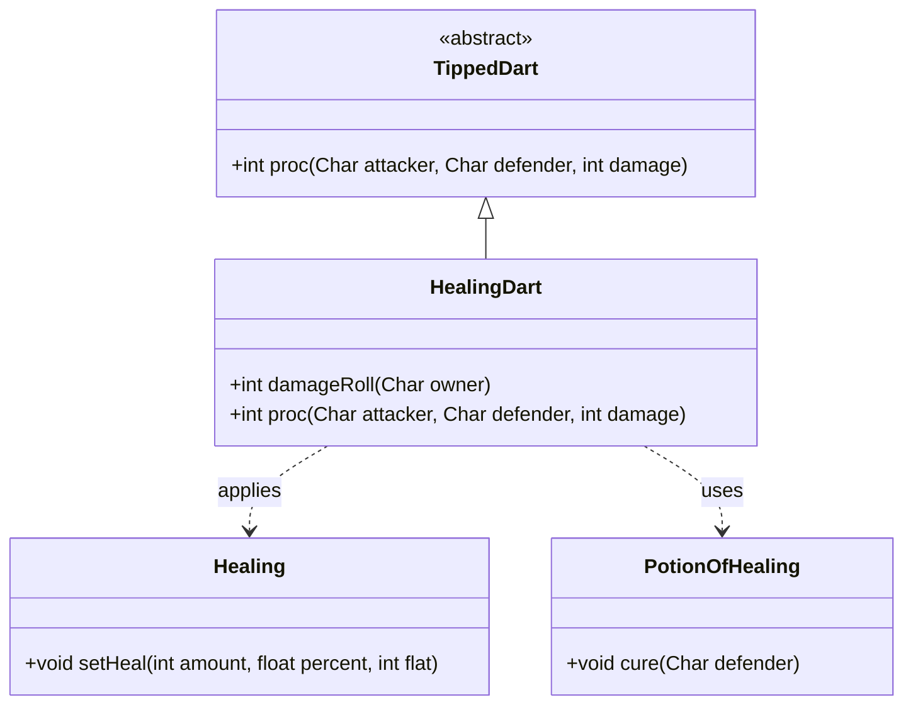

# HealingDart 类文档

## 1. 基本信息
| 属性 | 值 |
|------|-----|
| 文件路径 | core/src/main/java/com/shatteredpixel/shatteredpixeldungeon/items/weapon/missiles/darts/HealingDart.java |
| 包名 | com.shatteredpixel.shatteredpixeldungeon.items.weapon.missiles.darts |
| 类类型 | public class |
| 继承关系 | extends TippedDart |
| 代码行数 | 63 行 |

## 2. 类职责说明
HealingDart（治疗飞镖）是由Sungrass（Sungrass.Seed）种子制作的药尖飞镖。命中后对目标施加治疗效果，恢复生命值。这是一个纯辅助道具，设计用于治疗友军（包括自己），不建议对敌人使用。

## 4. 继承与协作关系


## 静态常量表
| 常量名 | 类型 | 值 | 说明 |
|--------|------|-----|------|
| 无 | - | - | 此类无静态常量 |

## 实例字段表
| 字段名 | 类型 | 修饰符 | 说明 |
|--------|------|--------|------|
| image | int | - | 物品图标，使用ItemSpriteSheet.HEALING_DART |
| usesTargeting | boolean | - | 设为false，因为不应该瞄准敌人 |

## 7. 方法详解

### damageRoll
**签名**: `public int damageRoll(Char owner)`
**功能**: 计算伤害值，对友军不造成伤害
**参数**: 
- `owner` - 武器持有者
**返回值**: 伤害值
**实现逻辑**: 
```java
// 第39-46行
if (owner instanceof Hero) {
    if (((Hero) owner).attackTarget().alignment == owner.alignment){
        return 0;                                    // 对友军不造成伤害
    }
}
return super.damageRoll(owner);
```

### proc
**签名**: `public int proc(Char attacker, Char defender, int damage)`
**功能**: 处理命中效果，施加治疗
**参数**: 
- `attacker` - 攻击者
- `defender` - 防御者
- `damage` - 基础伤害
**返回值**: 处理后的伤害值
**实现逻辑**: 
```java
// 第49-61行
// 充能射击时不影响英雄自己或敌人
if (processingChargedShot && (defender == attacker || attacker.alignment != defender.alignment)){
    return super.proc(attacker, defender, damage);
}

// 治疗：基础30点 + 目标最大生命值的50%
PotionOfHealing.cure( defender );                    // 先治愈负面状态
Buff.affect( defender, Healing.class ).setHeal((int)(0.5f*defender.HT + 30), 0.25f, 0);
// 治疗量 = 0.5*最大生命值 + 30
// 每回合恢复25%

return super.proc(attacker, defender, damage);
```

## 11. 使用示例
```java
// 对自己使用（投掷到自己的位置）
// 恢复生命值并治愈负面状态

// 对召唤物或宠物使用
// 恢复它们的生命值

// 注意：不建议对敌人使用
// 敌人也会获得治疗效果
```

## 注意事项
1. **治疗量计算**: 基础30点 + 目标最大生命值的50%
2. **治愈效果**: 同时会治愈目标的负面状态
3. **充能射击保护**: 充能射击时不会治疗敌人
4. **不瞄准敌人**: usesTargeting设为false，UI上不优先显示敌人
5. **制作材料**: 需要Sungrass.Seed

## 最佳实践
1. 主要用于治疗自己或召唤物
2. 可以在战斗中快速回复生命值
3. 同时具有治愈负面状态的效果
4. 不要对敌人使用（敌人也会被治疗）