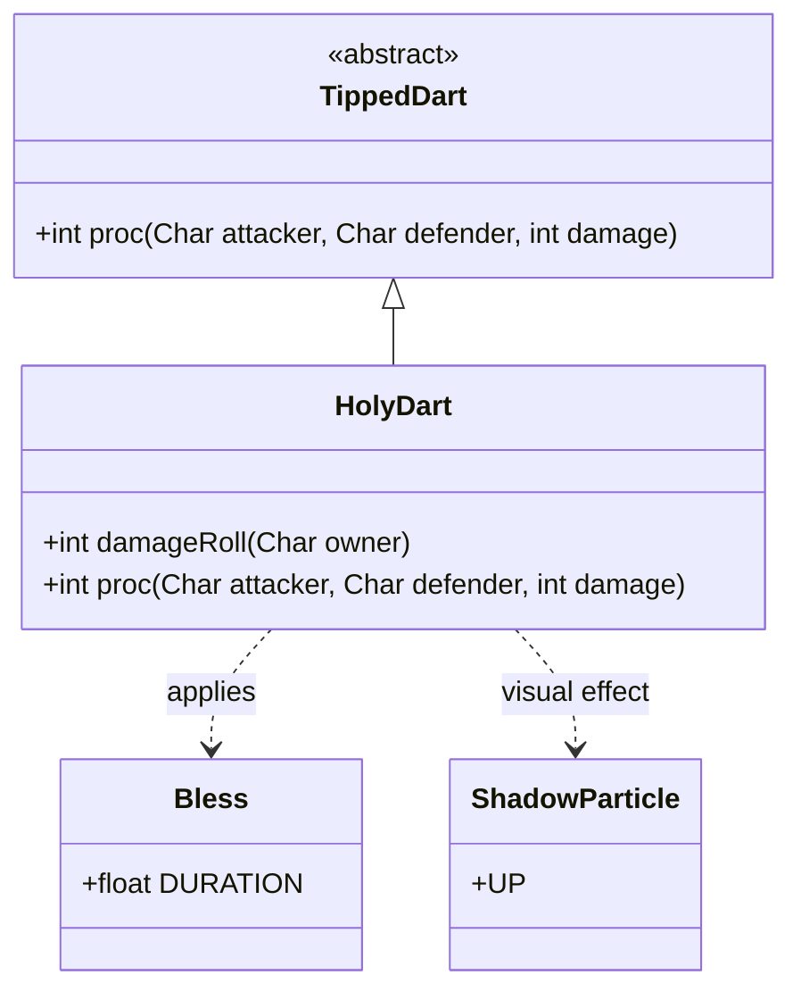

# HolyDart 类文档

## 1. 基本信息
| 属性 | 值 |
|------|-----|
| 文件路径 | core/src/main/java/com/shatteredpixel/shatteredpixeldungeon/items/weapon/missiles/darts/HolyDart.java |
| 包名 | com.shatteredpixel.shatteredpixeldungeon.items.weapon.missiles.darts |
| 类类型 | public class |
| 继承关系 | extends TippedDart |
| 代码行数 | 74 行 |

## 2. 类职责说明
HolyDart（神圣飞镖）是由Starflower（Starflower.Seed）种子制作的药尖飞镖。它具有多重效果：对友军施加祝福效果（提升命中和伤害），对亡灵和恶魔类敌人造成额外神圣伤害并施加祝福。这是一个强大的多功能道具，特别适合对付亡灵敌人。

## 4. 继承与协作关系


## 静态常量表
| 常量名 | 类型 | 值 | 说明 |
|--------|------|-----|------|
| 无 | - | - | 此类无静态常量 |

## 实例字段表
| 字段名 | 类型 | 修饰符 | 说明 |
|--------|------|--------|------|
| image | int | - | 物品图标，使用ItemSpriteSheet.HOLY_DART |

## 7. 方法详解

### damageRoll
**签名**: `public int damageRoll(Char owner)`
**功能**: 计算伤害值，对友军不造成伤害
**参数**: 
- `owner` - 武器持有者
**返回值**: 伤害值
**实现逻辑**: 
```java
// 第42-49行
if (owner instanceof Hero) {
    if (((Hero) owner).attackTarget().alignment == owner.alignment){
        return 0;                                    // 对友军不造成伤害
    }
}
return super.damageRoll(owner);
```

### proc
**签名**: `public int proc(Char attacker, Char defender, int damage)`
**功能**: 处理命中效果
**参数**: 
- `attacker` - 攻击者
- `defender` - 防御者
- `damage` - 基础伤害
**返回值**: 处理后的伤害值
**实现逻辑**: 
```java
// 第52-73行
// 充能射击时不影响英雄自己
if (processingChargedShot && defender == attacker){
    return super.proc(attacker, defender, damage);
}

// 对友军施加祝福
if (attacker.alignment == defender.alignment){
    Buff.affect(defender, Bless.class, Math.round(Bless.DURATION));
}

// 对亡灵或恶魔造成额外伤害
if (Char.hasProp(defender, Char.Property.UNDEAD) || Char.hasProp(defender, Char.Property.DEMONIC)){
    defender.sprite.emitter().start( ShadowParticle.UP, 0.05f, 10+buffedLvl() );  // 暗影粒子效果
    Sample.INSTANCE.play(Assets.Sounds.BURNING);     // 燃烧音效
    // 伤害：10+深度/3 到 20+深度/3
    defender.damage(Random.NormalIntRange(10 + Dungeon.scalingDepth()/3, 20 + Dungeon.scalingDepth()/3), this);
// 充能射击时不祝福敌人
} else if (!processingChargedShot){
    Buff.affect(defender, Bless.class, Math.round(Bless.DURATION));  // 祝福敌人
}

return super.proc(attacker, defender, damage);
```

## 11. 使用示例
```java
// 对友军使用
// 施加祝福，提升命中和伤害

// 对亡灵或恶魔敌人使用
// 造成大量神圣伤害
// 显示暗影粒子效果

// 对普通敌人使用
// 施加祝福（可能不太有用）
```

## 注意事项
1. **亡灵/恶魔伤害**: 对UNDEAD和DEMONIC属性的敌人造成额外伤害
2. **祝福效果**: 除了伤害还会施加祝福
3. **充能射击保护**: 充能射击时不会祝福敌人
4. **伤害随深度增加**: 神圣伤害随地下城深度增加
5. **制作材料**: 需要Starflower.Seed

## 最佳实践
1. 专门用于对付亡灵和恶魔敌人
2. 对友军使用可以获得祝福增益
3. 在深层地下城效果更佳
4. 充能射击时不会给敌人祝福，更安全